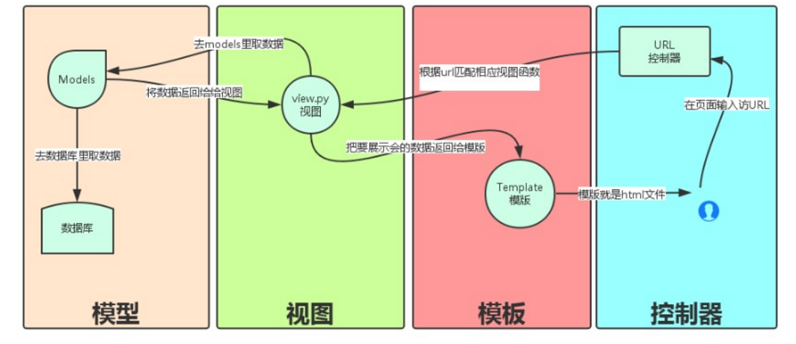
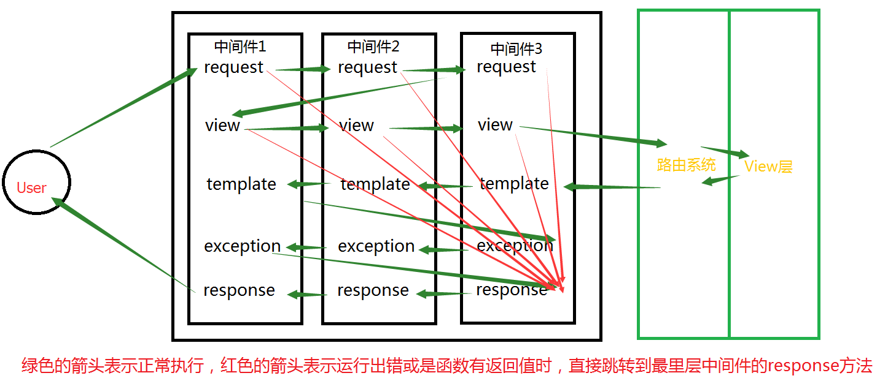

# Django框架笔记

Python 的 WEB 框架有 Django、Tornado、Flask 等多种，Django 相较于其它 WEB 框架其优势为：大而全，框架本身集成了ORM、模型绑定、模板引擎、缓存、Session等诸多功能。

本文将以下方面带大家全面了解 Django 框架，笔者使用的版本为3.1.1。

1. [流程](Django流程介绍)
2. [基本配置](#Django基本配置)
3. [路由系统](#Django路由系统)
   - [一、命名组(Named groups)](#一、命名组)
   - [二、二级路由(include)](#二、二级路由)
   - [三、添加额外的参数](#三、添加额外的参数)
   - [四、别名的使用](#四、别名的使用)
   - [五、指定view的默认配置](#五、指定view的默认配置)
4. [视图view](#Django_Views（视图函数）)
   - [一、HttpRequest对象](#一、HttpRequest对象)
   - [二、HttpResponse对象](#二、HttpResponse对象)
   - [三、render()](#三、render())
5. [模板](#模板)
   - [一、模板的执行](#一、模板的执行)
   - [二、模板语言](#二、模板语言)
   - [三、自定义标签](#三、自定义标签)
6. [Model](#Model)
   - [一、创建表](#一、创建表)
     - [A.基本结构](#A.基本结构)
     - [B.连表结构](#B.连表结构)
   - [二、操作表](#二、操作表)
     - [A.基本操作](#A.基本操作)
     - [B.进阶操作（了不起的双下划线）](#B.进阶操作（了不起的双下划线）)
     - [C.其他操作](#C.其他操作)
     - [D.连表操作（了不起的双下划线）](#D.连表操作（了不起的双下划线）)
   - [三、上传](#三、上传)
7. [中间件](#中间件(MiddleWare))
8. [Form](#Form)
9. 认证系统
10. CSRF
11. 分页
12. Cookie
13. Seesion
14. 缓存
15. 序列化
16. 信号
17. admin

## Django流程介绍



MVC是众所周知的模式，即：将应用程序分解成三个组成部分：model（模型），view（视图）和 controller（控制器）。其中：

- M: 管理应用程序的状态（通常存储到数据库中），并约束改变状态的行为（或者叫做“业务规则”）。
- C: 接受外部用户的操作，根据操作访问模型获取数据，并调用“视图”显示这些数据。控制器是将“模型”和“视图”隔离，并成为二者之间的联系纽带。
- V: 负责把数据格式化后呈现给用户。

Django 也是一个MVC框架。但是在 Django 中，控制器接受用户输入的部分由框架自行处理，所以 Django 里更关注的是模型(Model)、模板(Template) 和 视图(Views)，称为 MTV 模式：

- M 代表模型(Model)，即数据存取层。该层处理与数据相关的所有事务：如何存取、如何验证有效性、包含哪些行为以及数据之间的关系等。

- T 代表模板(Template)，即表现层。该层处理与表现相关的决定：如何在页面或其他类型文档中进行显示。

- V 代表视图(View)，即业务逻辑层。该层包含存取模型及调取恰当模板的相关逻辑。 你可以把它看作模型与模板之间的桥梁。

## Django基本配置

一、创建django程序

```sh
# 终端命令：
django-admin startproject sitename  # 在当前目录下创建一个Django程序
# IDE 创建 Django 程序时，本质上都是自动执行上述命令

# 其他常用命令：
python manage.py runserver ip:port  # 启动服务器，默认ip和端口为http://127.0.0.1:8000/
python manage.py startapp appname  # 新建 app
python manage.py syncdb  # 同步数据库命令，Django 1.7及以上版本需要用以下的命令
python manage.py makemigrations  # 显示并记录所有数据的改动
python manage.py migrate  # 将改动更新到数据库
python manage.py createsuperuser  # 创建超级管理员
python manage.py dbshell  # 数据库命令行
python manage.py  # 查看命令列表
```

二、配置文件

A. 数据库

支持SQLite 3（默认）、PostgreSQL 、MySQL、Oracle数据库的操作

```py
# 默认是SQLit 3 的配置

DATABASES = {
    'default': {
        'ENGINE': 'django.db.backends.sqlite3',
        'NAME': os.path.join(BASE_DIR, 'db.sqlite3'),
    }
}


# MySQL的配置

DATABASES = {
    'default': {
    'ENGINE': 'django.db.backends.mysql',
    'NAME':'dbname',   #注意这里的数据库应该以utf-8编码
    'USER': 'xxx',
    'PASSWORD': 'xxx',
    'HOST': '',
    'PORT': '',
    }
}

# 对于python3的使用者们还需要再加一步操作
# 由于Django内部连接MySQL时使用的是MySQLdb模块，而python3中还无此模块，所以需要使用pymysql来代替
  
# 如下设置放置的与project同名的配置的 __init__.py文件中
  
import pymysql
pymysql.install_as_MySQLdb()


# PostgreSQL配置
DATABASES = {
    'default': {
        'NAME': 'app_data',
        'ENGINE': 'django.db.backends.postgresql_psycopg2',
        'USER': 'XXX',
        'PASSWORD': 'XXX'
    }


# Oracle配置
DATABASES = {
    'default': {
        'ENGINE': 'django.db.backends.oracle',
        'NAME': 'xe',
        'USER': 'a_user',
        'PASSWORD': 'a_password',
        'HOST': '',
        'PORT': '',
    }
}
```

Django框架对于开发者而言高度透明化，对于不同数据库的具体使用方法是一致的，改变数据库类型只需要变动上述配置即可。

查看[更多](https://docs.djangoproject.com/en/1.11/ref/databases/#using-a-3rd-party-database-backend)

B. 静态文件添加

```py
# 首先在项目根目录下创建static目录

# 接着在settings.py 文件下添加

STATIC_URL = '/static/'  # 默认已添加，使用静态文件时的前缀
STATICFILES_DIRS = (
  os.path.join(BASE_DIR,'static'), #行末的逗号不能漏
)
```

这样在template中就可以导入static目录下的静态文件啦。例：

```html
<script src="/static/jquery-1.12.4.js"></script>
```

## Django路由系统

URL 配置(URLconf)就像 Django 所支撑网站的目录。它的本质是 URL 模式以及要为该 URL 模式调用的视图函数之间的映射表；你就是以这种方式告诉 Django，对于这个 URL 调用这段代码，对于那个 URL 调用那段代码。URL 的加载是从配置文件中开始。

参数说明：

- 一个正则表达式字符串
- 一个可调用对象，通常为一个视图函数或一个指定视图函数路径的字符串
- 可选的要传递给视图函数的默认参数（字典形式）
- 一个可选的name参数

示例：

```py
from django.conf.urls import url

from . import views

urlpatterns = [
    url(r'^articles/2003/$', views.special_case_2003),
    url(r'^articles/([0-9]{4})/$', views.year_archive),
    url(r'^articles/([0-9]{4})/([0-9]{2})/$', views.month_archive),
    url(r'^articles/([0-9]{4})/([0-9]{2})/([0-9]+)/$', views.article_detail),
]
```

说明:

- 要捕获从 URL 中的值，用括号括起来，会当参数传入 views 视图。
- 没有必要添加一个斜线，因为每个 URL 都有。例如，它 ^articles 不是 ^/articles。
- 在每个正则表达式字符串前面的'r'是可选的。它告诉 Python 是“原始”字符串 —— 字符串中没有什么要进行转义。

请求示例:

- 一个请求 `/articles/2005/03/` 会匹配上面列表中的第三条. Django 会调用函数 `views.month_archive(request, '2005', '03')`
- `/articles/2005/3/` 不会匹配上面列表中的任何条目, 因为第三条的月份需要二位数字
- `/articles/2003/` 会匹配上第一条而不是第二条，因为匹配是按照从上到下顺序进行的，Django 会调用函数 `views.special_case_2003(request)`
- `/articles/2003` 不会匹配上面列表中的任何条目，因为每个 URL 应该以 `/` 结尾
- `/articles/2003/03/03/` 会匹配最后一条。Django 会调用函数 `views.article_detail(request, '2003', '03', '03')`

### 一、命名组

在上面的简单例子中，并没有使用正则表达式分组，在更高级的用法中，很有可能使用正则分组来匹配 URL 并且将分组值通过参数传递给 view 函数。

在 Python 的正则表达式中，分组的语法是 `(?P<name>pattern)`, name 表示分组名，pattern 表示一些匹配正则。

这里是一个简单的小例子：

```py
# 正则知识
import re

ret=re.search('(?P<id>\d{3})/(?P<name>\w{3})','weeew34ttt123/ooo')

print(ret.group())
print(ret.group('id'))
print(ret.group('name'))
-------------------------------------
123/ooo
123
ooo


from django.conf.urls import url
from . import views

urlpatterns = [
    url(r'^articles/2003/$', views.special_case_2003),
    url(r'^articles/(?P<year>[0-9]{4})/$', views.year_archive),
    url(r'^articles/(?P<year>[0-9]{4})/(?P<month>[0-9]{2})/$', views.month_archive),
    url(r'^articles/(?P<year>[0-9]{4})/(?P<month>[0-9]{2})/(?P<day>[0-9]{2})/$', views.article_detail),
]
```

For example:

- A request to `/articles/2005/03/` 会调用函数 `views.month_archive(request, year='2005', month='03')`，而不是 `views.month_archive(request, '2005', '03')`
- A request to `/articles/2003/03/03/` 会调用函数 `views.article_detail(request, year='2003', month='03', day='03')`

常见写法：

```py
urlpatterns = [
    url(r'^index/(?P<id>\d{3})/(?P<name>\w+)/$', views.index)
]

def index(req, id, name)
    print(id, name)
    return render(req, "index.html")
```

### 二、二级路由

那如果映射 url 太多怎么办，全写一个在 urlpatterns 显得繁琐，so 二级路由应用而生

```py
from django.conf.urls import include, url

from apps.main import views as main_views
from credit import views as credit_views

extra_patterns = [
    url(r'^reports/$', credit_views.report),
    url(r'^reports/(?P<id>[0-9]+)/$', credit_views.report),
    url(r'^charge/$', credit_views.charge),
]

urlpatterns = [
    url(r'^$', main_views.homepage),
    url(r'^help/', include('apps.help.urls')),
    url(r'^credit/', include(extra_patterns)),
]
```

在上面这个例子中，如果请求url为 `/credit/reports/` 则会调用函数 `credit_views.report()`

使用二级路由也可以减少代码冗余，使代码更加简洁易懂

```py
# 原始版本
from django.conf.urls import url
from . import views

urlpatterns = [
    url(r'^(?P<page_slug>[\w-]+)-(?P<page_id>\w+)/history/$', views.history),
    url(r'^(?P<page_slug>[\w-]+)-(?P<page_id>\w+)/edit/$', views.edit),
    url(r'^(?P<page_slug>[\w-]+)-(?P<page_id>\w+)/discuss/$', views.discuss),
    url(r'^(?P<page_slug>[\w-]+)-(?P<page_id>\w+)/permissions/$', views.permissions),
]


# 改进版本
from django.conf.urls import include, url
from . import views

urlpatterns = [
    url(r'^(?P<page_slug>[\w-]+)-(?P<page_id>\w+)/', include([
        url(r'^history/$', views.history),
        url(r'^edit/$', views.edit),
        url(r'^discuss/$', views.discuss),
        url(r'^permissions/$', views.permissions),
    ])),
]
```

### 三、添加额外的参数

URLconfs 有一个钩子可以让你加入一些额外的参数到 view 函数中

```py
from django.conf.urls import url
from . import views

urlpatterns = [
    url(r'^blog/(?P<year>[0-9]{4})/$', views.year_archive, {'foo': 'bar'}),
]
```

在上面的例子中，如果一个请求为 `/blog/2005/`，Django 将会调用函数 `views.year_archive(request, year='2005', foo='bar')`

需要注意的是，当你加上参数时，对应函数 `views.year_archive` 必须加上一个参数，参数名也必须命名为 foo，如下：

```py
def year_archive(request, foo):
    print(foo)
    return render(request, 'index.html')
```

### 四、别名的使用

```py
url(r'^index', views.index, name='bieming')
```

url 中还支持 name 参数的配置，如果配置了 name 属性，在模板的文件中就可以使用 name 值来代替相应的 url 值。

我们来看一个例子：

```py
urlpatterns = [
    url(r'^index',views.index,name='bieming'),
    url(r'^admin/', admin.site.urls),
    # url(r'^articles/2003/$', views.special_case_2003),
    url(r'^articles/([0-9]{4})/$', views.year_archive),
    # url(r'^articles/([0-9]{4})/([0-9]{2})/$', views.month_archive),
    # url(r'^articles/([0-9]{4})/([0-9]{2})/([0-9]+)/$', views.article_detail),
]

## ------------------------------------------------------

def index(req):
  if req.method=='POST':
    username=req.POST.get('username')
    password=req.POST.get('password')
    if username=='alex' and password=='123':
      return HttpResponse("登陆成功")

  return render(req,'index.html')

## ------------------------------------------------------
```

```html
<!DOCTYPE html>
<html lang="en">
<head>
    <meta charset="UTF-8">
    <title>Title</title>
</head>
<body>
{#  <form action="/index/" method="post">#}
{#  这里只要使用bieming即可代替/index #}
    <form action="" method="post">
        用户名:<input type="text" name="username">
        密码:<input type="password" name="password">
        <input type="submit" value="submit">
    </form>
</body>
</html>
```

### 五、指定view的默认配置

```py
# URLconf
from django.conf.urls import url

from . import views

urlpatterns = [
    url(r'^blog/$', views.page),
    url(r'^blog/page(?P<num>[0-9]+)/$', views.page),
]

# View (in blog/views.py)
def page(request, num="1"):
    # Output the appropriate page of blog entries, according to num.
    ...
```

在上述的例子中，两个 URL 模式指向同一个视图 views.page，但第一个不捕获 URL 中任何东西。如果第一个模式匹配，该 page() 函数将使用它的默认参数 `num = "1"`。如果第二图案相匹配时，page() 将使用任何由正则表达式捕获的 num 值。

## Django_Views（视图函数）

http请求中产生两个核心对象：

- http请求：HttpRequest对象
- http响应：HttpResponse对象

### 一、HttpRequest对象

当请求一个页面时，Django 创建一个 `HttpRequest` 对象包含原数据的请求。然后 Django 加载适当的视图，通过 `HttpRequest` 作为视图函数的第一个参数。每个视图负责返回一个 `HttpResponse` 目标。

- path：请求页面的全路径，不包括域名
- method：请求中使用的 HTTP 方法的字符串表示。全大写表示。例如
  
  ```py
  if  req.method=="GET":
    do_something()
  elseif req.method=="POST":
    do_something_else()
  ```

- GET: 包含所有 HTTP GET 参数的类字典对象
- POST：包含所有 HTTP POST 参数的类字典对象
  
  服务器收到空的 POST 请求的情况也是可能发生的，也就是说，表单 form 通过 HTTP POST 方法提交请求，但是表单中可能没有数据，因此不能使用 `if req.POST` 来判断是否使用了 HTTP POST 方法；应该使用 `if req.method=="POST"`
- COOKIES: 包含所有 cookies 的标准 Python 字典对象；keys 和 values 都是字符串。
- FILES：包含所有上传文件的类字典对象；FILES 中的每一个 Key 都是 `<input type="file" name="" />`标签中 name 属性的值，FILES 中的每一个 value 同时也是一个标准的 python 字典对象，包含下面三个 Keys：
  1. filename: 上传文件名，用字符串表示
  2. content_type: 上传文件的Content Type
  3. content: 上传文件的原始内容
- user：是一个 `django.contrib.auth.models.User` 对象，代表当前登陆的用户。如果访问用户当前没有登陆，user 将被初始化为 django.contrib.auth.models.AnonymousUser 的实例。你可以通过 user 的 is_authenticated() 方法来辨别用户是否登陆：`if req.user.is_authenticated();` 只有激活 Django 中的 `AuthenticationMiddleware` 时该属性才可用
- session：唯一可读写的属性，代表当前会话的字典对象；自己有激活 Django 中的 session 支持时该属性才可用。
- META：一个标准的 Python 字典包含所有可用的 HTTP 头。可用标题取决于客户端和服务器，这里是一些例子：
  - CONTENT_LENGTH：请求体的长度（一个字符串）
  - CONTENT_TYPE：请求体的类型。
  - HTTP_ACCEPT：为响应–可以接受的内容类型。
  - HTTP_ACCEPT_ENCODING：接受编码的响应
  - HTTP_ACCEPT_LANGUAGE：接受语言的反应
  - HTTP_HOST：客户端发送的HTTP主机头。
  - HTTP_REFERER：参考页面
  - HTTP_USER_AGENT：客户端的用户代理字符串。
  - QUERY_STRING：查询字符串，作为一个单一的（分析的）字符串。
  - REMOTE_ADDR：客户端的IP地址
  - REMOTE_HOST：客户端的主机名
  - REMOTE_USER：用户通过Web服务器的身份验证。
  - REQUEST_METHOD：字符串，如"GET"或"POST"
  - SERVER_NAME：服务器的主机名
  - SERVER_PORT：服务器的端口（一个字符串）

### 二、HttpResponse对象

对于 HttpRequest 对象来说，是由 django 自动创建的，但是，HttpResponse对象就必须我们自己创建。每个 view 请求处理方法必须返回一个 HttpResponse 对象。

在 HttpResponse 对象上扩展的常用方法：

- 页面渲染：render（推荐），render_to_response
- 页面跳转：redirect
- locals：可以直接将对应视图函数中所有的变量传给模板

值得注意的是对于页面渲染的方法中，render 和 render_to_response 使用方法和功能类似，但是 render 功能更为强大，推荐使用

### 三、render()

```py
# 结合给定的模板与一个给定的上下文，返回一个字典HttpResponse在渲染文本对象
render(request, template_name, context=None, content_type=None, status=None, using=None)[source]
```

所需的参数：

- template_name：一个模板的使用或模板序列名称全称。如果序列是给定的，存在于第一个模板将被使用。

可选参数：

- context: 一组字典的值添加到模板中。默认情况下，这是一个空的字典。
- content_type: MIME类型用于生成文档。
- status: 为响应状态代码。默认值为200
- using: 这个名字一个模板引擎的使用将模板。

```py
from django.shortcuts import render

def my_view(request):
  # View code here...
  return render(request, 'myapp/index.html',
      { 'foo': 'bar' },
      content_type='application/xhtml+xml')
```

## 模板

### 一、模板的执行

模版的创建过程，对于模版，其实就是读取模版（其中嵌套着模版标签），然后将 Model 中获取的数据插入到模版中，最后将信息返回给用户。

view.py

```py
def index(request):
    return render(request, 'index.html', {'title':'welcome'})
```

index.html

```html
<!DOCTYPE html>
<html lang="en">
<head>
    <meta charset="UTF-8">
    <title>Title</title>
</head>
<body>
    <div>
        <h1>{{ title }}</h1>
    </div>
</body>
```

### 二、模板语言

模板中也有自己的语言，该语言可以实现数据展示

- {{ item }}

-   <a>{{ item }}</a>  

  forloop.counter  
  forloop.first  
  forloop.last

-    

- 母板：  
    
  子板：  
    
  

- 帮助方法：  
  {{ item.event_start|date:"Y-m-d H:i:s"}}  
  {{ bio|truncatewords:"30" }}  
  {{ my_list|first|upper }}  
  {{ name|lower }}  

小知识点：在模板语言中字典数据类型的取值是通过 `dict.xxx` 而不是 `dict[xxx]`

### 三、自定义标签

因为在模板语言中不能够做运算等一些稍显复杂的操作，所以在Django中提供了两种自定制标签，一种是simple_tag，一种是filter。

- simple_tag: 任意传递参数，但是不能用作布尔判断
- filter: 最多只能传递二个参数，可以用作布尔判断

在这里着重介绍simple_tag类型，filter的实现类似

1. 在app中创建templatetags模块
2. 创建任意 .py 文件，如：xx.py

   ```py
   #!/usr/bin/env python
   #coding:utf-8
   from django import template
   from django.utils.safestring import mark_safe
   from django.template.base import resolve_variable, Node, TemplateSyntaxError

   register = template.Library()
  
   @register.simple_tag
   def my_simple_time(v1,v2,v3):
     return  v1 + v2 + v3
  
   @register.simple_tag
   def my_input(id,arg):
     result = "<input type='text' id='%s' class='%s' />" %(id,arg,)
     return mark_safe(result)
   ```

3. 在使用自定义 simple_tag 的 html 文件中导入之前创建的 xx.py 文件名
  
   ```html
   
   ```

4. 使用simple_tag
  
   ```html
   
   
   ```

5. 在 settings 中配置当前app，不然 django 无法找到自定义的 simple_tag

   ```py
   INSTALLED_APPS = (
    'django.contrib.admin',
    'django.contrib.auth',
    'django.contrib.contenttypes',
    'django.contrib.sessions',
    'django.contrib.messages',
    'django.contrib.staticfiles',
    'app01',
   )
   ```

更多见文档：[https://docs.djangoproject.com/en/1.10/ref/templates/language/](https://docs.djangoproject.com/en/1.10/ref/templates/language/)

## Model

Django提供了一个抽象层(Model)来构建和管理Web应用程序的数据。

django中遵循 Code Frist 的原则，即：根据代码中定义的类来自动生成数据库表。

关系对象映射（Object Relational Mapping，简称ORM）。

### 一、创建表

#### A.基本结构

```py
from django.db import models

class userinfo(models.Model):
    name = models.CharField(max_length=30)
    email = models.EmailField()
    memo = models.TextField()
```

更多参数：

- `null=True`: 数据库中字段是否可以为空
- `blank=True`: django的 Admin 中添加数据时是否可允许空值
- `primary_key = False`: 主键，对 AutoField 设置主键后，就会代替原来的自增 id 列
- `auto_now`: 自动创建，无论添加或修改，都是当前操作的时间
- `auto_now_add`: 自动创建，永远是创建时的时间
- `choices`
  
  ```py
  GENDER_CHOICE = (
    (u'M', u'Male'),
    (u'F', u'Female'),
  )
  gender = models.CharField(max_length=2,choices = GENDER_CHOICE)
  ```

- `max_length`
- `default`: 默认值
- `verbose_name`: Admin中字段的显示名称
- `name|db_column`: 数据库中的字段名称
- `unique=True`: 不允许重复
- `db_index = True`: 数据库索引
- `editable=True`: 在Admin里是否可编辑
- `error_messages=None`: 错误提示
- `auto_created=False`: 自动创建
- `help_text`: 在Admin中提示帮助信息
- `validators=[]`
- `upload-to`

更多字段：

- `models.AutoField`: 自增列 = int(11)

  如果没有的话，默认会生成一个名称为 id 的列，如果要显示的自定义一个自增列，必须将给列设置为主键 `primary_key=True`。

- `models.CharField`: 字符串字段，必须 max_length 参数
- `models.BooleanField`: 布尔类型=tinyint(1)，不能为空，Blank=True
- `models.ComaSeparatedIntegerField`: 用逗号分割的数字=varchar，继承CharField，所以必须 max_lenght 参数
- `models.DateField`: 日期类型 date

  对于参数，`auto_now = True` 则每次更新都会更新这个时间；auto_now_add 则只是第一次创建添加，之后的更新不再改变。

- `models.DateTimeField`: 日期类型 datetime，同DateField的参数
- `models.Decimal`: 十进制小数类型 = decimal，必须指定整数位max_digits和小数位decimal_places
- `models.EmailField`: 字符串类型（正则表达式邮箱）= varchar，对字符串进行正则表达式
- `models.FloatField`: 浮点类型 = double
- `models.IntegerField`: 整形
- `models.BigIntegerField`: 长整形
  
  ```py
  integer_field_ranges = {
    'SmallIntegerField': (-32768, 32767),
    'IntegerField': (-2147483648, 2147483647),
    'BigIntegerField': (-9223372036854775808, 9223372036854775807),
    'PositiveSmallIntegerField': (0, 32767),
    'PositiveIntegerField': (0, 2147483647),
  }
  ```

- `models.IPAddressField`: 字符串类型（ip4正则表达式）
- `models.GenericIPAddressField`: 字符串类型（ip4和ip6是可选的）

  参数protocol可以是：both、ipv4、ipv6，验证时，会根据设置报错

- `models.NullBooleanField`: 允许为空的布尔类型
- `models.PositiveIntegerFiel`: 正Integer
- `models.PositiveSmallIntegerField`: 正smallInteger
- `models.SlugField`: 减号、下划线、字母、数字
- `models.SmallIntegerField`: 数字，数据库中的字段有：tinyint、smallint、int、bigint
- `models.TextField`: 字符串=longtext
- `models.TimeField`: 时间 HH:MM[:ss[.uuuuuu]]
- `models.URLField`: 字符串，地址正则表达式
- `models.BinaryField`: 二进制
- `models.ImageField`: 图片

元信息：

```py
class UserInfo(models.Model):
    nid = models.AutoField(primary_key=True)
    username = models.CharField(max_length=32)
    class Meta:
        # 数据库中生成的表名称 默认 app名称 + 下划线 + 类名
        db_table = "table_name"

        # 联合索引
        index_together = [
            ("pub_date", "deadline"),
        ]

        # 联合唯一索引
        unique_together = (("driver", "restaurant"),)

        # admin中显示的表名称
        verbose_name

        # verbose_name加s
        verbose_name_plural
   ```

更多：[https://docs.djangoproject.com/en/1.10/ref/models/options/](https://docs.djangoproject.com/en/1.10/ref/models/options/)

拓展知识：

1. 触发 Model 中的验证和错误提示有两种方式：

   - Django Admin 中的错误信息会优先根据 Admin 内部的 ModelForm 错误信息提示，如果都成功，才来检查 Model 的字段并显示指定错误信息
   - 调用 Model 对象的 clean_fields 方法，如：

   ```py
   # models.py
   class UserInfo(models.Model):
      nid = models.AutoField(primary_key=True)
      username = models.CharField(max_length=32)
      email = models.EmailField(error_messages={'invalid': '格式错了.'})

   # views.py
   def index(request):
      obj = models.UserInfo(username='11234', email='uu')
      try:
          print(obj.clean_fields())
          except Exception as e:
              print(e)
          return HttpResponse('ok')

   # Model的clean方法是一个钩子，可用于定制操作，如：上述的异常处理。

2. Admin中修改错误提示

   ```py
   # admin.py
   from django.contrib import admin
   from model_club import models
   from django import forms

   class UserInfoForm(forms.ModelForm):
      username = forms.CharField(error_messages={'required': '用户名不能为空.'})
      email = forms.EmailField(error_messages={'invalid': '邮箱格式错误.'})
      age = forms.IntegerField(initial=1, error_messages={'required': '请输入数值.', 'invalid': '年龄必须为数值.'})

      class Meta:
          model = models.UserInfo
          # fields = ('username',)
          fields = "__all__"


   class UserInfoAdmin(admin.ModelAdmin):
      form = UserInfoForm

   admin.site.register(models.UserInfo, UserInfoAdmin)
   ```

#### B.连表结构

- 一对多：models.ForeignKey（其他表）
- 多对多：models.ManyToManyField（其他表）
- 一对一：models.OneToOneField（其他表）

应用场景：

- 一对多：当一张表中创建一行数据时，有一个单选的下拉框（可以被重复选择）

  例如：创建用户信息时候，需要选择一个用户类型【普通用户】【金牌用户】【铂金用户】等。

- 多对多：在某表中创建一行数据时，有一个可以多选的下拉框

  例如：创建用户信息，需要为用户指定多个爱好

- 一对一：在某表中创建一行数据时，有一个单选的下拉框（下拉框中的内容被用过一次就消失了

  例如：原有含10列数据的一张表保存相关信息，经过一段时间之后，10列无法满足需求，需要为原来的表再添加5列数据

字段以及参数：

```py
ForeignKey(ForeignObject)   # ForeignObject(RelatedField)
to,                         # 要进行关联的表名
to_field=None,              # 要关联的表中的字段名称
on_delete=None,             # 当删除关联表中的数据时，当前表与其关联的行的行为
```

- models.CASCADE: 删除关联数据，与之关联也删除
- models.DO_NOTHING: 删除关联数据，引发错误IntegrityError
- models.PROTECT: 删除关联数据，引发错误ProtectedError
- models.SET_NULL: 删除关联数据，与之关联的值设置为null（前提FK字段需要设置为可空）
- models.SET_DEFAULT: 删除关联数据，与之关联的值设置为默认值（前提FK字段需要设置默认值）
- models.SET: 删除关联数据，

  - 与之关联的值设置为指定值，设置：`models.SET(值)`  
  - 与之关联的值设置为可执行对象的返回值，设置：`models.SET(可执行对象)`

```py
def func():
  return 10

class MyModel(models.Model):
  user = models.ForeignKey(
    to="User",
    to_field="id"
    on_delete=models.SET(func),)
# 反向操作时，使用的字段名，用于代替【表名_set】。如：obj.表名_set.all()
related_name=None
# 反向操作时，使用的连接前缀，用于替换【表名】。如：
# models.UserGroup.objects.filter(表名__字段名=1).values('表名__字段名')
related_query_name=None
# 在 Admin 或 ModelForm 中显示关联数据时，提供的条件
limit_choices_to=None
# 如：
limit_choices_to={'nid__gt': 5}
limit_choices_to=lambda : {'nid__gt': 5}

from django.db.models import Q
- limit_choices_to=Q(nid__gt=10)
- limit_choices_to=Q(nid=8) | Q(nid__gt=10)
- limit_choices_to=lambda : Q(Q(nid=8) | Q(nid__gt=10)) & Q(caption='root')
db_constraint=True    # 是否在数据库中创建外键约束
parent_link=False     # 在Admin中是否显示关联数据

OneToOneField(ForeignKey)
to,                   # 要进行关联的表名
to_field=None         # 要关联的表中的字段名称
on_delete=None,       # 当删除关联表中的数据时，当前表与其关联的行的行为
```

**对于一对一**

1、一对一其实就是 一对多 + 唯一索引  
2、当两个类之间有继承关系时，默认会创建一个一对一字段

```py
# 如下会在A表中额外增加一个c_ptr_id列且唯一：
class C(models.Model):
  nid = models.AutoField(primary_key=True)
  part = models.CharField(max_length=12)

class A(C):
  id = models.AutoField(primary_key=True)
  code = models.CharField(max_length=1)

ManyToManyField(RelatedField)
to,                         # 要进行关联的表名
related_name=None,          # 反向操作时，使用的字段名，用于代替【表名_set】 如：obj.表名_set.all()
related_query_name=None,    # 反向操作时，使用的连接前缀，用于替换【表名】 如： models.UserGroup.objects.filter(表名__字段名=1).values('表名__字段名')
limit_choices_to=None,      # 在Admin或ModelForm中显示关联数据时，提供的条件。如：
- limit_choices_to={'nid__gt': 5}
- limit_choices_to=lambda : {'nid__gt': 5}

from django.db.models import Q
- limit_choices_to=Q(nid__gt=10)
- limit_choices_to=Q(nid=8) | Q(nid__gt=10)
- limit_choices_to=lambda : Q(Q(nid=8) | Q(nid__gt=10)) & Q(caption='root')
symmetrical=None,    # 仅用于多对多自关联时，symmetrical用于指定内部是否创建反向操作的字段
# 做如下操作时，不同的symmetrical会有不同的可选字段
models.BB.objects.filter(...)

# 可选字段有：code, id, m1
class BB(models.Model):

code = models.CharField(max_length=12)
m1 = models.ManyToManyField('self',symmetrical=True)

# 可选字段有: bb, code, id, m1
class BB(models.Model):

code = models.CharField(max_length=12)
m1 = models.ManyToManyField('self',symmetrical=False)

through=None,         # 自定义第三张表时，使用字段用于指定关系表
through_fields=None,  # 自定义第三张表时，使用字段用于指定关系表中那些字段做多对多关系表

from django.db import models

class Person(models.Model):
  name = models.CharField(max_length=50)

class Group(models.Model):
  name = models.CharField(max_length=128)
  members = models.ManyToManyField(
    Person,
    through='Membership',
    through_fields=('group', 'person'),
  )

class Membership(models.Model):
  group = models.ForeignKey(Group, on_delete=models.CASCADE)
  person = models.ForeignKey(Person, on_delete=models.CASCADE)
  inviter = models.ForeignKey(
    Person,
    on_delete=models.CASCADE,
    related_name="membership_invites",
  )
  invite_reason = models.CharField(max_length=64)

db_constraint=True,         # 是否在数据库中创建外键约束
db_table=None,              # 默认创建第三张表时，数据库中表的名称
```

### 二、操作表

#### A.基本操作

```py
# 增
# 增加一条数据，可以接受字典类型数据 **kwargs
models.Tb1.objects.create(c1='xx', c2='oo')
obj = models.Tb1(c1='xx', c2='oo')
obj.save()

# 查
# 获取单条数据，不存在则报错（不建议）
models.Tb1.objects.get(id=123)
# 获取全部
models.Tb1.objects.all()
# 获取指定条件的数据
models.Tb1.objects.filter(name='seven')

# 删
# 删除指定条件的数据
models.Tb1.objects.filter(name='seven').delete()

# 改
# 将指定条件的数据更新，均支持 **kwargs
models.Tb1.objects.filter(name='seven').update(gender='0')
obj = models.Tb1.objects.get(id=1)
obj.c1 = '111'
# 修改单条数据
obj.save()
```

#### B.进阶操作（了不起的双下划线）

利用双下划线将字段和对应的操作连接起来

```py
# 获取个数
models.Tb1.objects.filter(name='seven').count()

# 大于，小于
models.Tb1.objects.filter(id__gt=1)            # 获取id大于1的值
models.Tb1.objects.filter(id__gte=1)           # 获取id大于等于1的值
models.Tb1.objects.filter(id__lt=10)           # 获取id小于10的值
models.Tb1.objects.filter(id__lte=10)          # 获取id小于10的值
models.Tb1.objects.filter(id__lt=10, id__gt=1) # 获取id大于1且小于10的值

# in
# 获取id等于11、22、33的数据
models.Tb1.objects.filter(id__in=[11, 22, 33])
# not in
models.Tb1.objects.exclude(id__in=[11, 22, 33])

# isnull
Entry.objects.filter(pub_date__isnull=True)

# contains
models.Tb1.objects.filter(name__contains="ven")
models.Tb1.objects.filter(name__icontains="ven") # icontains大小写不敏感
models.Tb1.objects.exclude(name__icontains="ven")

# range
models.Tb1.objects.filter(id__range=[1, 2])   # 范围bettwen and

# 其他类似
# startswith，istartswith, endswith, iendswith,

# order by
models.Tb1.objects.filter(name='seven').order_by('id')    # asc
models.Tb1.objects.filter(name='seven').order_by('-id')   # desc

# group by
from django.db.models import Count, Min, Max, Sum
models.Tb1.objects.filter(c1=1).values('id').annotate(c=Count('num'))
# SELECT "app01_tb1"."id", COUNT("app01_tb1"."num") AS "c" FROM "app01_tb1" WHERE "app01_tb1"."c1" = 1 GROUP BY "app01_tb1"."id"

# limit 、offset
models.Tb1.objects.all()[10:20]

# regex正则匹配，iregex 不区分大小写
Entry.objects.get(title__regex=r'^(An?|The) +')
Entry.objects.get(title__iregex=r'^(an?|the) +')

# date
Entry.objects.filter(pub_date__date=datetime.date(2005, 1, 1))
Entry.objects.filter(pub_date__date__gt=datetime.date(2005, 1, 1))

# year
Entry.objects.filter(pub_date__year=2005)
Entry.objects.filter(pub_date__year__gte=2005)

# month
Entry.objects.filter(pub_date__month=12)
Entry.objects.filter(pub_date__month__gte=6)

# day
Entry.objects.filter(pub_date__day=3)
Entry.objects.filter(pub_date__day__gte=3)

# week_day
Entry.objects.filter(pub_date__week_day=2)
Entry.objects.filter(pub_date__week_day__gte=2)

# hour
Event.objects.filter(timestamp__hour=23)
Event.objects.filter(time__hour=5)
Event.objects.filter(timestamp__hour__gte=12)

# minute
Event.objects.filter(timestamp__minute=29)
Event.objects.filter(time__minute=46)
Event.objects.filter(timestamp__minute__gte=29)

# second
Event.objects.filter(timestamp__second=31)
Event.objects.filter(time__second=2)
Event.objects.filter(timestamp__second__gte=31)
```

#### C.其他操作

```py
# extra
extra(self, select=None, where=None, params=None, tables=None, order_by=None, select_params=None)
Entry.objects.extra(select={'new_id': "select col from sometable where othercol > %s"}, select_params=(1,))
Entry.objects.extra(where=['headline=%s'], params=['Lennon'])
Entry.objects.extra(where=["foo='a' OR bar = 'a'", "baz = 'a'"])
Entry.objects.extra(select={'new_id': "select id from tb where id > %s"}, select_params=(1,), order_by=['-nid'])

# F
from django.db.models import F
models.Tb1.objects.update(num=F('num')+1)

# Q
# 方式一：
Q(nid__gt=10)
Q(nid=8) | Q(nid__gt=10)
Q(Q(nid=8) | Q(nid__gt=10)) & Q(caption='root')
# 方式二：
con = Q()
q1 = Q()
q1.connector = 'OR'
q1.children.append(('id', 1))
q1.children.append(('id', 10))
q1.children.append(('id', 9))
q2 = Q()
q2.connector = 'OR'
q2.children.append(('c1', 1))
q2.children.append(('c1', 10))
q2.children.append(('c1', 9))
con.add(q1, 'AND')
con.add(q2, 'AND')
models.Tb1.objects.filter(con)

# 执行原生SQL
from django.db import connection, connections
cursor = connection.cursor()
# cursor = connections['default'].cursor()
cursor.execute("""SELECT * from auth_user where id = %s""", [1])
row = cursor.fetchone()
```

#### D.连表操作（了不起的双下划线）

利用 `双下划线` 和 `_set` 将表之间的操作连接起来

```py
# 表结构实例：
class UserProfile(models.Model):
    user_info = models.OneToOneField('UserInfo')
    username = models.CharField(max_length=64)
    password = models.CharField(max_length=64)

    def __unicode__(self):
        return self.username


class UserInfo(models.Model):
    user_type_choice = (
        (0, u'普通用户'),
        (1, u'高级用户'),
    )
    user_type = models.IntegerField(choices=user_type_choice)
    name = models.CharField(max_length=32)
    email = models.CharField(max_length=32)
    address = models.CharField(max_length=128)

    def __unicode__(self):
        return self.name


class UserGroup(models.Model):

    caption = models.CharField(max_length=64)

    user_info = models.ManyToManyField('UserInfo')

    def __unicode__(self):
        return self.caption


class Host(models.Model):
    hostname = models.CharField(max_length=64)
    ip = models.GenericIPAddressField()
    user_group = models.ForeignKey('UserGroup')

    def __unicode__(self):
        return self.hostname

# 一对一操作
user_info_obj = models.UserInfo.objects.filter(id=1).first()
print user_info_obj.user_type
print user_info_obj.get_user_type_display()
print user_info_obj.userprofile.password

user_info_obj = models.UserInfo.objects.filter(id=1).values('email', 'userprofile__username').first()
print user_info_obj.keys()
print user_info_obj.values()


# 添加一对多
dic = {
    "hostname": "名字1",
    "ip": "192.168.1.1",
    "user_group_id": 1,   # 加对象则为"user_group"
}
models.Host.objects.create(**dic)

# 正向查一对多
host_obj = models.Host.objects.all()
print(type(host_obj),     # <class 'django.db.models.query.QuerySet'>
        host_obj)           # <QuerySet [<Host: 名字1>]>
for item in host_obj:
    print(item.hostname)
    print(item.user_group.caption)
    print(item.user_group.user_info.values())
    # <QuerySet [{'name': 'nick', 'user_type': 1, 'id': 1, 'email': '630571017@qq.com', 'address': '128号'}]>

usergroup_obj = models.Host.objects.filter(user_group__caption='标题1')
    print(usergroup_obj)


# 反向查一对多
usergroup_obj = models.UserGroup.objects.get(id=1)
print(usergroup_obj.caption)
ret = usergroup_obj.host_set.all()  # 所有关于id=1的host
print(ret)

obj = models.UserGroup.objects.filter(host__ip='192.168.1.1').\
    values('host__id', 'host__hostname')
print(obj)      # <QuerySet [{'host__id': 1, 'host__hostname': '名字1'}]>


# 多对多操作
user_info_obj = models.UserInfo.objects.get(name='nick')
user_info_objs = models.UserInfo.objects.all()

group_obj = models.UserGroup.objects.get(caption='CTO')
group_objs = models.UserGroup.objects.all()

# 添加数据
#group_obj.user_info.add(user_info_obj)
#group_obj.user_info.add(*user_info_objs)

# 删除数据
#group_obj.user_info.remove(user_info_obj)
#group_obj.user_info.remove(*user_info_objs)

# 添加数据
#user_info_obj.usergroup_set.add(group_obj)
#user_info_obj.usergroup_set.add(*group_objs)

# 删除数据
#user_info_obj.usergroup_set.remove(group_obj)
#user_info_obj.usergroup_set.remove(*group_objs)

# 获取数据
#print group_obj.user_info.all()
#print group_obj.user_info.all().filter(id=1)

# 获取数据
#print user_info_obj.usergroup_set.all()
#print user_info_obj.usergroup_set.all().filter(caption='CTO')
#print user_info_obj.usergroup_set.all().filter(caption='DBA')

# 添加多对多
# userinfo_id_1 = models.UserInfo.objects.filter(id=1)
# usergroup_id_1 = models.UserGroup.objects.filter(id=1).first()
# usergroup_id_1.user_info.add(*userinfo_id_1)
```

### 三、上传

**a. 自定义上传**

```py
def upload_file(request):
  if request.method == "POST":
    obj = request.FILES.get('fafafa')
    f = open(obj.name, 'wb')
    for chunk in obj.chunks():
      f.write(chunk)
    f.close()
  return render(request, 'file.html')
```

**b. Form上传文件实例**

```html
<form method="post" action="/view1/" enctype="multipart/form-data">
  <input type="file" name="ExcelFile" id="id_ExcelFile" />
  <input type="submit" value="提交" />
</form>
```

```py
# Form
class FileForm(forms.Form):
  ExcelFile = forms.FileField()

# Models
from django.db import models
class UploadFile(models.Model):
  userid = models.CharField(max_length = 30)
  file = models.FileField(upload_to = './upload/')
  date = models.DateTimeField(auto_now_add=True)

# Views
def UploadFile(request):
  uf = AssetForm.FileForm(request.POST,request.FILES)
  if uf.is_valid():
    upload = models.UploadFile()
    upload.userid = 1
    upload.file = uf.cleaned_data['ExcelFile']
    upload.save()
    print upload.file
```

**c. ajax上传文件实例**

```html
<div>
  {{ up.ExcelFile }}
  <input type="button" id="submitj" value="提交" />
</div>

<script src="/static/js/jquery-2.1.4.min.js"></script>
<script>
  $('#submitj').bind("click",function () {
    var file = $('#id_ExcelFile')[0].files[0];
    var form = new FormData();
    form.append('ExcelFile', file);
    $.ajax({
      type:'POST',
      url: '/view1/',
      data: form,
      processData: false,  // tell jQuery not to process the data
      contentType: false,  // tell jQuery not to set contentType
      success: function(arg){
        console.log(arg);
      }
    })
  })
</script>
```

```py
# Form
class FileForm(forms.Form):
  ExcelFile = forms.FileField()

from django.db import models

# Models
class UploadFile(models.Model):
  userid = models.CharField(max_length = 30)
  file = models.FileField(upload_to = './upload/')
  date = models.DateTimeField(auto_now_add=True)

from study1 import forms

# View
def UploadFile(request):
  uf = AssetForm.FileForm(request.POST,request.FILES)
  if uf.is_valid():
    upload = models.UploadFile()
    upload.userid = 1
    upload.file = uf.cleaned_data['ExcelFile']
    upload.save()
    print upload.file
  return render(request, 'file.html', locals())
```

## 中间件(MiddleWare)

django 中的中间件(middleware)，在django中，中间件其实就是一个类，在请求到来和结束后，django会根据自己的规则在合适的时机执行中间件中相应的方法。

在django项目的settings模块中，有一个 MIDDLEWARE_CLASSES 变量，其中每一个元素就是一个中间件

与 manage.py 在同一目录下的文件夹 ./middleware 下的 auth.py 文件中的 Authentication 类

中间件中可以定义五个方法，分别是：

- process_request(self,request)
- process_view(self, request, callback, callback_args, callback_kwargs)
- process_template_response(self,request,response)
- process_exception(self, request, exception)
- process_response(self, request, response)

分析源码得知前二个方法是从前往后执行的，后三个方法是从后往前执行的

所以前两个方法是请求进来时要穿越的，而后三个方法是请求出去时要穿越的

一张图告诉你中间件的运行流程：



**自定义中间件：**

1、创建中间件类

```py
class Middle_Test(object):
  def process_request(self,request):
    pass
  def process_view(self, request, callback, callback_args, callback_kwargs):
    i =1
    pass
  def process_exception(self, request, exception):
    pass
  def process_response(self, request, response):
    return response
```

2、注册中间件

```py
MIDDLEWARE_CLASSES = (
  'django.contrib.sessions.middleware.SessionMiddleware',
  'django.middleware.common.CommonMiddleware',
  'django.middleware.csrf.CsrfViewMiddleware',
  'django.contrib.auth.middleware.AuthenticationMiddleware',
  'django.contrib.auth.middleware.SessionAuthenticationMiddleware',
  'django.contrib.messages.middleware.MessageMiddleware',
  'django.middleware.clickjacking.XFrameOptionsMiddleware',
  'sparks.middleware.auth.Middle_Test',
)
```

## Form

django 中的 Form 一般有两种功能：

- 输入html
- 验证用户输入

```py
#!/usr/bin/env python
# -*- coding:utf-8 -*-
# Form
import re
from django import forms
from django.core.exceptions import ValidationError

def mobile_validate(value):
  mobile_re = re.compile(r'^(13[0-9]|15[012356789]|17[678]|18[0-9]|14[57])[0-9]{8}$')
  if not mobile_re.match(value):
    raise ValidationError('手机号码格式错误')

class PublishForm(forms.Form):
  user_type_choice = (
    (0, u'普通用户'),
    (1, u'高级用户'),
  )

  user_type = forms.IntegerField(widget=forms.widgets.Select(
    choices=user_type_choice,
    attrs={'class': "form-control"}
  ))

  title = forms.CharField(
    max_length=20,
    min_length=5,
    error_messages={
      'required': u'标题不能为空',
      'min_length': u'标题最少为5个字符',
      'max_length': u'标题最多为20个字符'
    },
    widget=forms.TextInput(attrs={
      'class': "form-control",
      'placeholder': u'标题5-20个字符'
    })
  )

  memo = forms.CharField(
    required=False,
    max_length=256,
    widget=forms.widgets.Textarea(attrs={
      'class': "form-control no-radius",
      'placeholder': u'详细描述',
      'rows': 3
    })
  )

  phone = forms.CharField(
    validators=[mobile_validate, ],
    error_messages={'required': u'手机不能为空'},
    widget=forms.TextInput(attrs={
      'class': "form-control",
      'placeholder': u'手机号码'
    })
  )

  email = forms.EmailField(
    required=False,
    error_messages={
      'required': u'邮箱不能为空',
      'invalid': u'邮箱格式错误'
    },
    widget=forms.TextInput(attrs={
      'class': "form-control",
      'placeholder': u'邮箱'
    })
  )


# 示例
def publish(request):
  ret = {'status': False, 'data': '', 'error': '', 'summary': ''}
  if request.method == 'POST':
    request_form = PublishForm(request.POST)
    if request_form.is_valid():
      request_dict = request_form.clean()
      print request_dict
      ret['status'] = True
    else:
      error_msg = request_form.errors.as_json()
      ret['error'] = json.loads(error_msg)
    return HttpResponse(json.dumps(ret))
```

利用 Form 还可以自动生成前端的 input 标签：

form.py:

```py
from app01 import models
from django import forms

class Form1(forms.Form):
  user = forms.CharField(
    widget=forms.TextInput(attrs={'class':'c1'}), # 给标签添加属性
    error_messages={'required':'用户名不能为空'}, # 自定义错误输出
  )
  pwd = forms.CharField(max_length=4, min_length=2)
  email = forms.EmailField(error_messages={'required':'邮箱不能为空', 'invalid':'邮箱格式错误'})

  memo = forms.CharField(
    widget=forms.Textarea()
  )
  # user_type_choice = (
  #     (0, '普通用户'),
  #     (1, '高级用户'),
  # )
  user_type_choice = models.BookType.objects.values_list("id", "caption")
  # 这样并不能跟数据库实时同步，因为静态字段不更新
  book_type = forms.CharField(
    widget=forms.widgets.Select(choices=user_type_choice)
  )
  def __init__(self, *args, **kwargs):
    super(Form1, self).__init__(*args, **kwargs)
    # 让选项框跟数据库进行实时联动，解决上一行注释的问题
    self.fields['book_type'] = forms.CharField(
      widget=forms.widgets.Select(choices=models.BookType.objects.values_list("id", "caption"))
    )
```

view.py

```py
def form1(request):
  if request.method == "POST":
    # 获取请求做验证
    f = Form1(request.POST)
    if f.is_valid():
      print(f.cleaned_data)
    else:
      pass
      # print(f.errors['user'][0])
      # print(f.errors['pwd'][0])
      return render(request, "form1.html", {'error': f.errors, 'form':f})
  else:
    f = Form1()
    return render(request, 'form1.html',{'form':f})
```

form1.html

```html
<!DOCTYPE html>
<html lang="en">
<head>
  <meta charset="UTF-8">
  <title>Title</title>
  <style>
    .input-group{
      position: relative;
      padding: 23px;
    }
    .input-group input{
      width: 200px;
      display: inline-block;
    }
    .input-group span{
      display: inline-block;
      position: absolute;
      height: 20px;
      background-color:coral;
      color: white;
      bottom: 1px;
      left: 22px;
      width: 204px;
    }
  </style>
</head>
<body>
  <div>
    <form action="/form/" method="post">
      <div class="input-group">
        {#<input type="text" name="user"/>#}
        {{ form.user }}
        
        <span>{{ error.user.0 }}</span>
        
      </div>
      <div class="input-group">
        {#<input type="text" name="pwd"/>#}
        {{ form.pwd }}
        
        <span>{{ error.pwd.0 }}</span>
        
      </div>
      <div class="input-group">
        {{ form.email }}
        
        <span>{{ error.email.0 }}</span>
        
      </div>
      <div class="input-group">
        {{ form.memo }}
        
        <span>{{ error.memo.0 }}</span>
        
      </div>
      <div class="input-group">
        {{ form.book_type }}
        
        <span>{{ error.book_type.0 }}</span>
        
      </div>
      <input type="submit" value="提交"/>
    </form>
  </div>
</body>
</html>
```

> 扩展：ModelForm
>
> 在使用 Model 和 Form 时，都需要对字段进行定义并指定类型，通过 ModelForm 则可以省去 From 中字段的定义

```py
class AdminModelForm(forms.ModelForm):

  class Meta:
    model = models.Admin
    #fields = '__all__'
    fields = ('username', 'email')

    widgets = {
      'email' : forms.PasswordInput(attrs={'class':"alex"}),
    }
```
