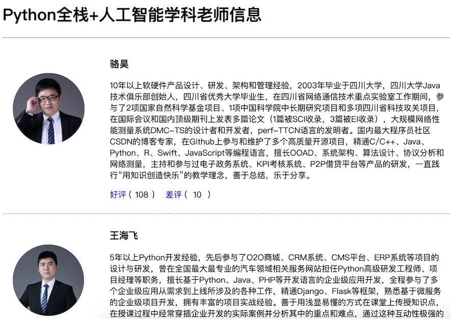

# Django框架笔记

Python 的 WEB 框架有 Django、Tornado、Flask 等多种，Django 相较于其它 WEB 框架其优势为：大而全，框架本身集成了ORM、模型绑定、模板引擎、缓存、Session等诸多功能。

本文将以下方面带大家全面了解 Django 框架，笔者使用的版本为3.1.1。

1. [准备工作](#准备工作)

2. [动态页面](#动态页面)

3. [流程](#Django流程介绍)

4. [基本配置](#Django基本配置)

5. [路由系统](#Django路由系统)
   - [一、命名组(Named groups)](#一、命名组)
   - [二、二级路由(include)](#二、二级路由)
   - [三、添加额外的参数](#三、添加额外的参数)
   - [四、别名的使用](#四、别名的使用)
   - [五、指定view的默认配置](#五、指定view的默认配置)
   
6. [视图view](#Django_Views（视图函数）)
   - [一、HttpRequest对象](#一、HttpRequest对象)
   - [二、HttpResponse对象](#二、HttpResponse对象)
   - [三、render()](#三、render())
   
7. [模板](#模板)
   - [一、模板的执行](#一、模板的执行)
   - [二、模板语言](#二、模板语言)
   - [三、自定义标签](#三、自定义标签)
   
8. [Model](#Model)
   - [一、创建表](#一、创建表)
     - [A.基本结构](#A.基本结构)
     - [B.连表结构](#B.连表结构)
   - [二、操作表](#二、操作表)
     - [A.基本操作](#A.基本操作)
     - [B.进阶操作（了不起的双下划线）](#B.进阶操作（了不起的双下划线）)
     - [C.其他操作](#C.其他操作)
     - [D.连表操作（了不起的双下划线）](#D.连表操作（了不起的双下划线）)
   - [三、上传](#三、上传)
   
9. [中间件](#中间件(MiddleWare))

10. [Form](#Form)
    
    - [Ajax请求](#Ajax请求)
    - [表单的应用](#表单的应用)
    
11. [认证系统](#认证系统(auth))

    - [cookie](#cookie)

    - [session](#session)

12. [CSRF](#跨站请求伪造(csrf))

13. [分页](#分页)

14. [缓存](#缓存)

15. [序列化](#序列化)

16. [报表](#报表)

17. [日志](#日志)

18. [信号](#信号)

19. [admin](#admin)

20. [总结](#总结)


## 准备工作

1、检查 Python 环境：Django 1.11 需要 Python 2.7 或 Python 3.4 以上的版本；Django 2.0 需要 Python 3.4 以上的版本；Django 2.1 需要 Python 3.5 以上的版本。

```sh
python --version
```

2、创建项目文件夹并切换到该目录，例如我们要实例一个OA（办公自动化）项目。

```sh
mkdir oa
cd oa
```

3、创建并激活虚拟环境。

```sh
python3 -m venv venv
# 激活虚拟环境 Linux
source venv/bin/activate
# 激活虚拟环境 Windows
venv\Scripts\activate
```

>说明：上面使用了 Python 自带的 venv 模块完成了虚拟环境的创建，当然也可以使用 virtualenv 或 pipenv 这样的工具。

4、更新包管理工具pip。

```sh
(venv)$ pip install -U pip -i https://pypi.tuna.tsinghua.edu.cn/simple
```

或

```sh
(venv)$ python -m pip install -U pip -i https://pypi.tuna.tsinghua.edu.cn/simple
```

>注意：请注意终端提示符发生的变化，前面的(venv)说明我们已经进入虚拟环境，而虚拟环境下的 python 和 pip 已经是 Python 3 的解释器和包管理工具了。
>
>一般 pip 等插件安装在类似 C:\Users\Administrator\AppData\Local\Programs\Python\Python37-32\Scripts 的目录中，需要将这个目录加入环境变量path，才能方便地使用 pip 命令。

5、安装 Django。

```sh
(venv)$ pip install django -i https://pypi.tuna.tsinghua.edu.cn/simple
```

或指定版本号来安装对应的Django的版本。

```sh
(venv)$ pip install django==2.1.8
```

6、检查 Django 的版本。

```sh
(venv)$ python -m django --version
(venv)$ django-admin --version
```

或

```sh
(venv)$ python
>>> import django
>>> django.get_version()
```

当然，也可以通过 pip 来查看安装的依赖库及其版本，如：

```sh
(venv)$ pip freeze
(venv)$ pip list
```

下图展示了 Django 版本和 Python 版本的对应关系，如果在安装时没有指定版本号，将自动选择最新的版本（在写作这段内容时，Django 最新的版本是2.2）。

| Django版本 | Python版本              |
| ---------- | ----------------------- |
| 1.8        | 2.7、3.2、3.3、3.4、3.5 |
| 1.9、1.10  | 2.7、3.4、3.5           |
| 1.11       | 2.7、3.4、3.5、3.6、3.7 |
| 2.0        | 3.4、3.5、3.6、3.7      |
| 2.1、2.2   | 3.5、3.6、3.7           |

7、使用django-admin创建项目，项目命名为oa。

```sh
(venv)$ django-admin startproject oa .
```

>注意：上面的命令最后的那个点，它表示在当前路径下创建项目。

执行上面的命令后看看生成的文件和文件夹，它们的作用如下所示：

- `manage.py`： 一个让你可以管理Django项目的工具程序。
- `oa/__init__.py`：一个空文件，告诉Python解释器这个目录应该被视为一个Python的包。
- `oa/settings.py`：Django项目的配置文件。
- `oa/urls.py`：Django项目的URL声明（URL映射），就像是你的网站的“目录”。
- `oa/wsgi.py`：项目运行在WSGI兼容Web服务器上的接口文件。

>说明：WSGI全称是Web服务器网关接口，维基百科上给出的解释是“为Python语言定义的[Web服务器](https://zh.wikipedia.org/wiki/%E7%B6%B2%E9%A0%81%E4%BC%BA%E6%9C%8D%E5%99%A8)和[Web应用程序](https://zh.wikipedia.org/wiki/%E7%BD%91%E7%BB%9C%E5%BA%94%E7%94%A8%E7%A8%8B%E5%BA%8F)或框架之间的一种简单而通用的接口”。

8、启动服务器运行项目。

```sh
(venv)$ python manage.py runserver
```

在浏览器中输入 `http://127.0.0.1:8000` 访问我们的服务器

>说明1：刚刚启动的是Django自带的用于开发和测试的服务器，它是一个用纯Python编写的轻量级Web服务器，但它并不是真正意义上的生产级别的服务器，千万不要将这个服务器用于和生产环境相关的任何地方。
>
>说明2：用于开发的服务器在需要的情况下会对每一次的访问请求重新载入一遍Python代码。所以你不需要为了让修改的代码生效而频繁的重新启动服务器。然而，一些动作，比如添加新文件，将不会触发自动重新加载，这时你得自己手动重启服务器。
>
>说明3：可以通过 `python manage.py help` 命令查看可用命令列表；在启动服务器时，也可以通过 `python manage.py runserver 1.2.3.4:5678` 来指定将服务器运行于哪个IP地址和端口。
>
>说明4：可以通过 `Ctrl+C` 来终止服务器的运行。

9、接下来我们修改项目的配置文件 settings.py，Django是一个支持国际化和本地化的框架，因此刚才我们看到的默认首页也是支持国际化的，我们将默认语言修改为中文，时区设置为东八区。

```sh
(venv)$ vim oa/settings.py
```

```py
# 此处省略上面的内容

# 设置语言代码
LANGUAGE_CODE = 'zh-hans'
# 设置时区
TIME_ZONE = 'Asia/Chongqing'

# 此处省略下面的内容
```

10、刷新刚才的页面。


## 动态页面

1、创建名为oa（办公自动化系统）的应用，一个Django项目可以包含一个或多个应用。

```sh
(venv)$ python manage.py startapp oa
```

执行上面的命令会在当前路径下创建oa目录，其目录结构如下所示：

- `__init__.py`：一个空文件，告诉Python解释器这个目录应该被视为一个Python的包。
- `admin.py`：可以用来注册模型，用于在Django的管理界面管理模型。
- `apps.py`：当前应用的配置文件。
- `migrations`：存放与模型有关的数据库迁移信息。
- `__init__.py`：一个空文件，告诉Python解释器这个目录应该被视为一个Python的包。
- `models.py`：存放应用的数据模型，即实体类及其之间的关系（MVC/MTV中的M）。
- `tests.py`：包含测试应用各项功能的测试类和测试函数。
- `views.py`：处理请求并返回响应的函数（MVC中的C，MTV中的V）。

2、修改应用目录下的视图文件views.py。

```sh
(venv)$ vim oa/views.py
```

```python
from django.http import HttpResponse

def index(request):
  return HttpResponse('<h1>Hello, Django!</h1>')
```

3、在应用目录创建一个urls.py文件并映射URL。

```sh
(venv)$ touch oa/urls.py
(venv)$ vim oa/urls.py
```

```python
from django.urls import path
from hrs import views

urlpatterns = [
  path('', views.index, name='index'),
]
```

>说明：上面使用的path函数是Django 2.x中新添加的函数，除此之外还可以使用支持正则表达式的URL映射函数re_path函数；Django 1.x中是用名为url函数来设定URL映射。

4、修改项目目录下的urls.py文件，对应用中设定的URL进行合并。

```sh
(venv) $ vim oa/urls.py
```

```python
from django.contrib import admin
from django.urls import path, include

urlpatterns = [
  path('admin/', admin.site.urls),
  path('oa/', include('oa.urls')),
]
```

>说明：上面的代码通过include函数将oa应用中配置URL的文件包含到项目的URL配置中，并映射到oa/路径下。

5、重新运行项目，并打开浏览器中访问 `http://localhost:8000/oa` 。

```sh
(venv)$ python manage.py runserver
```


## Django流程介绍


MVC是众所周知的模式，即：将应用程序分解成三个组成部分：model（模型），view（视图）和 controller（控制器）。其中：

- M: 管理应用程序的状态（通常存储到数据库中），并约束改变状态的行为（或者叫做“业务规则”）。
- C: 接受外部用户的操作，根据操作访问模型获取数据，并调用“视图”显示这些数据。控制器是将“模型”和“视图”隔离，并成为二者之间的联系纽带。
- V: 负责把数据格式化后呈现给用户。

Django 也是一个MVC框架。但是在 Django 中，控制器接受用户输入的部分由框架自行处理，所以 Django 里更关注的是模型(Model)、模板(Template) 和 视图(Views)，称为 MTV 模式：

- M 代表模型(Model)，即数据存取层。该层处理与数据相关的所有事务：如何存取、如何验证有效性、包含哪些行为以及数据之间的关系等。
- T 代表模板(Template)，即表现层。该层处理与表现相关的决定：如何在页面或其他类型文档中进行显示。
- V 代表视图(View)，即业务逻辑层。该层包含存取模型及调取恰当模板的相关逻辑。 你可以把它看作模型与模板之间的桥梁。

## Django基本配置

一、创建django程序

```sh
# 终端命令：
django-admin startproject sitename  # 在当前目录下创建一个Django程序
# IDE 创建 Django 程序时，本质上都是自动执行上述命令

# 其他常用命令：
python manage.py runserver ip:port  # 启动服务器，默认ip和端口为http://127.0.0.1:8000/
python manage.py startapp appname  # 新建 app
python manage.py syncdb  # 同步数据库命令，Django 1.7及以上版本需要用以下的命令
python manage.py makemigrations  # 显示并记录所有数据的改动
python manage.py migrate  # 将改动更新到数据库
python manage.py createsuperuser  # 创建超级管理员
python manage.py dbshell  # 数据库命令行
python manage.py  # 查看命令列表
```

二、配置文件

A. 数据库

支持SQLite 3（默认）、PostgreSQL 、MySQL、Oracle数据库的操作

```python
# 默认是SQLit 3 的配置
DATABASES = {
    'default': {
        'ENGINE': 'django.db.backends.sqlite3',
        'NAME': os.path.join(BASE_DIR, 'db.sqlite3'),
    }
}

# MySQL的配置
DATABASES = {
    'default': {
    'ENGINE': 'django.db.backends.mysql',
    'NAME':'dbname',   #注意这里的数据库应该以utf-8编码
    'USER': 'xxx',
    'PASSWORD': 'xxx',
    'HOST': '',
    'PORT': '',
    }
}

# 对于python3的使用者们还需要再加一步操作
# 由于Django内部连接MySQL时使用的是MySQLdb模块，而python3中还无此模块，所以需要使用pymysql来代替
  
# 如下设置放置的与project同名的配置的 __init__.py文件中
import pymysql
pymysql.install_as_MySQLdb()


# PostgreSQL配置
DATABASES = {
    'default': {
        'NAME': 'app_data',
        'ENGINE': 'django.db.backends.postgresql_psycopg2',
        'USER': 'XXX',
        'PASSWORD': 'XXX'
    }


# Oracle配置
DATABASES = {
    'default': {
        'ENGINE': 'django.db.backends.oracle',
        'NAME': 'xe',
        'USER': 'a_user',
        'PASSWORD': 'a_password',
        'HOST': '',
        'PORT': '',
    }
}
```

Django框架对于开发者而言高度透明化，对于不同数据库的具体使用方法是一致的，改变数据库类型只需要变动上述配置即可。

查看[更多](https://docs.djangoproject.com/en/1.11/ref/databases/#using-a-3rd-party-database-backend)

B. 静态文件添加

```python
# 首先在项目根目录下创建static目录
# 接着在settings.py 文件下添加
STATIC_URL = '/static/'  # 默认已添加，使用静态文件时的前缀
STATICFILES_DIRS = (
  os.path.join(BASE_DIR,'static'), #行末的逗号不能漏
)
```

这样在template中就可以导入static目录下的静态文件啦。例：

```html
<script src="/static/jquery-1.12.4.js"></script>
```

## Django路由系统

URL 配置(URLconf)就像 Django 所支撑网站的目录。它的本质是 URL 模式以及要为该 URL 模式调用的视图函数之间的映射表；你就是以这种方式告诉 Django，对于这个 URL 调用这段代码，对于那个 URL 调用那段代码。URL 的加载是从配置文件中开始。

参数说明：

- 一个正则表达式字符串
- 一个可调用对象，通常为一个视图函数或一个指定视图函数路径的字符串
- 可选的要传递给视图函数的默认参数（字典形式）
- 一个可选的name参数

示例：

```py
from django.conf.urls import url

from . import views

urlpatterns = [
    url(r'^articles/2003/$', views.special_case_2003),
    url(r'^articles/([0-9]{4})/$', views.year_archive),
    url(r'^articles/([0-9]{4})/([0-9]{2})/$', views.month_archive),
    url(r'^articles/([0-9]{4})/([0-9]{2})/([0-9]+)/$', views.article_detail),
]
```

说明:

- 要捕获从 URL 中的值，用括号括起来，会当参数传入 views 视图。
- 没有必要添加一个斜线，因为每个 URL 都有。例如，它 ^articles 不是 ^/articles。
- 在每个正则表达式字符串前面的'r'是可选的。它告诉 Python 是“原始”字符串 —— 字符串中没有什么要进行转义。

请求示例:

- 一个请求 `/articles/2005/03/` 会匹配上面列表中的第三条. Django 会调用函数 `views.month_archive(request, '2005', '03')`
- `/articles/2005/3/` 不会匹配上面列表中的任何条目, 因为第三条的月份需要二位数字
- `/articles/2003/` 会匹配上第一条而不是第二条，因为匹配是按照从上到下顺序进行的，Django 会调用函数 `views.special_case_2003(request)`
- `/articles/2003` 不会匹配上面列表中的任何条目，因为每个 URL 应该以 `/` 结尾
- `/articles/2003/03/03/` 会匹配最后一条。Django 会调用函数 `views.article_detail(request, '2003', '03', '03')`

### 一、命名组

在上面的简单例子中，并没有使用正则表达式分组，在更高级的用法中，很有可能使用正则分组来匹配 URL 并且将分组值通过参数传递给 view 函数。

在 Python 的正则表达式中，分组的语法是 `(?P<name>pattern)`, name 表示分组名，pattern 表示一些匹配正则。

这里是一个简单的小例子：

```py
# 正则知识
import re

ret=re.search('(?P<id>\d{3})/(?P<name>\w{3})','weeew34ttt123/ooo')

print(ret.group())
print(ret.group('id'))
print(ret.group('name'))
-------------------------------------
123/ooo
123
ooo


from django.conf.urls import url
from . import views

urlpatterns = [
    url(r'^articles/2003/$', views.special_case_2003),
    url(r'^articles/(?P<year>[0-9]{4})/$', views.year_archive),
    url(r'^articles/(?P<year>[0-9]{4})/(?P<month>[0-9]{2})/$', views.month_archive),
    url(r'^articles/(?P<year>[0-9]{4})/(?P<month>[0-9]{2})/(?P<day>[0-9]{2})/$', views.article_detail),
]
```

For example:

- A request to `/articles/2005/03/` 会调用函数 `views.month_archive(request, year='2005', month='03')`，而不是 `views.month_archive(request, '2005', '03')`
- A request to `/articles/2003/03/03/` 会调用函数 `views.article_detail(request, year='2003', month='03', day='03')`

常见写法：

```py
urlpatterns = [
    url(r'^index/(?P<id>\d{3})/(?P<name>\w+)/$', views.index)
]

def index(req, id, name)
    print(id, name)
    return render(req, "index.html")
```

### 二、二级路由

那如果映射 url 太多怎么办，全写一个在 urlpatterns 显得繁琐，so 二级路由应用而生

```py
from django.conf.urls import include, url

from apps.main import views as main_views
from credit import views as credit_views

extra_patterns = [
    url(r'^reports/$', credit_views.report),
    url(r'^reports/(?P<id>[0-9]+)/$', credit_views.report),
    url(r'^charge/$', credit_views.charge),
]

urlpatterns = [
    url(r'^$', main_views.homepage),
    url(r'^help/', include('apps.help.urls')),
    url(r'^credit/', include(extra_patterns)),
]
```

在上面这个例子中，如果请求url为 `/credit/reports/` 则会调用函数 `credit_views.report()`

使用二级路由也可以减少代码冗余，使代码更加简洁易懂

```py
# 原始版本
from django.conf.urls import url
from . import views

urlpatterns = [
    url(r'^(?P<page_slug>[\w-]+)-(?P<page_id>\w+)/history/$', views.history),
    url(r'^(?P<page_slug>[\w-]+)-(?P<page_id>\w+)/edit/$', views.edit),
    url(r'^(?P<page_slug>[\w-]+)-(?P<page_id>\w+)/discuss/$', views.discuss),
    url(r'^(?P<page_slug>[\w-]+)-(?P<page_id>\w+)/permissions/$', views.permissions),
]


# 改进版本
from django.conf.urls import include, url
from . import views

urlpatterns = [
    url(r'^(?P<page_slug>[\w-]+)-(?P<page_id>\w+)/', include([
        url(r'^history/$', views.history),
        url(r'^edit/$', views.edit),
        url(r'^discuss/$', views.discuss),
        url(r'^permissions/$', views.permissions),
    ])),
]
```

### 三、添加额外的参数

URLconfs 有一个钩子可以让你加入一些额外的参数到 view 函数中

```py
from django.conf.urls import url
from . import views

urlpatterns = [
    url(r'^blog/(?P<year>[0-9]{4})/$', views.year_archive, {'foo': 'bar'}),
]
```

在上面的例子中，如果一个请求为 `/blog/2005/`，Django 将会调用函数 `views.year_archive(request, year='2005', foo='bar')`

需要注意的是，当你加上参数时，对应函数 `views.year_archive` 必须加上一个参数，参数名也必须命名为 foo，如下：

```py
def year_archive(request, foo):
    print(foo)
    return render(request, 'index.html')
```

### 四、别名的使用

```py
url(r'^index', views.index, name='bieming')
```

url 中还支持 name 参数的配置，如果配置了 name 属性，在模板的文件中就可以使用 name 值来代替相应的 url 值。

我们来看一个例子：

```py
urlpatterns = [
    url(r'^index',views.index,name='bieming'),
    url(r'^admin/', admin.site.urls),
    # url(r'^articles/2003/$', views.special_case_2003),
    url(r'^articles/([0-9]{4})/$', views.year_archive),
    # url(r'^articles/([0-9]{4})/([0-9]{2})/$', views.month_archive),
    # url(r'^articles/([0-9]{4})/([0-9]{2})/([0-9]+)/$', views.article_detail),
]

## ------------------------------------------------------

def index(req):
  if req.method=='POST':
    username=req.POST.get('username')
    password=req.POST.get('password')
    if username=='alex' and password=='123':
      return HttpResponse("登陆成功")

  return render(req,'index.html')

## ------------------------------------------------------
```

```html
<!DOCTYPE html>
<html lang="en">
<head>
    <meta charset="UTF-8">
    <title>Title</title>
</head>
<body>
{#  <form action="/index/" method="post">#}
{#  这里只要使用bieming即可代替/index #}
    <form action="" method="post">
        用户名:<input type="text" name="username">
        密码:<input type="password" name="password">
        <input type="submit" value="submit">
    </form>
</body>
</html>
```

### 五、指定view的默认配置

```py
# URLconf
from django.conf.urls import url

from . import views

urlpatterns = [
    url(r'^blog/$', views.page),
    url(r'^blog/page(?P<num>[0-9]+)/$', views.page),
]

# View (in blog/views.py)
def page(request, num="1"):
    # Output the appropriate page of blog entries, according to num.
    ...
```

在上述的例子中，两个 URL 模式指向同一个视图 views.page，但第一个不捕获 URL 中任何东西。如果第一个模式匹配，该 page() 函数将使用它的默认参数 `num = "1"`。如果第二图案相匹配时，page() 将使用任何由正则表达式捕获的 num 值。

## Django_Views（视图函数）

http请求中产生两个核心对象：

- http请求：HttpRequest对象
- http响应：HttpResponse对象

### 一、HttpRequest对象

当请求一个页面时，Django 创建一个 `HttpRequest` 对象包含原数据的请求。然后 Django 加载适当的视图，通过 `HttpRequest` 作为视图函数的第一个参数。每个视图负责返回一个 `HttpResponse` 目标。

- path：请求页面的全路径，不包括域名
- method：请求中使用的 HTTP 方法的字符串表示。全大写表示。例如
  
  ```py
  if  req.method=="GET":
    do_something()
  elseif req.method=="POST":
    do_something_else()
  ```

- GET: 包含所有 HTTP GET 参数的类字典对象
- POST：包含所有 HTTP POST 参数的类字典对象
  
  服务器收到空的 POST 请求的情况也是可能发生的，也就是说，表单 form 通过 HTTP POST 方法提交请求，但是表单中可能没有数据，因此不能使用 `if req.POST` 来判断是否使用了 HTTP POST 方法；应该使用 `if req.method=="POST"`
- COOKIES: 包含所有 cookies 的标准 Python 字典对象；keys 和 values 都是字符串。
- FILES：包含所有上传文件的类字典对象；FILES 中的每一个 Key 都是 `<input type="file" name="" />`标签中 name 属性的值，FILES 中的每一个 value 同时也是一个标准的 python 字典对象，包含下面三个 Keys：
  1. filename: 上传文件名，用字符串表示
  2. content_type: 上传文件的Content Type
  3. content: 上传文件的原始内容
- user：是一个 `django.contrib.auth.models.User` 对象，代表当前登陆的用户。如果访问用户当前没有登陆，user 将被初始化为 django.contrib.auth.models.AnonymousUser 的实例。你可以通过 user 的 is_authenticated() 方法来辨别用户是否登陆：`if req.user.is_authenticated();` 只有激活 Django 中的 `AuthenticationMiddleware` 时该属性才可用
- session：唯一可读写的属性，代表当前会话的字典对象；自己有激活 Django 中的 session 支持时该属性才可用。
- META：一个标准的 Python 字典包含所有可用的 HTTP 头。可用标题取决于客户端和服务器，这里是一些例子：
  - CONTENT_LENGTH：请求体的长度（一个字符串）
  - CONTENT_TYPE：请求体的类型。
  - HTTP_ACCEPT：为响应–可以接受的内容类型。
  - HTTP_ACCEPT_ENCODING：接受编码的响应
  - HTTP_ACCEPT_LANGUAGE：接受语言的反应
  - HTTP_HOST：客户端发送的HTTP主机头。
  - HTTP_REFERER：参考页面
  - HTTP_USER_AGENT：客户端的用户代理字符串。
  - QUERY_STRING：查询字符串，作为一个单一的（分析的）字符串。
  - REMOTE_ADDR：客户端的IP地址
  - REMOTE_HOST：客户端的主机名
  - REMOTE_USER：用户通过Web服务器的身份验证。
  - REQUEST_METHOD：字符串，如"GET"或"POST"
  - SERVER_NAME：服务器的主机名
  - SERVER_PORT：服务器的端口（一个字符串）

### 二、HttpResponse对象

对于 HttpRequest 对象来说，是由 django 自动创建的，但是，HttpResponse对象就必须我们自己创建。每个 view 请求处理方法必须返回一个 HttpResponse 对象。

在 HttpResponse 对象上扩展的常用方法：

- 页面渲染：render（推荐），render_to_response
- 页面跳转：redirect
- locals：可以直接将对应视图函数中所有的变量传给模板

值得注意的是对于页面渲染的方法中，render 和 render_to_response 使用方法和功能类似，但是 render 功能更为强大，推荐使用

### 三、render()

```py
# 结合给定的模板与一个给定的上下文，返回一个字典HttpResponse在渲染文本对象
render(request, template_name, context=None, content_type=None, status=None, using=None)[source]
```

所需的参数：

- template_name：一个模板的使用或模板序列名称全称。如果序列是给定的，存在于第一个模板将被使用。

可选参数：

- context: 一组字典的值添加到模板中。默认情况下，这是一个空的字典。
- content_type: MIME类型用于生成文档。
- status: 为响应状态代码。默认值为200
- using: 这个名字一个模板引擎的使用将模板。

```py
from django.shortcuts import render

def my_view(request):
  # View code here...
  return render(request, 'myapp/index.html',
      { 'foo': 'bar' },
      content_type='application/xhtml+xml')
```

## 模板

通过拼接 HTML 代码的方式生成动态视图的做法在实际开发中是不能接受的，这一点大家一定能够想到。

为了解决这个问题，我们可以提前准备一个模板页，所谓模板页就是一个带占位符的 HTML 页面，当我们将程序中获得的数据替换掉页面中的占位符时，一个动态页面就产生了。

我们可以用 Django 框架中 template 模块的 `Template` 类创建模板对象，通过模板对象的 `render` 方法实现对模板的渲染，在 Django 框架中还有一个名为 `render` 的便捷函数可以来完成渲染模板的操作。

所谓的渲染就是用数据替换掉模板页中的占位符，当然这里的渲染称为后端渲染，即在服务器端完成页面的渲染再输出到浏览器中，这种做法的主要坏处是当并发访问量较大时，服务器会承受较大的负担，所以今天有很多的 Web 应用都使用了前端渲染，即服务器只提供所需的数据（通常是 JSON 格式），在浏览器中通过 JavaScript 获取这些数据并渲染到页面上，这个我们在后面的内容中会讲到。

### 一、模板的执行

模版的创建过程，对于模版，其实就是读取模版（其中嵌套着模版标签），然后将 Model 中获取的数据插入到模版中，最后将信息返回给用户。

view.py

```py
def index(request):
  return render(request, 'index.html', {'title':'welcome'})
```

index.html

```html
<!DOCTYPE html>
<html lang="en">
<head>
  <meta charset="UTF-8">
  <title>Title</title>
</head>
<body>
  <div>
    <h1>{{ title }}</h1>
  </div>
</body>
```

### 二、模板语言

模板中也有自己的语言，该语言可以实现数据展示

- {{ item }}

-   <a>{{ item }}</a>  

  forloop.counter  
  forloop.first  
  forloop.last

-    

- 母板：  
    
  子板：  
    
  

- 帮助方法：  
  {{ item.event_start|date:"Y-m-d H:i:s"}}  
  {{ bio|truncatewords:"30" }}  
  {{ my_list|first|upper }}  
  {{ name|lower }}  

小知识点：在模板语言中字典数据类型的取值是通过 `dict.xxx` 而不是 `dict[xxx]`

### 三、自定义标签

因为在模板语言中不能够做运算等一些稍显复杂的操作，所以在Django中提供了两种自定制标签，一种是simple_tag，一种是filter。

- simple_tag: 任意传递参数，但是不能用作布尔判断
- filter: 最多只能传递二个参数，可以用作布尔判断

在这里着重介绍simple_tag类型，filter的实现类似

1. 在app中创建templatetags模块
2. 创建任意 .py 文件，如：xx.py

   ```python
   #!/usr/bin/env python
   #coding:utf-8
   from django import template
   from django.utils.safestring import mark_safe
   from django.template.base import resolve_variable, Node, TemplateSyntaxError

   register = template.Library()

   @register.simple_tag
   def my_simple_time(v1,v2,v3):
     return  v1 + v2 + v3

   @register.simple_tag
   def my_input(id,arg):
     result = "<input type='text' id='%s' class='%s' />" %(id,arg,)
     return mark_safe(result)
   ```

3. 在使用自定义 simple_tag 的 html 文件中导入之前创建的 xx.py 文件名
  
   ```html
   
   ```

4. 使用simple_tag
  
   ```html
   
   
   ```

5. 在 settings 中配置当前app，不然 django 无法找到自定义的 simple_tag

   ```python
   INSTALLED_APPS = (
    'django.contrib.admin',
    'django.contrib.auth',
    'django.contrib.contenttypes',
    'django.contrib.sessions',
    'django.contrib.messages',
    'django.contrib.staticfiles',
    'app01',
   )
   ```

更多见文档：[https://docs.djangoproject.com/en/1.10/ref/templates/language/](https://docs.djangoproject.com/en/1.10/ref/templates/language/)

## Model

MVC 架构追求的是“模型”和“视图”的解耦合。所谓“模型”说得更直白一些就是数据（的表示），所以通常也被称作“数据模型”。

在实际的项目中，数据模型通常通过数据库实现持久化操作，而关系型数据库在过去和当下都是持久化的首选方案，下面我们以 MySQL 为例来说明如何使用关系型数据库来实现持久化操作。

Django提供了一个抽象层(Model)来构建和管理Web应用程序的数据。django中遵循 Code Frist 的原则，即：根据代码中定义的类来自动生成数据库表。关系对象映射（Object Relational Mapping，简称ORM）。

**配置关系型数据库MySQL**

我们继续来完善 OA 项目，首先从配置项目使用的数据库开始。

1、修改项目的 settings.py 文件，首先将我们之前创建的应用 hrs 添加已安装的项目中，然后配置 MySQL 作为持久化方案。

```sh
(venv)$ vim oa/settings.py
```

```py
# 此处省略上面的代码
INSTALLED_APPS = [
  'django.contrib.admin',
  'django.contrib.auth',
  'django.contrib.contenttypes',
  'django.contrib.sessions',
  'django.contrib.messages',
  'django.contrib.staticfiles',
  'hrs'
]

DATABASES = {
  'default': {
    'ENGINE': 'django.db.backends.mysql',
    'NAME': 'oa',
    'HOST': '127.0.0.1',
    'PORT': 3306,
    'USER': 'root',
    'PASSWORD': '123456',
  }
}
# 此处省略下面的代码
```

在配置ENGINE属性时，常用的可选值包括：

- django.db.backends.sqlite3'：SQLite嵌入式数据库。
- django.db.backends.postgresql'：BSD许可证下发行的开源关系型数据库产品。
- django.db.backends.mysql'：转手多次目前属于甲骨文公司的经济高效的数据库产品。
- django.db.backends.oracle'：甲骨文公司的关系型数据库旗舰产品。

其他的配置可以参考官方文档中[数据库配置](https://docs.djangoproject.com/zh-hans/2.0/ref/databases/#third-party-notes)的部分。

`NAME` 属性代表数据库的名称，如果使用 SQLite 它对应着一个文件，在这种情况下 `NAME` 的属性值应该是一个绝对路径；使用其他关系型数据库，则要配置对应的 `HOST（主机）`、`PORT（端口）`、`USER（用户名）`、`PASSWORD（口令）`等属性。

2、安装 Python 操作 MySQL 的依赖库，Python3 中通常使用 PyMySQL，Python2 中通常用 MySQLdb。

```sh
(venv)$ pip install pymysql -i https://pypi.tuna.tsinghua.edu.cn/simple
```

如果使用 Python3 需要修改项目目录下的 `__init__.py` 文件并加入如下所示的代码，这段代码的作用是将 PyMySQL 视为 MySQLdb 来使用，从而避免 Django 找不到连接 MySQL 的客户端工具而询问你："Did you install mysqlclient?"（你安装了 mysqlclient 吗？）。

```py
import pymysql

pymysql.install_as_MySQLdb()
```

3、如果之前没有为应用程序创建数据库，那么现在是时候创建名为 oa 的数据库了。在 MySQL 中创建数据库的 SQL 语句如下所示：

```sql
create database oa default charset utf8;
```

4、Django 框架本身有自带的数据模型，我们稍后会用到这些模型，为此我们先做一次迁移操作。所谓迁移，就是根据模型自动生成关系数据库中的二维表，命令如下所示：

```sh
(venv)$ python manage.py migrate
Operations to perform:
Apply all migrations: admin, auth, contenttypes, sessions
Running migrations:
  Applying contenttypes.0001_initial... OK
  Applying auth.0001_initial... OK
  Applying admin.0001_initial... OK
  Applying admin.0002_logentry_remove_auto_add... OK
  Applying contenttypes.0002_remove_content_type_name... OK
  Applying auth.0002_alter_permission_name_max_length... OK
  Applying auth.0003_alter_user_email_max_length... OK
  Applying auth.0004_alter_user_username_opts... OK
  Applying auth.0005_alter_user_last_login_null... OK
  Applying auth.0006_require_contenttypes_0002... OK
  Applying auth.0007_alter_validators_add_error_messages... OK
  Applying auth.0008_alter_user_username_max_length... OK
  Applying auth.0009_alter_user_last_name_max_length... OK
  Applying sessions.0001_initial... OK
```

5、接下来，我们为自己的应用创建数据模型。如果要在 hrs 应用中实现对部门和员工的管理，我们可以先创建部门和员工数据模型，代码如下所示。

```sh
(venv)$ vim hrs/models.py
```

```py
from django.db import models

class Dept(models.Model):
  """部门类"""
  no = models.IntegerField(primary_key=True, db_column='dno', verbose_name='部门编号')
  name = models.CharField(max_length=20, db_column='dname', verbose_name='部门名称')
  location = models.CharField(max_length=10, db_column='dloc', verbose_name='部门所在地')

  class Meta:
    db_table = 'tb_dept'


class Emp(models.Model):
  """员工类"""
  no = models.IntegerField(primary_key=True, db_column='eno', verbose_name='员工编号')
  name = models.CharField(max_length=20, db_column='ename', verbose_name='员工姓名')
  job = models.CharField(max_length=10, verbose_name='职位')
  # 多对一外键关联(自参照)
  mgr = models.ForeignKey('self', on_delete=models.SET_NULL, null=True, blank=True, verbose_name='主管')
  sal = models.DecimalField(max_digits=7, decimal_places=2, verbose_name='月薪')
  comm = models.DecimalField(max_digits=7, decimal_places=2, null=True, blank=True, verbose_name='补贴')
  # 多对一外键关联(参照部门模型)
  dept = models.ForeignKey(Dept, db_column='dno', on_delete=models.PROTECT, verbose_name='所在部门')

  class Meta:
    db_table = 'tb_emp'
```

>说明：上面定义模型时使用了字段类及其属性，其中 IntegerField 对应数据库中的 integer 类型，CharField 对应数据库的 varchar 类型，DecimalField 对应数据库的 decimal 类型，ForeignKey 用来建立多对一外键关联。
>
>字段属性 primary_key 用于设置主键，max_length 用来设置字段的最大长度，db_column 用来设置数据库中与字段对应的列，verbose_name 则设置了 Django 后台管理系统中该字段显示的名称。如果对这些东西感到很困惑也不要紧，文末提供了字段类、字段属性、元数据选项等设置的相关说明，不清楚的读者可以稍后查看对应的参考指南。

6、再次执行迁移操作，先通过模型生成迁移文件，再执行迁移创建二维表。

```sh
(venv)$ python manage.py makemigrations hrs
Migrations for 'hrs':
  hrs/migrations/0001_initial.py
    - Create model Dept
    - Create model Emp
(venv)$ python manage.py migrate
Operations to perform:
  Apply all migrations: admin, auth, contenttypes, hrs, sessions
Running migrations:
  Applying hrs.0001_initial... OK
```

### 一、创建表

#### A.基本结构

```py
from django.db import models

class userinfo(models.Model):
    name = models.CharField(max_length=30)
    email = models.EmailField()
    memo = models.TextField()
```

更多参数：

- `null=True`: 数据库中字段是否可以为空
- `blank=True`: django的 Admin 中添加数据时是否可允许空值
- `primary_key = False`: 主键，对 AutoField 设置主键后，就会代替原来的自增 id 列
- `auto_now`: 自动创建，无论添加或修改，都是当前操作的时间
- `auto_now_add`: 自动创建，永远是创建时的时间
- `choices`
  
  ```py
  GENDER_CHOICE = (
    (u'M', u'Male'),
    (u'F', u'Female'),
  )
  gender = models.CharField(max_length=2,choices = GENDER_CHOICE)
  ```

- `max_length`
- `default`: 默认值
- `verbose_name`: Admin中字段的显示名称
- `name|db_column`: 数据库中的字段名称
- `unique=True`: 不允许重复
- `db_index = True`: 数据库索引
- `editable=True`: 在Admin里是否可编辑
- `error_messages=None`: 错误提示
- `auto_created=False`: 自动创建
- `help_text`: 在Admin中提示帮助信息
- `validators=[]`
- `upload-to`

更多字段：

- `models.AutoField`: 自增列 = int(11)

  如果没有的话，默认会生成一个名称为 id 的列，如果要显示的自定义一个自增列，必须将给列设置为主键 `primary_key=True`。

- `models.CharField`: 字符串字段，必须 max_length 参数
- `models.BooleanField`: 布尔类型=tinyint(1)，不能为空，Blank=True
- `models.ComaSeparatedIntegerField`: 用逗号分割的数字=varchar，继承CharField，所以必须 max_lenght 参数
- `models.DateField`: 日期类型 date

  对于参数，`auto_now = True` 则每次更新都会更新这个时间；auto_now_add 则只是第一次创建添加，之后的更新不再改变。

- `models.DateTimeField`: 日期类型 datetime，同DateField的参数
- `models.Decimal`: 十进制小数类型 = decimal，必须指定整数位max_digits和小数位decimal_places
- `models.EmailField`: 字符串类型（正则表达式邮箱）= varchar，对字符串进行正则表达式
- `models.FloatField`: 浮点类型 = double
- `models.IntegerField`: 整形
- `models.BigIntegerField`: 长整形
  
  ```py
  integer_field_ranges = {
    'SmallIntegerField': (-32768, 32767),
    'IntegerField': (-2147483648, 2147483647),
    'BigIntegerField': (-9223372036854775808, 9223372036854775807),
    'PositiveSmallIntegerField': (0, 32767),
    'PositiveIntegerField': (0, 2147483647),
  }
  ```

- `models.IPAddressField`: 字符串类型（ip4正则表达式）
- `models.GenericIPAddressField`: 字符串类型（ip4和ip6是可选的）

  参数protocol可以是：both、ipv4、ipv6，验证时，会根据设置报错

- `models.NullBooleanField`: 允许为空的布尔类型
- `models.PositiveIntegerFiel`: 正Integer
- `models.PositiveSmallIntegerField`: 正smallInteger
- `models.SlugField`: 减号、下划线、字母、数字
- `models.SmallIntegerField`: 数字，数据库中的字段有：tinyint、smallint、int、bigint
- `models.TextField`: 字符串=longtext
- `models.TimeField`: 时间 HH:MM[:ss[.uuuuuu]]
- `models.URLField`: 字符串，地址正则表达式
- `models.BinaryField`: 二进制
- `models.ImageField`: 图片

元信息：

```py
class UserInfo(models.Model):
    nid = models.AutoField(primary_key=True)
    username = models.CharField(max_length=32)
    class Meta:
        # 数据库中生成的表名称 默认 app名称 + 下划线 + 类名
        db_table = "table_name"

        # 联合索引
        index_together = [
            ("pub_date", "deadline"),
        ]

        # 联合唯一索引
        unique_together = (("driver", "restaurant"),)

        # admin中显示的表名称
        verbose_name

        # verbose_name加s
        verbose_name_plural
```

更多：[https://docs.djangoproject.com/en/1.10/ref/models/options/](https://docs.djangoproject.com/en/1.10/ref/models/options/)

拓展知识：

1. 触发 Model 中的验证和错误提示有两种方式：

   - Django Admin 中的错误信息会优先根据 Admin 内部的 ModelForm 错误信息提示，如果都成功，才来检查 Model 的字段并显示指定错误信息
   - 调用 Model 对象的 clean_fields 方法，如：

   ```py
   # models.py
   class UserInfo(models.Model):
      nid = models.AutoField(primary_key=True)
      username = models.CharField(max_length=32)
      email = models.EmailField(error_messages={'invalid': '格式错了.'})

   # views.py
   def index(request):
      obj = models.UserInfo(username='11234', email='uu')
      try:
          print(obj.clean_fields())
          except Exception as e:
              print(e)
          return HttpResponse('ok')

   # Model的clean方法是一个钩子，可用于定制操作，如：上述的异常处理。
   ```

2. Admin中修改错误提示

   ```py
   # admin.py
   from django.contrib import admin
   from model_club import models
   from django import forms

   class UserInfoForm(forms.ModelForm):
      username = forms.CharField(error_messages={'required': '用户名不能为空.'})
      email = forms.EmailField(error_messages={'invalid': '邮箱格式错误.'})
      age = forms.IntegerField(initial=1, error_messages={'required': '请输入数值.', 'invalid': '年龄必须为数值.'})

      class Meta:
          model = models.UserInfo
          # fields = ('username',)
          fields = "__all__"

   class UserInfoAdmin(admin.ModelAdmin):
      form = UserInfoForm

   admin.site.register(models.UserInfo, UserInfoAdmin)
   ```

#### B.连表结构

- 一对多：models.ForeignKey（其他表）
- 多对多：models.ManyToManyField（其他表）
- 一对一：models.OneToOneField（其他表）

应用场景：

- 一对多：当一张表中创建一行数据时，有一个单选的下拉框（可以被重复选择）

  例如：创建用户信息时候，需要选择一个用户类型【普通用户】【金牌用户】【铂金用户】等。

- 多对多：在某表中创建一行数据时，有一个可以多选的下拉框

  例如：创建用户信息，需要为用户指定多个爱好

- 一对一：在某表中创建一行数据时，有一个单选的下拉框（下拉框中的内容被用过一次就消失了

  例如：原有含10列数据的一张表保存相关信息，经过一段时间之后，10列无法满足需求，需要为原来的表再添加5列数据

字段以及参数：

```python
ForeignKey(ForeignObject)   # ForeignObject(RelatedField)
to,                         # 要进行关联的表名
to_field=None,              # 要关联的表中的字段名称
on_delete=None,             # 当删除关联表中的数据时，当前表与其关联的行的行为
```

- models.CASCADE: 删除关联数据，与之关联也删除
- models.DO_NOTHING: 删除关联数据，引发错误IntegrityError
- models.PROTECT: 删除关联数据，引发错误ProtectedError
- models.SET_NULL: 删除关联数据，与之关联的值设置为null（前提FK字段需要设置为可空）
- models.SET_DEFAULT: 删除关联数据，与之关联的值设置为默认值（前提FK字段需要设置默认值）
- models.SET: 删除关联数据，

  - 与之关联的值设置为指定值，设置：`models.SET(值)`  
  - 与之关联的值设置为可执行对象的返回值，设置：`models.SET(可执行对象)`

```py
def func():
  return 10

class MyModel(models.Model):
  user = models.ForeignKey(
    to="User",
    to_field="id"
    on_delete=models.SET(func),)
# 反向操作时，使用的字段名，用于代替【表名_set】。如：obj.表名_set.all()
related_name=None
# 反向操作时，使用的连接前缀，用于替换【表名】。如：
# models.UserGroup.objects.filter(表名__字段名=1).values('表名__字段名')
related_query_name=None
# 在 Admin 或 ModelForm 中显示关联数据时，提供的条件
limit_choices_to=None
# 如：
limit_choices_to={'nid__gt': 5}
limit_choices_to=lambda : {'nid__gt': 5}

from django.db.models import Q
- limit_choices_to=Q(nid__gt=10)
- limit_choices_to=Q(nid=8) | Q(nid__gt=10)
- limit_choices_to=lambda : Q(Q(nid=8) | Q(nid__gt=10)) & Q(caption='root')
db_constraint=True    # 是否在数据库中创建外键约束
parent_link=False     # 在Admin中是否显示关联数据

OneToOneField(ForeignKey)
to,                   # 要进行关联的表名
to_field=None         # 要关联的表中的字段名称
on_delete=None,       # 当删除关联表中的数据时，当前表与其关联的行的行为
```

**对于一对一**

1、一对一其实就是 一对多 + 唯一索引  
2、当两个类之间有继承关系时，默认会创建一个一对一字段

```py
# 如下会在A表中额外增加一个c_ptr_id列且唯一：
class C(models.Model):
  nid = models.AutoField(primary_key=True)
  part = models.CharField(max_length=12)

class A(C):
  id = models.AutoField(primary_key=True)
  code = models.CharField(max_length=1)

ManyToManyField(RelatedField)
to,                         # 要进行关联的表名
related_name=None,          # 反向操作时，使用的字段名，用于代替【表名_set】 如：obj.表名_set.all()
related_query_name=None,    # 反向操作时，使用的连接前缀，用于替换【表名】 如： models.UserGroup.objects.filter(表名__字段名=1).values('表名__字段名')
limit_choices_to=None,      # 在Admin或ModelForm中显示关联数据时，提供的条件。如：
- limit_choices_to={'nid__gt': 5}
- limit_choices_to=lambda : {'nid__gt': 5}

from django.db.models import Q
- limit_choices_to=Q(nid__gt=10)
- limit_choices_to=Q(nid=8) | Q(nid__gt=10)
- limit_choices_to=lambda : Q(Q(nid=8) | Q(nid__gt=10)) & Q(caption='root')
symmetrical=None,    # 仅用于多对多自关联时，symmetrical用于指定内部是否创建反向操作的字段
# 做如下操作时，不同的symmetrical会有不同的可选字段
models.BB.objects.filter(...)

# 可选字段有：code, id, m1
class BB(models.Model):

code = models.CharField(max_length=12)
m1 = models.ManyToManyField('self',symmetrical=True)

# 可选字段有: bb, code, id, m1
class BB(models.Model):

code = models.CharField(max_length=12)
m1 = models.ManyToManyField('self',symmetrical=False)

through=None,         # 自定义第三张表时，使用字段用于指定关系表
through_fields=None,  # 自定义第三张表时，使用字段用于指定关系表中那些字段做多对多关系表

from django.db import models

class Person(models.Model):
  name = models.CharField(max_length=50)

class Group(models.Model):
  name = models.CharField(max_length=128)
  members = models.ManyToManyField(
    Person,
    through='Membership',
    through_fields=('group', 'person'),
  )

class Membership(models.Model):
  group = models.ForeignKey(Group, on_delete=models.CASCADE)
  person = models.ForeignKey(Person, on_delete=models.CASCADE)
  inviter = models.ForeignKey(
    Person,
    on_delete=models.CASCADE,
    related_name="membership_invites",
  )
  invite_reason = models.CharField(max_length=64)

db_constraint=True,         # 是否在数据库中创建外键约束
db_table=None,              # 默认创建第三张表时，数据库中表的名称
```

### 二、操作表

#### A.基本操作

```py
# 增
# 增加一条数据，可以接受字典类型数据 **kwargs
models.Tb1.objects.create(c1='xx', c2='oo')
obj = models.Tb1(c1='xx', c2='oo')
obj.save()

# 查
# 获取单条数据，不存在则报错（不建议）
models.Tb1.objects.get(id=123)
# 获取全部
models.Tb1.objects.all()
# 获取指定条件的数据
models.Tb1.objects.filter(name='seven')

# 删
# 删除指定条件的数据
models.Tb1.objects.filter(name='seven').delete()

# 改
# 将指定条件的数据更新，均支持 **kwargs
models.Tb1.objects.filter(name='seven').update(gender='0')
obj = models.Tb1.objects.get(id=1)
obj.c1 = '111'
# 修改单条数据
obj.save()
```

#### B.进阶操作（了不起的双下划线）

利用双下划线将字段和对应的操作连接起来

```py
# 获取个数
models.Tb1.objects.filter(name='seven').count()

# 大于，小于
models.Tb1.objects.filter(id__gt=1)            # 获取id大于1的值
models.Tb1.objects.filter(id__gte=1)           # 获取id大于等于1的值
models.Tb1.objects.filter(id__lt=10)           # 获取id小于10的值
models.Tb1.objects.filter(id__lte=10)          # 获取id小于10的值
models.Tb1.objects.filter(id__lt=10, id__gt=1) # 获取id大于1且小于10的值

# in
# 获取id等于11、22、33的数据
models.Tb1.objects.filter(id__in=[11, 22, 33])
# not in
models.Tb1.objects.exclude(id__in=[11, 22, 33])

# isnull
Entry.objects.filter(pub_date__isnull=True)

# contains
models.Tb1.objects.filter(name__contains="ven")
models.Tb1.objects.filter(name__icontains="ven") # icontains大小写不敏感
models.Tb1.objects.exclude(name__icontains="ven")

# range
models.Tb1.objects.filter(id__range=[1, 2])   # 范围bettwen and

# 其他类似
# startswith，istartswith, endswith, iendswith,

# order by
models.Tb1.objects.filter(name='seven').order_by('id')    # asc
models.Tb1.objects.filter(name='seven').order_by('-id')   # desc

# group by
from django.db.models import Count, Min, Max, Sum
models.Tb1.objects.filter(c1=1).values('id').annotate(c=Count('num'))
# SELECT "app01_tb1"."id", COUNT("app01_tb1"."num") AS "c" FROM "app01_tb1" WHERE "app01_tb1"."c1" = 1 GROUP BY "app01_tb1"."id"

# limit 、offset
models.Tb1.objects.all()[10:20]

# regex正则匹配，iregex 不区分大小写
Entry.objects.get(title__regex=r'^(An?|The) +')
Entry.objects.get(title__iregex=r'^(an?|the) +')

# date
Entry.objects.filter(pub_date__date=datetime.date(2005, 1, 1))
Entry.objects.filter(pub_date__date__gt=datetime.date(2005, 1, 1))

# year
Entry.objects.filter(pub_date__year=2005)
Entry.objects.filter(pub_date__year__gte=2005)

# month
Entry.objects.filter(pub_date__month=12)
Entry.objects.filter(pub_date__month__gte=6)

# day
Entry.objects.filter(pub_date__day=3)
Entry.objects.filter(pub_date__day__gte=3)

# week_day
Entry.objects.filter(pub_date__week_day=2)
Entry.objects.filter(pub_date__week_day__gte=2)

# hour
Event.objects.filter(timestamp__hour=23)
Event.objects.filter(time__hour=5)
Event.objects.filter(timestamp__hour__gte=12)

# minute
Event.objects.filter(timestamp__minute=29)
Event.objects.filter(time__minute=46)
Event.objects.filter(timestamp__minute__gte=29)

# second
Event.objects.filter(timestamp__second=31)
Event.objects.filter(time__second=2)
Event.objects.filter(timestamp__second__gte=31)
```

#### C.其他操作

```py
# extra
extra(self, select=None, where=None, params=None, tables=None, order_by=None, select_params=None)
Entry.objects.extra(select={'new_id': "select col from sometable where othercol > %s"}, select_params=(1,))
Entry.objects.extra(where=['headline=%s'], params=['Lennon'])
Entry.objects.extra(where=["foo='a' OR bar = 'a'", "baz = 'a'"])
Entry.objects.extra(select={'new_id': "select id from tb where id > %s"}, select_params=(1,), order_by=['-nid'])

# F
from django.db.models import F
models.Tb1.objects.update(num=F('num')+1)

# Q
# 方式一：
Q(nid__gt=10)
Q(nid=8) | Q(nid__gt=10)
Q(Q(nid=8) | Q(nid__gt=10)) & Q(caption='root')
# 方式二：
con = Q()
q1 = Q()
q1.connector = 'OR'
q1.children.append(('id', 1))
q1.children.append(('id', 10))
q1.children.append(('id', 9))
q2 = Q()
q2.connector = 'OR'
q2.children.append(('c1', 1))
q2.children.append(('c1', 10))
q2.children.append(('c1', 9))
con.add(q1, 'AND')
con.add(q2, 'AND')
models.Tb1.objects.filter(con)

# 执行原生SQL
from django.db import connection, connections
cursor = connection.cursor()
# cursor = connections['default'].cursor()
cursor.execute("""SELECT * from auth_user where id = %s""", [1])
row = cursor.fetchone()
```

#### D.连表操作（了不起的双下划线）

利用 `双下划线` 和 `_set` 将表之间的操作连接起来

```py
# 表结构实例：
class UserProfile(models.Model):
    user_info = models.OneToOneField('UserInfo')
    username = models.CharField(max_length=64)
    password = models.CharField(max_length=64)

    def __unicode__(self):
        return self.username


class UserInfo(models.Model):
    user_type_choice = (
        (0, u'普通用户'),
        (1, u'高级用户'),
    )
    user_type = models.IntegerField(choices=user_type_choice)
    name = models.CharField(max_length=32)
    email = models.CharField(max_length=32)
    address = models.CharField(max_length=128)

    def __unicode__(self):
        return self.name


class UserGroup(models.Model):

    caption = models.CharField(max_length=64)

    user_info = models.ManyToManyField('UserInfo')

    def __unicode__(self):
        return self.caption


class Host(models.Model):
    hostname = models.CharField(max_length=64)
    ip = models.GenericIPAddressField()
    user_group = models.ForeignKey('UserGroup')

    def __unicode__(self):
        return self.hostname

# 一对一操作
user_info_obj = models.UserInfo.objects.filter(id=1).first()
print user_info_obj.user_type
print user_info_obj.get_user_type_display()
print user_info_obj.userprofile.password

user_info_obj = models.UserInfo.objects.filter(id=1).values('email', 'userprofile__username').first()
print user_info_obj.keys()
print user_info_obj.values()


# 添加一对多
dic = {
    "hostname": "名字1",
    "ip": "192.168.1.1",
    "user_group_id": 1,   # 加对象则为"user_group"
}
models.Host.objects.create(**dic)

# 正向查一对多
host_obj = models.Host.objects.all()
print(type(host_obj),     # <class 'django.db.models.query.QuerySet'>
        host_obj)           # <QuerySet [<Host: 名字1>]>
for item in host_obj:
    print(item.hostname)
    print(item.user_group.caption)
    print(item.user_group.user_info.values())
    # <QuerySet [{'name': 'nick', 'user_type': 1, 'id': 1, 'email': '630571017@qq.com', 'address': '128号'}]>

usergroup_obj = models.Host.objects.filter(user_group__caption='标题1')
    print(usergroup_obj)


# 反向查一对多
usergroup_obj = models.UserGroup.objects.get(id=1)
print(usergroup_obj.caption)
ret = usergroup_obj.host_set.all()  # 所有关于id=1的host
print(ret)

obj = models.UserGroup.objects.filter(host__ip='192.168.1.1').\
    values('host__id', 'host__hostname')
print(obj)      # <QuerySet [{'host__id': 1, 'host__hostname': '名字1'}]>


# 多对多操作
user_info_obj = models.UserInfo.objects.get(name='nick')
user_info_objs = models.UserInfo.objects.all()

group_obj = models.UserGroup.objects.get(caption='CTO')
group_objs = models.UserGroup.objects.all()

# 添加数据
#group_obj.user_info.add(user_info_obj)
#group_obj.user_info.add(*user_info_objs)

# 删除数据
#group_obj.user_info.remove(user_info_obj)
#group_obj.user_info.remove(*user_info_objs)

# 添加数据
#user_info_obj.usergroup_set.add(group_obj)
#user_info_obj.usergroup_set.add(*group_objs)

# 删除数据
#user_info_obj.usergroup_set.remove(group_obj)
#user_info_obj.usergroup_set.remove(*group_objs)

# 获取数据
#print group_obj.user_info.all()
#print group_obj.user_info.all().filter(id=1)

# 获取数据
#print user_info_obj.usergroup_set.all()
#print user_info_obj.usergroup_set.all().filter(caption='CTO')
#print user_info_obj.usergroup_set.all().filter(caption='DBA')

# 添加多对多
# userinfo_id_1 = models.UserInfo.objects.filter(id=1)
# usergroup_id_1 = models.UserGroup.objects.filter(id=1).first()
# usergroup_id_1.user_info.add(*userinfo_id_1)
```

### 三、上传

**a. 自定义上传**

```py
def upload_file(request):
  if request.method == "POST":
    obj = request.FILES.get('fafafa')
    f = open(obj.name, 'wb')
    for chunk in obj.chunks():
      f.write(chunk)
    f.close()
  return render(request, 'file.html')
```

**b. Form上传文件实例**

```html
<form method="post" action="/view1/" enctype="multipart/form-data">
  <input type="file" name="ExcelFile" id="id_ExcelFile" />
  <input type="submit" value="提交" />
</form>
```

```py
# Form
class FileForm(forms.Form):
  ExcelFile = forms.FileField()

# Models
from django.db import models
class UploadFile(models.Model):
  userid = models.CharField(max_length = 30)
  file = models.FileField(upload_to = './upload/')
  date = models.DateTimeField(auto_now_add=True)

# Views
def UploadFile(request):
  uf = AssetForm.FileForm(request.POST,request.FILES)
  if uf.is_valid():
    upload = models.UploadFile()
    upload.userid = 1
    upload.file = uf.cleaned_data['ExcelFile']
    upload.save()
    print upload.file
```

**c. ajax上传文件实例**

```html
<div>
  {{ up.ExcelFile }}
  <input type="button" id="submitj" value="提交" />
</div>

<script src="/static/js/jquery-2.1.4.min.js"></script>
<script>
  $('#submitj').bind("click",function () {
    var file = $('#id_ExcelFile')[0].files[0];
    var form = new FormData();
    form.append('ExcelFile', file);
    $.ajax({
      type:'POST',
      url: '/view1/',
      data: form,
      processData: false,  // tell jQuery not to process the data
      contentType: false,  // tell jQuery not to set contentType
      success: function(arg){
        console.log(arg);
      }
    })
  })
</script>
```

```py
# Form
class FileForm(forms.Form):
  ExcelFile = forms.FileField()

from django.db import models

# Models
class UploadFile(models.Model):
  userid = models.CharField(max_length = 30)
  file = models.FileField(upload_to = './upload/')
  date = models.DateTimeField(auto_now_add=True)

from study1 import forms

# View
def UploadFile(request):
  uf = AssetForm.FileForm(request.POST,request.FILES)
  if uf.is_valid():
    upload = models.UploadFile()
    upload.userid = 1
    upload.file = uf.cleaned_data['ExcelFile']
    upload.save()
    print upload.file
  return render(request, 'file.html', locals())
```


## 中间件(MiddleWare)

django 中的中间件(middleware)，在django中，中间件其实就是一个类，在请求到来和结束后，django会根据自己的规则在合适的时机执行中间件中相应的方法。

在django项目的settings模块中，有一个 MIDDLEWARE_CLASSES 变量，其中每一个元素就是一个中间件

与 manage.py 在同一目录下的文件夹 ./middleware 下的 auth.py 文件中的 Authentication 类

中间件中可以定义五个方法，分别是：

- process_request(self,request)
- process_view(self, request, callback, callback_args, callback_kwargs)
- process_template_response(self,request,response)
- process_exception(self, request, exception)
- process_response(self, request, response)

分析源码得知前二个方法是从前往后执行的，后三个方法是从后往前执行的

所以前两个方法是请求进来时要穿越的，而后三个方法是请求出去时要穿越的

一张图告诉你中间件的运行流程：


**自定义中间件：**

1、创建中间件类

```py
class Middle_Test(object):
  def process_request(self,request):
    pass
  def process_view(self, request, callback, callback_args, callback_kwargs):
    i =1
    pass
  def process_exception(self, request, exception):
    pass
  def process_response(self, request, response):
    return response
```

2、注册中间件

```py
MIDDLEWARE_CLASSES = (
  'django.contrib.sessions.middleware.SessionMiddleware',
  'django.middleware.common.CommonMiddleware',
  'django.middleware.csrf.CsrfViewMiddleware',
  'django.contrib.auth.middleware.AuthenticationMiddleware',
  'django.contrib.auth.middleware.SessionAuthenticationMiddleware',
  'django.contrib.messages.middleware.MessageMiddleware',
  'django.middleware.clickjacking.XFrameOptionsMiddleware',
  'sparks.middleware.auth.Middle_Test',
)
```

### 中间件的应用

#### 实现登录验证

我们继续来完善投票应用。在上一个章节中，我们在用户登录成功后通过session保留了用户信息，接下来我们可以应用做一些调整，要求在为老师投票时必须要先登录，登录过的用户可以投票，否则就将用户引导到登录页面，为此我们可以这样修改视图函数。

```python
def praise_or_criticize(request: HttpRequest):
    """投票"""
    if 'username' in request.session:
        try:
            tno = int(request.GET.get('tno', '0'))
            teacher = Teacher.objects.get(no=tno)
            if request.path.startswith('/praise'):
                teacher.good_count += 1
            else:
                teacher.bad_count += 1
            teacher.save()
            data = {'code': 200, 'message': '操作成功'}
        except (ValueError, Teacher.DoesNotExist):
            data = {'code': 404, 'message': '操作失败'}
    else:
        data = {'code': 401, 'message': '请先登录'}
    return JsonResponse(data)
```

前端页面在收到 `{'code': 401, 'message': '请先登录'}` 后，可以将用户引导到登录页面，修改后的teacher.html页面的JavaScript代码部门如下所示。

```js
<script>
    $(() => {
        $('.comment > a').on('click', (evt) => {
            evt.preventDefault()
            let a = $(evt.target)
            $.getJSON(a.attr('href'), (json) => {
                if (json.code == 200) {
                    let span = a.next()
                    span.text(parseInt(span.text()) + 1)
                } else if (json.code == 401) {
                    location.href = '/login/?backurl=' + location.href
                } else {
                    alert(json.message)
                }
            })
        })
    })
</script>
```

>注意：为了在登录成功之后能够回到刚才投票的页面，我们在跳转登录时设置了一个backurl参数，把当前浏览器中的URL作为返回的页面地址。

这样我们已经实现了用户必须登录才能投票的限制，但是一个新的问题来了。如果我们的应用中有很多功能都需要用户先登录才能执行，例如将前面导出Excel报表和查看统计图表的功能都加以登录限制，那么我们是不是需要在每个视图函数中添加代码来检查session中是否包含了登录用户的信息呢？答案是否定的，如果这样做了，我们的视图函数中必然会充斥着大量的重复代码。编程大师Martin Fowler曾经说过：**代码有很多种坏味道，重复是最坏的一种**。在Django项目中，我们可以把验证用户是否登录这样的重复性代码放到中间件中。

### Django中间件概述

中间件是安插在Web应用请求和响应过程之间的组件，它在整个Web应用中扮演了拦截过滤器的角色，通过中间件可以拦截请求和响应，并对请求和响应进行过滤（简单的说就是执行额外的处理）。通常，一个中间件组件只专注于完成一件特定的事，例如：Django框架通过 `SessionMiddleware` 中间件实现了对session的支持，又通过 `AuthenticationMiddleware` 中间件实现了基于session的请求认证。通过把多个中间件组合在一起，我们可以完成更为复杂的任务，Django框架就是这么做的。

Django项目的配置文件中就包含了对中间件的配置，代码如下所示。

```python
MIDDLEWARE = [
    'django.middleware.security.SecurityMiddleware',
    'django.contrib.sessions.middleware.SessionMiddleware',
    'django.middleware.common.CommonMiddleware',
    'django.middleware.csrf.CsrfViewMiddleware',
    'django.contrib.auth.middleware.AuthenticationMiddleware',
    'django.contrib.messages.middleware.MessageMiddleware',
    'django.middleware.clickjacking.XFrameOptionsMiddleware',
]
```

我们稍微为大家解释一下这些中间件的作用：

1. CommonMiddleware - 基础设置中间件，可以处理以下一些配置参数。

   - DISALLOWED_USER_AGENTS - 不被允许的用户代理（浏览器）
   - APPEND_SLASH - 是否追加/
   - USE_ETAG - 浏览器缓存相关

2. SecurityMiddleware - 安全相关中间件，可以处理和安全相关的配置项。

   - SECURE_HSTS_SECONDS - 强制使用HTTPS的时间
   - SECURE_HSTS_INCLUDE_SUBDOMAINS - HTTPS是否覆盖子域名
   - SECURE_CONTENT_TYPE_NOSNIFF - 是否允许浏览器推断内容类型
   - SECURE_BROWSER_XSS_FILTER - 是否启用跨站脚本攻击过滤器
   - SECURE_SSL_REDIRECT - 是否重定向到HTTPS连接
   - SECURE_REDIRECT_EXEMPT - 免除重定向到HTTPS
3. SessionMiddleware - 会话中间件。
4. CsrfViewMiddleware - 通过生成令牌，防范跨请求份伪的造中间件。
5. XFrameOptionsMiddleware - 通过设置请求头参数，防范点击劫持攻击的中间件。

在请求的过程中，上面的中间件会按照书写的顺序从上到下执行，然后是URL解析，最后请求才会来到视图函数；在响应的过程中，上面的中间件会按照书写的顺序从下到上执行，与请求时中间件执行的顺序正好相反。

### 自定义中间件

Django中的中间件有两种实现方式：基于类的实现方式和基于函数的实现方式，后者更接近于装饰器的写法。装饰器实际上是代理模式的应用，将横切关注功能（与正常业务逻辑没有必然联系的功能，例如：身份认证、日志记录、编码转换之类的功能）置于代理中，由代理对象来完成被代理对象的行为并添加额外的功能。

中间件对用户请求和响应进行拦截过滤并增加额外的处理，在这一点上它跟装饰器是完全一致的，所以基于函数的写法来实现中间件就跟装饰器的写法几乎一模一样。下面我们用自定义的中间件来实现用户登录验证的功能。

```python
"""
middlewares.py
"""
from django.http import JsonResponse
from django.shortcuts import redirect

# 需要登录才能访问的资源路径
LOGIN_REQUIRED_URLS = {
    '/praise/', '/criticize/', '/excel/', '/teachers_data/',
}


def check_login_middleware(get_resp):

    def wrapper(request, *args, **kwargs):
        # 请求的资源路径在上面的集合中
        if request.path in LOGIN_REQUIRED_URLS:
            # 会话中包含userid则视为已经登录
            if 'userid' not in request.session:
                # 判断是不是Ajax请求
                if request.is_ajax():
                    # Ajax请求返回JSON数据提示用户登录
                    return JsonResponse({'code': 10003, 'hint': '请先登录'})
                else:
                    backurl = request.get_full_path()
                    # 非Ajax请求直接重定向到登录页
                    return redirect(f'/login/?backurl={backurl}')
        return get_resp(request, *args, **kwargs)

    return wrapper
```

修改配置文件，激活中间件使其生效。

```python
MIDDLEWARE = [
    'django.middleware.security.SecurityMiddleware',
    'django.contrib.sessions.middleware.SessionMiddleware',
    'django.middleware.common.CommonMiddleware',
    'django.middleware.csrf.CsrfViewMiddleware',
    'django.contrib.auth.middleware.AuthenticationMiddleware',
    'django.contrib.messages.middleware.MessageMiddleware',
    'django.middleware.clickjacking.XFrameOptionsMiddleware',
    'debug_toolbar.middleware.DebugToolbarMiddleware',
    'vote.middlewares.check_login_middleware',
]
```

注意上面这个中间件列表中元素的顺序，当收到来自用户的请求时，中间件按照从上到下的顺序依次执行，这行完这些中间件以后，请求才会最终到达视图函数。当然，在这个过程中，用户的请求可以被拦截，就像上面我们自定义的中间件那样，如果用户在没有登录的情况下访问了受保护的资源，中间件会将请求直接重定向到登录页，后面的中间件和视图函数将不再执行。在响应用户请求的过程中，上面的中间件会按照从下到上的顺序依次执行，这样的话我们还可以对响应做进一步的处理。

中间件执行的顺序是非常重要的，对于有依赖关系的中间件必须保证被依赖的中间件要置于依赖它的中间件的前面，就好比我们刚才自定义的中间件要放到SessionMiddleware的后面，因为我们要依赖这个中间件为请求绑定的session对象才能判定用户是否登录。


## Form

基于前面讲解的知识，我们已经可以使用Django框架来完成Web应用的开发了，接下来我们就尝试实现一个投票应用。

具体的需求是用户进入应用首先查看到“学科介绍”页面，该页面显示了一个学校所开设的所有学科；通过点击某个学科，可以进入“老师介绍”页面，该页面展示了该学科所有老师的详细情况，可以在该页面上给老师点击“好评”或“差评”；如果用户没有登录，在投票时会先跳转到“登录页”要求用户登录，登录成功才能投票；对于未注册的用户，可以在“登录页”点击“新用户注册”进入“注册页”完成用户注册操作，注册成功后会跳转到“登录页”，注册失败会获得相应的提示信息。

**准备工作**

由于之前已经详细的讲解了如何创建Django项目以及项目的相关配置，因此我们略过这部分内容，唯一需要说明的是，从上面对投票应用需求的描述中我们可以分析出三个业务实体：学科、老师和用户。学科和老师之间通常是一对多关联关系（一个学科有多个老师，一个老师通常只属于一个学科），用户因为要给老师投票，所以跟老师之间是多对多关联关系（一个用户可以给多个老师投票，一个老师也可以收到多个用户的投票）。首先修改应用下的models.py文件来定义数据模型，先给出学科和老师的模型。

```python
from django.db import models


class Subject(models.Model):
    """学科"""
    no = models.IntegerField(primary_key=True, verbose_name='编号')
    name = models.CharField(max_length=20, verbose_name='名称')
    intro = models.CharField(max_length=511, default='', verbose_name='介绍')
    create_date = models.DateField(null=True, verbose_name='成立日期')
    is_hot = models.BooleanField(default=False, verbose_name='是否热门')

    def __str__(self):
        return self.name

    class Meta:
        db_table = 'tb_subject'
        verbose_name = '学科'
        verbose_name_plural = '学科'


class Teacher(models.Model):
    """老师"""
    no = models.AutoField(primary_key=True, verbose_name='编号')
    name = models.CharField(max_length=20, verbose_name='姓名')
    detail = models.CharField(max_length=1023, default='', blank=True, verbose_name='详情')
    photo = models.CharField(max_length=1023, default='', verbose_name='照片')
    good_count = models.IntegerField(default=0, verbose_name='好评数')
    bad_count = models.IntegerField(default=0, verbose_name='差评数')
    subject = models.ForeignKey(to=Subject, on_delete=models.PROTECT, db_column='sno', verbose_name='所属学科')

    class Meta:
        db_table = 'tb_teacher'
        verbose_name = '老师'
        verbose_name_plural = '老师'
```

模型定义完成后，可以通过“生成迁移”和“执行迁移”来完成关系型数据库中二维表的创建，当然这需要提前启动数据库服务器并创建好对应的数据库，同时我们在项目中已经安装了PyMySQL而且完成了相应的配置，这些内容此处不再赘述。

```sh
(venv)$ python manage.py makemigrations vote
...
(venv)$ python manage.py migrate
...
```

>注意：为了给vote应用生成迁移文件，需要修改Django项目settings.py文件，在INSTALLED_APPS中添加vote应用。

完成模型迁移之后，我们可以直接使用Django提供的后台管理来添加学科和老师信息，这需要先注册模型类和模型管理类。

```python
from django.contrib import admin

from poll2.forms import UserForm
from poll2.models import Subject, Teacher


class SubjectAdmin(admin.ModelAdmin):
    list_display = ('no', 'name', 'create_date', 'is_hot')
    ordering = ('no', )


class TeacherAdmin(admin.ModelAdmin):
    list_display = ('no', 'name', 'detail', 'good_count', 'bad_count', 'subject')
    ordering = ('subject', 'no')


admin.site.register(Subject, SubjectAdmin)
admin.site.register(Teacher, TeacherAdmin)
```

接下来，我们就可以修改views.py文件，通过编写视图函数先实现“学科介绍”页面。

```python
def show_subjects(request):
    """查看所有学科"""
    subjects = Subject.objects.all()
    return render(request, 'subject.html', {'subjects': subjects})
```

至此，我们还需要一个模板页，模板的配置以及模板页中模板语言的用法在之前已经进行过简要的介绍，如果不熟悉可以看看下面的代码，相信这并不是一件困难的事情。

```html
<!DOCTYPE html>
<html lang="en">
<head>
    <meta charset="UTF-8">
    <title>所有学科信息</title>
    <style>/* 此处略去了层叠样式表的选择器 */</style>
</head>
<body>
    <h1>所有学科</h1>
    <hr>
    
    <div>
        <h3>
            <a href="/teachers/?sno={{ subject.no }}">{{ subject.name }}</a>
            
            
            
        </h3>
        <p>{{ subject.intro }}</p>
    </div>
    
</body>
</html>
```

在上面的模板中，我们为每个学科添加了一个超链接，点击超链接可以查看该学科的讲师信息，为此需要再编写一个视图函数来处理查看指定学科老师信息。

```python
def show_teachers(request):
    """显示指定学科的老师"""
    try:
        sno = int(request.GET['sno'])
        subject = Subject.objects.get(no=sno)
        teachers = subject.teacher_set.all()
        return render(request, 'teachers.html', {'subject': subject, 'teachers': teachers})
    except (KeyError, ValueError, Subject.DoesNotExist):
        return redirect('/')
```

显示老师信息的模板页。

```html
<!DOCTYPE html>

<html lang="en">
<head>
    <meta charset="UTF-8">
    <title>老师</title>
    <style>/* 此处略去了层叠样式表的选择器 */</style>
</head>
<body>
    <h1>{{ subject.name }}学科老师信息</h1>
    <hr>
    
    
    <div>
        <div>
            
        </div>
        <div>
            <h3>{{ teacher.name }}</h3>
            <p>{{ teacher.detail }}</p>
            <p class="comment">
                <a href="">好评</a>
                (<span>{{ teacher.good_count }}</span>)
                <a href="">差评</a>
                (<span>{{ teacher.bad_count }}</span>)
            </p>
        </div>
    </div>
    
    
    <h3>暂时没有该学科的老师信息</h3>
    
    <p>
        <a href="/">返回首页</a>
    </p>
</body>
</html>
```

**加载静态资源**

在上面的模板页面中，我们使用了 `` 标签来加载老师的照片，其中使用了引用静态资源的模板指令 ``，要使用该指令，首先要使用 `` 指令来加载静态资源，我们将这段代码放在了页码开始的位置。在上面的项目中，我们将静态资源置于名为static的文件夹中，在该文件夹下又创建了三个文件夹：css、js和images，分别用来保存外部层叠样式表、外部JavaScript文件和图片资源。为了能够找到保存静态资源的文件夹，我们还需要修改Django项目的配置文件settings.py，如下所示：

```python
# 此处省略上面的代码

STATICFILES_DIRS = [os.path.join(BASE_DIR, 'static'), ]
STATIC_URL = '/static/'

# 此处省略下面的代码
```

接下来修改urls.py文件，配置用户请求的URL和视图函数的对应关系。

```python
from django.contrib import admin
from django.urls import path

from vote import views

urlpatterns = [
    path('', views.show_subjects),
    path('teachers/', views.show_teachers),
    path('admin/', admin.site.urls),
]
```

启动服务器运行项目，进入首页查看学科信息。


点击学科查看老师信息。




### Ajax请求

接下来就可以实现“好评”和“差评”的功能了，很明显如果能够在不刷新页面的情况下实现这两个功能会带来更好的用户体验，因此我们考虑使用[Ajax](https://zh.wikipedia.org/wiki/AJAX)技术来实现“好评”和“差评”，Ajax技术我们在Web前端部分已经介绍过了，此处不再赘述。

首先修改项目的urls.py文件，为“好评”和“差评”功能映射对应的URL。

```python
from django.contrib import admin
from django.urls import path

from vote import views

urlpatterns = [
    path('', views.show_subjects),
    path('teachers/', views.show_teachers),
    path('praise/', views.prise_or_criticize),
    path('criticize/', views.prise_or_criticize),
    path('admin/', admin.site.urls),
]
```

设计视图函数praise_or_criticize来支持“好评”和“差评”功能，该视图函数通过Django封装的JsonResponse类将字典序列化成JSON字符串作为返回给浏览器的响应内容。

```python
def praise_or_criticize(request):
    """好评"""
    try:
        tno = int(request.GET['tno'])
        teacher = Teacher.objects.get(no=tno)
        if request.path.startswith('/praise'):
            teacher.good_count += 1
        else:
            teacher.bad_count += 1
        teacher.save()
        data = {'code': 200, 'hint': '操作成功'}
    except (KeyError, ValueError, Teacher.DoseNotExist):
        data = {'code': 404, 'hint': '操作失败'}
    return JsonResponse(data)
```

修改显示老师信息的模板页，引入jQuery库来实现事件处理、Ajax请求和DOM操作。

```html
<!DOCTYPE html>

<html lang="en">
<head>
    <meta charset="UTF-8">
    <title>老师</title>
    <style>/* 此处略去了层叠样式表的选择器 */</style>
</head>
<body>
    <h1>{{ subject.name }}学科老师信息</h1>
    <hr>
    
    
    <div class="teacher">
        <div class="photo">
            
        </div>
        <div class="info">
            <h3>{{ teacher.name }}</h3>
            <p>{{ teacher.detail }}</p>
            <p class="comment">
                <a href="/praise/?tno={{ teacher.no }}">好评</a>
                (<span>{{ teacher.good_count }}</span>)
                &nbsp;&nbsp;
                <a href="/criticize/?tno={{ teacher.no }}">差评</a>
                (<span>{{ teacher.bad_count }}</span>)
            </p>
        </div>
    </div>
    
    
    <h3>暂时没有该学科的老师信息</h3>
    
    <p>
        <a href="/">返回首页</a>
    </p>
    <script src="https://cdn.bootcss.com/jquery/3.4.1/jquery.min.js"></script>
    <script>
        $(() => {
            $('.comment>a').on('click', (evt) => {
                evt.preventDefault()
                let anchor = $(evt.target)
                let url = anchor.attr('href')
                $.getJSON(url, (json) => {
                    if (json.code == 10001) {
                        let span = anchor.next()
                        span.text(parseInt(span.text()) + 1)
                    } else {
                        alert(json.hint)
                    }
                })
            })
        })
    </script>
</body>
</html>
```

到此为止，这个投票项目的核心功能已然完成，在下面的章节中我们会要求用户必须登录才能投票，没有账号的用户可以通过注册功能注册一个账号。

### 表单的应用

我们继续来实现“用户注册”和“用户登录”的功能，并限制只有登录的用户才能为老师投票。Django框架中提供了对表单的封装，而且提供了多种不同的使用方式。

首先添加用户模型。

```python
class User(models.Model):
    """用户"""
    no = models.AutoField(primary_key=True, verbose_name='编号')
    username = models.CharField(max_length=20, unique=True, verbose_name='用户名')
    password = models.CharField(max_length=32, verbose_name='密码')
    regdate = models.DateTimeField(auto_now_add=True, verbose_name='注册时间')

    class Meta:
        db_table = 'tb_user'
        verbose_name_plural = '用户'
```

通过生成迁移和执行迁移操作，在数据库中创建对应的用户表。

```sh
(venv)$ python manage.py makemigrations vote
...
(venv)$ python manage.py migrate
...
```

定制一个非常简单的注册模板页面。

```html
<!DOCTYPE html>
<html lang="en">
<head>
    <meta charset="UTF-8">
    <title>用户注册</title>
    <style>/* 此处省略层叠样式表选择器 */</style>
</head>
<body>
    <h1>用户注册</h1>
    <hr>
    <p class="hint">{{ hint }}</p>
    <form action="/register/" method="post">
        
        <div class="input">
            <label for="username">用户名：</label>
            <input type="text" id="username" name="username">
        </div>
        <div class="input">
            <label for="password">密码：</label>
            <input type="password" id="password" name="password">
        </div>
        <div class="input">
            <label for="repassword">确认密码：</label>
            <input type="password" id="repassword" name="repassword">
        </div>
        <div class="input">
            <input type="submit" value="注册">
            <input type="reset" value="重置">
        </div>
    </form>
    <a href="/login">返回登录</a>
</body>
</html>
```

注意，在上面的表单中，我们使用了模板指令 `` 为表单添加一个隐藏域（type属性值为hidden的input标签），它的作用是在表单中生成一个随机令牌（token）来防范[跨站请求伪造](https://zh.wikipedia.org/wiki/%E8%B7%A8%E7%AB%99%E8%AF%B7%E6%B1%82%E4%BC%AA%E9%80%A0)（通常简称为CSRF），这也是Django在提交表单时的硬性要求，除非我们设置了免除CSRF令牌。下图是一个关于CSRF简单生动的例子，它来自于[维基百科](https://zh.wikipedia.org/wiki/Wikipedia:%E9%A6%96%E9%A1%B5)。


用户在提交注册表单时，我们还需要对用户的输入进行验证，例如我们的网站要求用户名必须由字母、数字、下划线构成且长度在4-20个字符之间，密码的长度为8-20个字符，确认密码必须跟密码保持一致。这些验证操作首先可以通过浏览器中的JavaScript代码来完成，但是即便如此，在服务器端仍然要对用户输入再次进行验证来避免将无效的数据库交给数据库，因为用户可能会禁用浏览器的JavaScript功能，也有可能绕过浏览器的输入检查将注册数据提交给服务器，所以服务器端的用户输入检查仍然是必要的。

我们可以利用Django框架封装的表单功能来对用户输入的有效性进行检查，虽然Django封装的表单还能帮助我们定制出页面上的表单元素，但这显然是一种灵活性很差的设计，这样的功能在实际开发中基本不考虑，所以表单主要的作用就在于数据验证，具体的做法如下所示。

```python
USERNAME_PATTERN = re.compile(r'\w{4,20}')

class RegisterForm(forms.ModelForm):
    repassword = forms.CharField(min_length=8, max_length=20)
    
    def clean_username(self):
        username = self.cleaned_data['username']
        if not USERNAME_PATTERN.fullmatch(username):
            raise ValidationError('用户名由字母、数字和下划线构成且长度为4-20个字符')
        return username
        
    def clean_password(self):
        password = self.cleaned_data['password']
        if len(password) < 8 or len(password) > 20:
            raise ValidationError('无效的密码，密码长度为8-20个字符')
        return to_md5_hex(self.cleaned_data['password'])

    def clean_repassword(self):
        repassword = to_md5_hex(self.cleaned_data['repassword'])
        if repassword != self.cleaned_data['password']:
            raise ValidationError('密码和确认密码不一致')
        return repassword

    class Meta:
        model = User
        exclude = ('no', 'regdate')
```

上面，我们定义了一个与User模型绑定的表单（继承自ModelForm），我们排除了用户编号（no）和注册日期（regdate）这两个属性，并添加了一个repassword属性用来接收从用户表单传给服务器的确认密码。我们在定义User模型时已经对用户名的最大长度进行了限制，上面我们又对确认密码的最小和最大长度进行了限制，但是这些都不足以完成我们对用户输入的验证。上面以clean_打头的方法就是我们自定义的验证规则。很明显，clean_username是对用户名的检查，而clean_password是对密码的检查。由于数据库二维表中不应该保存密码的原文，所以对密码做了一个简单的MD5摘要处理，实际开发中如果只做出这样的处理还不太够，因为即便使用了摘要，仍然有利用彩虹表反向查询破解用户密码的风险，如何做得更好我们会在后续的内容中讲到。为字符串生成MD5摘要的代码如下所示。

```python
def to_md5_hex(message):
    return hashlib.md5(message.encode()).hexdigest()
```

新增一个视图函数实现用户注册的功能。

```python
def register(request):
    page, hint = 'register.html', ''
    if request.method == 'POST':
        form = RegisterForm(request.POST)
        if form.is_valid():
            form.save()
            page = 'login.html'
            hint = '注册成功，请登录'
        else:
            hint = '请输入有效的注册信息'
    return render(request, page, {'hint': hint})
```

如果用户发起GET请求，将直接跳转到注册的页面；如果用户以POST方式提交注册表单，则创建自定义的注册表单对象并获取用户输入。可以通过表单对象的is_valid方法对表单进行验证，如果用户输入没有问题，该方法返回True，否则返回False；由于我们定义的RegisterForm继承自ModelForm，因此也可以直接使用表单对象的save方法来保存模型。下面是注册请求的URL配置。

```python
from django.contrib import admin
from django.urls import path

from vote import views

urlpatterns = [
	# 此处省略上面的代码
    path('register/', views.register, name='register'),
    # 此处省略下面的代码
]
```

>说明：path函数可以通过name参数给URL绑定一个逆向解析的名字，也就是说，如果需要可以从后面给的名字逆向解析出对应的URL。

我们再来定制一个非常简单的登录页。

```html
<!DOCTYPE html>
<html lang="en">
<head>
    <meta charset="UTF-8">
    <title>用户登录</title>
    <style>/* 此处省略层叠样式表选择器 */</style>
</head>
<body>
    <h1>用户登录</h1>
    <hr>
    <p class="hint">{{ hint }}</p>
    <form action="/login/" method="post">
        
        <div class="input">
            <label for="username">用户名：</label>
            <input type="text" id="username" name="username">
        </div>
        <div class="input">
            <label for="password">密码：</label>
            <input type="password" id="password" name="password">
        </div>
        <div class="input captcha">
            <label for="captcha">验证码：</label>
            <input type="text" id="captcha" name="captcha">
            
        </div>
        <div class="input">
            <input type="submit" value="登录">
            <input type="reset" value="重置">
        </div>
    </form>
    <a href="/register">注册新用户</a>
</body>
</html>
```

上面的登录页中，我们要求用户提供验证码，验证码全称是**全自动区分计算机和人类的公开图灵测试**，它是一种用来区分系统的使用者是计算机还是人类的程序。简单的说就是程序出一个只有人类能够回答的问题，由系统使用者来解答，由于计算机理论上无法解答程序提出的问题，所以回答出问题的用户就可以被认为是人类。大多数的网站都使用了不同类型的验证码技术来防范用程序自动注册用户或模拟用户登录（暴力破解用户密码），因为验证码具有一次消费性，而没有通过图灵测试的程序是不能够完成注册或登录的。

在Python程序中生成验证码并不算特别复杂，但需要三方库Pillow的支持（PIL的分支），因为要对验证码图片进行旋转、扭曲、拉伸以及加入干扰信息来防范那些用OCR（光学文字识别）破解验证码的程序。下面的代码封装了生成验证码图片的功能，大家可以直接用这些代码来生成图片验证码，不要“重复发明轮子”。

```python
"""
图片验证码
"""
import os
import random

from io import BytesIO

from PIL import Image
from PIL import ImageFilter
from PIL.ImageDraw import Draw
from PIL.ImageFont import truetype


class Bezier(object):
    """贝塞尔曲线"""

    def __init__(self):
        self.tsequence = tuple([t / 20.0 for t in range(21)])
        self.beziers = {}

    def make_bezier(self, n):
        """绘制贝塞尔曲线"""
        try:
            return self.beziers[n]
        except KeyError:
            combinations = pascal_row(n - 1)
            result = []
            for t in self.tsequence:
                tpowers = (t ** i for i in range(n))
                upowers = ((1 - t) ** i for i in range(n - 1, -1, -1))
                coefs = [c * a * b for c, a, b in zip(combinations,
                                                      tpowers, upowers)]
                result.append(coefs)
            self.beziers[n] = result
            return result


class Captcha(object):
    """验证码"""

    def __init__(self, width, height, fonts=None, color=None):
        self._image = None
        self._fonts = fonts if fonts else \
            [os.path.join(os.path.dirname(__file__), 'fonts', font)
             for font in ['ArialRB.ttf', 'ArialNI.ttf', 'Georgia.ttf', 'Kongxin.ttf']]
        self._color = color if color else random_color(0, 200, random.randint(220, 255))
        self._width, self._height = width, height

    @classmethod
    def instance(cls, width=200, height=75):
        prop_name = f'_instance_{width}_{height}'
        if not hasattr(cls, prop_name):
            setattr(cls, prop_name, cls(width, height))
        return getattr(cls, prop_name)

    def background(self):
        """绘制背景"""
        Draw(self._image).rectangle([(0, 0), self._image.size],
                                    fill=random_color(230, 255))

    def smooth(self):
        """平滑图像"""
        return self._image.filter(ImageFilter.SMOOTH)

    def curve(self, width=4, number=6, color=None):
        """绘制曲线"""
        dx, height = self._image.size
        dx /= number
        path = [(dx * i, random.randint(0, height))
                for i in range(1, number)]
        bcoefs = Bezier().make_bezier(number - 1)
        points = []
        for coefs in bcoefs:
            points.append(tuple(sum([coef * p for coef, p in zip(coefs, ps)])
                                for ps in zip(*path)))
        Draw(self._image).line(points, fill=color if color else self._color, width=width)

    def noise(self, number=50, level=2, color=None):
        """绘制扰码"""
        width, height = self._image.size
        dx, dy = width / 10, height / 10
        width, height = width - dx, height - dy
        draw = Draw(self._image)
        for i in range(number):
            x = int(random.uniform(dx, width))
            y = int(random.uniform(dy, height))
            draw.line(((x, y), (x + level, y)),
                      fill=color if color else self._color, width=level)

    def text(self, captcha_text, fonts, font_sizes=None, drawings=None, squeeze_factor=0.75, color=None):
        """绘制文本"""
        color = color if color else self._color
        fonts = tuple([truetype(name, size)
                       for name in fonts
                       for size in font_sizes or (65, 70, 75)])
        draw = Draw(self._image)
        char_images = []
        for c in captcha_text:
            font = random.choice(fonts)
            c_width, c_height = draw.textsize(c, font=font)
            char_image = Image.new('RGB', (c_width, c_height), (0, 0, 0))
            char_draw = Draw(char_image)
            char_draw.text((0, 0), c, font=font, fill=color)
            char_image = char_image.crop(char_image.getbbox())
            for drawing in drawings:
                d = getattr(self, drawing)
                char_image = d(char_image)
            char_images.append(char_image)
        width, height = self._image.size
        offset = int((width - sum(int(i.size[0] * squeeze_factor)
                                  for i in char_images[:-1]) -
                      char_images[-1].size[0]) / 2)
        for char_image in char_images:
            c_width, c_height = char_image.size
            mask = char_image.convert('L').point(lambda i: i * 1.97)
            self._image.paste(char_image,
                        (offset, int((height - c_height) / 2)),
                        mask)
            offset += int(c_width * squeeze_factor)

    @staticmethod
    def warp(image, dx_factor=0.3, dy_factor=0.3):
        """图像扭曲"""
        width, height = image.size
        dx = width * dx_factor
        dy = height * dy_factor
        x1 = int(random.uniform(-dx, dx))
        y1 = int(random.uniform(-dy, dy))
        x2 = int(random.uniform(-dx, dx))
        y2 = int(random.uniform(-dy, dy))
        warp_image = Image.new(
            'RGB',
            (width + abs(x1) + abs(x2), height + abs(y1) + abs(y2)))
        warp_image.paste(image, (abs(x1), abs(y1)))
        width2, height2 = warp_image.size
        return warp_image.transform(
            (width, height),
            Image.QUAD,
            (x1, y1, -x1, height2 - y2, width2 + x2, height2 + y2, width2 - x2, -y1))

    @staticmethod
    def offset(image, dx_factor=0.1, dy_factor=0.2):
        """图像偏移"""
        width, height = image.size
        dx = int(random.random() * width * dx_factor)
        dy = int(random.random() * height * dy_factor)
        offset_image = Image.new('RGB', (width + dx, height + dy))
        offset_image.paste(image, (dx, dy))
        return offset_image

    @staticmethod
    def rotate(image, angle=25):
        """图像旋转"""
        return image.rotate(random.uniform(-angle, angle),
                            Image.BILINEAR, expand=1)

    def generate(self, captcha_text='', fmt='PNG'):
        """生成验证码(文字和图片)"""
        self._image = Image.new('RGB', (self._width, self._height), (255, 255, 255))
        self.background()
        self.text(captcha_text, self._fonts,
                  drawings=['warp', 'rotate', 'offset'])
        self.curve()
        self.noise()
        self.smooth()
        image_bytes = BytesIO()
        self._image.save(image_bytes, format=fmt)
        return image_bytes.getvalue()


def pascal_row(n=0):
    """生成Pascal三角第n行"""
    result = [1]
    x, numerator = 1, n
    for denominator in range(1, n // 2 + 1):
        x *= numerator
        x /= denominator
        result.append(x)
        numerator -= 1
    if n & 1 == 0:
        result.extend(reversed(result[:-1]))
    else:
        result.extend(reversed(result))
    return result


def random_color(start=0, end=255, opacity=255):
    """获得随机颜色"""
    red = random.randint(start, end)
    green = random.randint(start, end)
    blue = random.randint(start, end)
    if opacity is None:
        return red, green, blue
    return red, green, blue, opacity
```

>说明：上面的代码在生成验证码图片时用到了三种字体文件，使用上面的代码时需要添加字体文件到应用目录下的fonts目录中。

下面的视图函数用来生成验证码并通过HttpResponse对象输出到用户浏览器中。

```python
ALL_CHARS = '0123456789abcdefghijklmnopqrstuvwxyzABCDEFGHIJKLMNOPQRSTUVWXYZ'

def get_captcha_text(length=4):
    selected_chars = random.choices(ALL_CHARS, k=length)
    return ''.join(selected_chars)

def get_captcha(request):
    """获得验证码"""
    captcha_text = get_captcha_text()
    image = Captcha.instance().generate(captcha_text)
    return HttpResponse(image, content_type='image/png')
```

生成的验证码如下图所示。


为了验证用户提交的登录表单，我们再定义个表单类。

```python
class LoginForm(forms.Form):
    username = forms.CharField(min_length=4, max_length=20)
    password = forms.CharField(min_length=8, max_length=20)
    captcha = forms.CharField(min_length=4, max_length=4)

    def clean_username(self):
        username = self.cleaned_data['username']
        if not USERNAME_PATTERN.fullmatch(username):
            raise ValidationError('无效的用户名')
        return username

    def clean_password(self):
        return to_md5_hex(self.cleaned_data['password'])
```

跟之前我们定义的注册表单类略有区别，登录表单类直接继承自Form没有跟模型绑定，定义了三个字段分别对应登录表单中的用户名、密码和验证码。接下来是处理用户登录的视图函数。

```python
def login(request):
    hint = ''
    if request.method == 'POST':
        form = LoginForm(request.POST)
        if form.is_valid():
            username = form.cleaned_data['username']
            password = form.cleaned_data['password']
            user = User.objects.filter(username=username, password=password).first()
            if user:
                return redirect('/')
            else:
                hint = '用户名或密码错误'
        else:
            hint = '请输入有效的登录信息'
    return render(request, 'login.html', {'hint': hint})
```

映射URL。

```python
from django.contrib import admin
from django.urls import path

from vote import views

urlpatterns = [
	# 此处省略上面的代码
    path('login/', views.login, name='login'),
    # 此处省略下面的代码
]
```

需要指出，上面我们设定用户登录成功时直接返回首页，而且在用户登录时并没有验证用户输入的验证码是否正确，这些我们留到下一个单元再为大家讲解。另外，如果要在Django自带的管理后台中进行表单验证，可以在admin.py的模型管理类中指定form属性为自定义的表单即可，例如：

```python
class UserForm(forms.ModelForm):
    password = forms.CharField(min_length=8, max_length=20,
                               widget=forms.PasswordInput, label='密码')

    def clean_username(self):
        username = self.cleaned_data['username']
        if not USERNAME_PATTERN.fullmatch(username):
            raise ValidationError('用户名由字母、数字和下划线构成且长度为4-20个字符')
        return username
        
    def clean_password(self):
        password = self.cleaned_data['password']
        return to_md5_hex(self.cleaned_data['password'])

    class Meta:
        model = User
        exclude = ('no', )


class UserAdmin(admin.ModelAdmin):
    list_display = ('no', 'username', 'password', 'email', 'tel')
    ordering = ('no', )
    form = UserForm
    list_per_page = 10


admin.site.register(User, UserAdmin)
```

django 中的 Form 一般有两种功能：

1. 输入html
2. 验证用户输入

```python
#!/usr/bin/env python
# -*- coding:utf-8 -*-

# Form
import re
from django import forms
from django.core.exceptions import ValidationError

def mobile_validate(value):
  mobile_re = re.compile(r'^(13[0-9]|15[012356789]|17[678]|18[0-9]|14[57])[0-9]{8}$')
  if not mobile_re.match(value):
    raise ValidationError('手机号码格式错误')

class PublishForm(forms.Form):
  user_type_choice = (
    (0, u'普通用户'),
    (1, u'高级用户'),
  )

  user_type = forms.IntegerField(widget=forms.widgets.Select(
    choices=user_type_choice,
    attrs={'class': "form-control"}
  ))

  title = forms.CharField(
    max_length=20,
    min_length=5,
    error_messages={
      'required': u'标题不能为空',
      'min_length': u'标题最少为5个字符',
      'max_length': u'标题最多为20个字符'
    },
    widget=forms.TextInput(attrs={
      'class': "form-control",
      'placeholder': u'标题5-20个字符'
    })
  )

  memo = forms.CharField(
    required=False,
    max_length=256,
    widget=forms.widgets.Textarea(attrs={
      'class': "form-control no-radius",
      'placeholder': u'详细描述',
      'rows': 3
    })
  )

  phone = forms.CharField(
    validators=[mobile_validate, ],
    error_messages={'required': u'手机不能为空'},
    widget=forms.TextInput(attrs={
      'class': "form-control",
      'placeholder': u'手机号码'
    })
  )

  email = forms.EmailField(
    required=False,
    error_messages={
      'required': u'邮箱不能为空',
      'invalid': u'邮箱格式错误'
    },
    widget=forms.TextInput(attrs={
      'class': "form-control",
      'placeholder': u'邮箱'
    })
  )

# 示例
def publish(request):
  ret = {'status': False, 'data': '', 'error': '', 'summary': ''}
  if request.method == 'POST':
    request_form = PublishForm(request.POST)
    if request_form.is_valid():
      request_dict = request_form.clean()
      print request_dict
      ret['status'] = True
    else:
      error_msg = request_form.errors.as_json()
      ret['error'] = json.loads(error_msg)
    return HttpResponse(json.dumps(ret))
```

利用 Form 还可以自动生成前端的 input 标签：

form.py:

```python
from app01 import models
from django import forms

class Form1(forms.Form):
  user = forms.CharField(
    widget=forms.TextInput(attrs={'class':'c1'}), # 给标签添加属性
    error_messages={'required':'用户名不能为空'}, # 自定义错误输出
  )
  pwd = forms.CharField(max_length=4, min_length=2)
  email = forms.EmailField(error_messages={'required':'邮箱不能为空', 'invalid':'邮箱格式错误'})
  memo = forms.CharField(
    widget=forms.Textarea()
  )
  # user_type_choice = (
  #     (0, '普通用户'),
  #     (1, '高级用户'),
  # )
  user_type_choice = models.BookType.objects.values_list("id", "caption")
  # 这样并不能跟数据库实时同步，因为静态字段不更新
  book_type = forms.CharField(
    widget=forms.widgets.Select(choices=user_type_choice)
  )
  
  def __init__(self, *args, **kwargs):
    super(Form1, self).__init__(*args, **kwargs)
    # 让选项框跟数据库进行实时联动，解决上一行注释的问题
    self.fields['book_type'] = forms.CharField(
      widget=forms.widgets.Select(choices=models.BookType.objects.values_list("id", "caption"))
    )
```

view.py

```python
def form1(request):
  if request.method == "POST":
    # 获取请求做验证
    f = Form1(request.POST)
    if f.is_valid():
      print(f.cleaned_data)
    else:
      pass
      # print(f.errors['user'][0])
      # print(f.errors['pwd'][0])
      return render(request, "form1.html", {'error': f.errors, 'form':f})
  else:
    f = Form1()
    return render(request, 'form1.html',{'form':f})
```

form1.html

```html
<!DOCTYPE html>
<html lang="en">
<head>
  <meta charset="UTF-8">
  <title>Title</title>
  <style>
    .input-group{
      position: relative;
      padding: 23px;
    }
    .input-group input{
      width: 200px;
      display: inline-block;
    }
    .input-group span{
      display: inline-block;
      position: absolute;
      height: 20px;
      background-color:coral;
      color: white;
      bottom: 1px;
      left: 22px;
      width: 204px;
    }
  </style>
</head>
<body>
  <div>
    <form action="/form/" method="post">
      <div class="input-group">
        {#<input type="text" name="user"/>#}
        {{ form.user }}
        
        <span>{{ error.user.0 }}</span>
        
      </div>
      <div class="input-group">
        {#<input type="text" name="pwd"/>#}
        {{ form.pwd }}
        
        <span>{{ error.pwd.0 }}</span>
        
      </div>
      <div class="input-group">
        {{ form.email }}
        
        <span>{{ error.email.0 }}</span>
        
      </div>
      <div class="input-group">
        {{ form.memo }}
        
        <span>{{ error.memo.0 }}</span>
        
      </div>
      <div class="input-group">
        {{ form.book_type }}
        
        <span>{{ error.book_type.0 }}</span>
        
      </div>
      <input type="submit" value="提交"/>
    </form>
  </div>
</body>
</html>
```

> 扩展：ModelForm  
> 在使用 Model 和 Form 时，都需要对字段进行定义并指定类型，通过 ModelForm 则可以省去 From 中字段的定义

```python
class AdminModelForm(forms.ModelForm):

  class Meta:
    model = models.Admin
    #fields = '__all__'
    fields = ('username', 'email')

    widgets = {
      'email' : forms.PasswordInput(attrs={'class':"alex"}),
    }
```


## 认证系统(auth)

auth 模块是 Django 提供的标准权限管理系统,可以提供用户身份认证, 用户组管理,并且可以和 admin 模块配合使用.

在 INSTALLED_APPS 中添加 'django.contrib.auth' 使用该APP, auth 模块默认启用

model:

```python
from django.contrib.auth.models import User

# 数据库中该表名为auth_user.
CREATE TABLE "auth_user" (
    "id" integer NOT NULL PRIMARY KEY AUTOINCREMENT,
    "password" varchar(128) NOT NULL, "last_login" datetime NULL,
    "is_superuser" bool NOT NULL,
    "first_name" varchar(30) NOT NULL,
    "last_name" varchar(30) NOT NULL,
    "email" varchar(254) NOT NULL,
    "is_staff" bool NOT NULL,
    "is_active" bool NOT NULL,
    "date_joined" datetime NOT NULL,
    "username" varchar(30) NOT NULL UNIQUE
)
```

**新建用户**

```python
user = User.objects.create_user(username, email, password)
user.save()
# 不存储用户密码明文而是存储一个Hash值
```

**认证用户**

```python
from django.contrib.auth import authenticate

user = authenticate(username=username, password=password)

# 认证用户的密码是否有效, 若有效则返回代表该用户的user对象, 若无效则返回None.
# 该方法不检查is_active标志位.
```

**修改密码**

```python
user.set_password(new_password)

# 以下实例为先认证通过后才可以修改密码
user = auth.authenticate(username=username, password=old_password)
if user is not None:
    user.set_password(new_password)
    user.save()
```

**登录**

```python
from django.contrib.auth import login

# login向session中添加SESSION_KEY, 便于对用户进行跟踪:
'login(request, user)'

# login不进行认证,也不检查is_active标志位
# 实例
user = authenticate(username=username, password=password)
if user is not None:
    if user.is_active:
        login(request, user)
```

**退出登录**

```python
# logout会移除request中的user信息, 并刷新session

from django.contrib.auth import logout

def logout_view(request):
    logout(request)
```

**只允许登录的用户访问**

`@login_required` 修饰器修饰的 view 函数会先通过 session key 检查是否登录, 已登录用户可以正常的执行操作, 未登录用户将被重定向到 login_url 指定的位置.

若未指定 login_url 参数, 则重定向到 settings.LOGIN_URL

```python
from django.contrib.auth.decorators import login_required

@login_required(login_url='/accounts/login/')
def userinfo(request):
    ...

# settings 配置
LOGIN_URL = '/index/'
# views
@login_required
def userinfo(request):
    ...
```

### Cookie

一、获取Cookie

```python
request.COOKIES['key']
request.get_signed_cookie(key, default=RAISE_ERROR, salt='', max_age=None)
    参数：
        default: 默认值
           salt: 加密盐
        max_age: 后台控制过期时间
```

二、设置Cookie：

```python
rep = HttpResponse(...) 或 rep ＝ render(request, ...)

rep.set_cookie(key,value,...)
rep.set_signed_cookie(key,value,salt='加密盐',...)
    参数：
        key,              键
        value='',         值
        max_age=None,     超时时间
        expires=None,     超时时间(IE requires expires, so set it if hasn't been already.)
        path='/',         Cookie生效的路径，/ 表示根路径，特殊的：跟路径的cookie可以被任何url的页面访问
        domain=None,      Cookie生效的域名
        secure=False,     https传输
        httponly=False    只能http协议传输，无法被JavaScript获取（不是绝对，底层抓包可以获取到也可以被覆盖）
```

由于 cookie 保存在客户端的电脑上，所以，JavaScript 和 jquery 也可以操作 cookie。

```html
<script src='/static/js/jquery.cookie.js'></script>
$.cookie("list_pager_num", 30,{ path: '/' });
```

### Session

Django中默认支持Session，其内部提供了5种类型的Session供开发者使用：

- 数据库（默认）
- 缓存
- 文件
- 缓存+数据库
- 加密cookie

一、数据库Session

```python
Django默认支持Session，并且默认是将Session数据存储在数据库中，即：django_session 表中。

a. 配置 settings.py

    SESSION_ENGINE = 'django.contrib.sessions.backends.db'   # 引擎（默认）

    SESSION_COOKIE_NAME ＝ "sessionid"                       # Session的cookie保存在浏览器上时的key，即：sessionid＝随机字符串（默认）
    SESSION_COOKIE_PATH ＝ "/"                               # Session的cookie保存的路径（默认）
    SESSION_COOKIE_DOMAIN = None                             # Session的cookie保存的域名（默认）
    SESSION_COOKIE_SECURE = False                            # 是否Https传输cookie（默认）
    SESSION_COOKIE_HTTPONLY = True                           # 是否Session的cookie只支持http传输（默认）
    SESSION_COOKIE_AGE = 1209600                             # Session的cookie失效日期（2周）（默认）
    SESSION_EXPIRE_AT_BROWSER_CLOSE = False                  # 是否关闭浏览器使得Session过期（默认）
    SESSION_SAVE_EVERY_REQUEST = False                       # 是否每次请求都保存Session，默认修改之后才保存（默认）

b. 使用

    def index(request):
        # 获取、设置、删除Session中数据
        request.session['k1']
        request.session.get('k1',None)
        request.session['k1'] = 123
        request.session.setdefault('k1',123) # 存在则不设置
        del request.session['k1']

        # 所有 键、值、键值对
        request.session.keys()
        request.session.values()
        request.session.items()
        request.session.iterkeys()
        request.session.itervalues()
        request.session.iteritems()

        # 用户session的随机字符串
        request.session.session_key

        # 将所有Session失效日期小于当前日期的数据删除
        request.session.clear_expired()

        # 检查 用户session的随机字符串 在数据库中是否
        request.session.exists("session_key")

        # 删除当前用户的所有Session数据
        request.session.delete("session_key")
        ...
```

二、缓存Session

```python
a. 配置 settings.py

    SESSION_ENGINE = 'django.contrib.sessions.backends.cache'  # 引擎
    SESSION_CACHE_ALIAS = 'default'                            # 使用的缓存别名（默认内存缓存，也可以是memcache），此处别名依赖缓存的设置

    SESSION_COOKIE_NAME ＝ "sessionid"                        # Session的cookie保存在浏览器上时的key，即：sessionid＝随机字符串
    SESSION_COOKIE_PATH ＝ "/"                                # Session的cookie保存的路径
    SESSION_COOKIE_DOMAIN = None                              # Session的cookie保存的域名
    SESSION_COOKIE_SECURE = False                             # 是否Https传输cookie
    SESSION_COOKIE_HTTPONLY = True                            # 是否Session的cookie只支持http传输
    SESSION_COOKIE_AGE = 1209600                              # Session的cookie失效日期（2周）
    SESSION_EXPIRE_AT_BROWSER_CLOSE = False                   # 是否关闭浏览器使得Session过期
    SESSION_SAVE_EVERY_REQUEST = False                        # 是否每次请求都保存Session，默认修改之后才保存

b. 使用

    同上
```

三、文件Session

```python
a. 配置 settings.py

    SESSION_ENGINE = 'django.contrib.sessions.backends.file'    # 引擎
    SESSION_FILE_PATH = None                                    # 缓存文件路径，如果为None，则使用tempfile模块获取一个临时地址tempfile.gettempdir()                                                            # 如：/var/folders/d3/j9tj0gz93dg06bmwxmhh6_xm0000gn/T

    SESSION_COOKIE_NAME ＝ "sessionid"                          # Session的cookie保存在浏览器上时的key，即：sessionid＝随机字符串
    SESSION_COOKIE_PATH ＝ "/"                                  # Session的cookie保存的路径
    SESSION_COOKIE_DOMAIN = None                                # Session的cookie保存的域名
    SESSION_COOKIE_SECURE = False                               # 是否Https传输cookie
    SESSION_COOKIE_HTTPONLY = True                              # 是否Session的cookie只支持http传输
    SESSION_COOKIE_AGE = 1209600                                # Session的cookie失效日期（2周）
    SESSION_EXPIRE_AT_BROWSER_CLOSE = False                     # 是否关闭浏览器使得Session过期
    SESSION_SAVE_EVERY_REQUEST = False                          # 是否每次请求都保存Session，默认修改之后才保存

b. 使用

    同上
```

四、缓存+数据库Session

```python
数据库用于做持久化，缓存用于提高效率

a. 配置 settings.py

    SESSION_ENGINE = 'django.contrib.sessions.backends.cached_db'        # 引擎

b. 使用

    同上
```

五、加密cookie Session

```python
a. 配置 settings.py

    SESSION_ENGINE = 'django.contrib.sessions.backends.signed_cookies'   # 引擎

b. 使用

    同上
```

跟数据库的操作一样，在Django中不同缓存方式的使用方法是一致的，想要改变缓存的类型只需要改变上述相应配置即可。

更多参考：[猛击这里](https://docs.djangoproject.com/en/1.9/topics/http/sessions/) 和 [猛击这里](https://docs.djangoproject.com/en/1.9/ref/settings/#settings-sessions)

扩展：Session用户验证（装饰器）

```python
def login(func):
    def wrap(request, *args, **kwargs):
        # 如果未登陆，跳转到指定页面
        if request.path == '/test/':
            return redirect('http://www.baidu.com')
        return func(request, *args, **kwargs)
    return wrap
```

**Django框架对session的支持**

在创建Django项目时，默认的配置文件 `settings.py` 文件中已经激活了一个名为 `SessionMiddleware` 的中间件，因为这个中间件的存在，我们可以直接通过请求对象的 `session` 属性来操作会话对象。

`session` 属性是一个像字典一样可以读写数据的容器对象，因此我们可以使用“键值对”的方式来保留用户数据。与此同时，`SessionMiddleware` 中间件还封装了对 `cookie` 的操作，在 `cookie` 中保存了 `sessionid`。

在默认情况下，Django将session的数据序列化后保存在关系型数据库中，在Django 1.6以后的版本中，默认的序列化数据的方式是JSON序列化，而在此之前一直使用Pickle序列化。

JSON序列化和Pickle序列化的差别在于前者将对象序列化为字符串（字符形式），而后者将对象序列化为字节串（二进制形式），因为安全方面的原因，JSON序列化成为了目前Django框架默认序列化数据的方式，这就要求在我们保存在session中的数据必须是能够JSON序列化的，否则就会引发异常。

还有一点需要说明的是，使用关系型数据库保存session中的数据在大多数时候并不是最好的选择，因为数据库可能会承受巨大的压力而成为系统性能的瓶颈，在后面我们会告诉大家如何将session的数据保存到缓存服务中。

我们继续完善之前的投票应用，前面我们实现了用户的登录和注册，下面我们首先完善登录时对验证码的检查。

```python
def get_captcha(request):
    """验证码"""
    captcha_text = random_captcha_text()
    request.session['captcha'] = captcha_text
    image_data = Captcha.instance().generate(captcha_text)
    return HttpResponse(image_data, content_type='image/png')
```

注意上面代码中的第4行，我们将随机生成的验证码字符串保存到session中，稍后用户登录时，我们要将保存在session中的验证码字符串和用户输入的验证码字符串进行比对，如果用户输入了正确的验证码才能够执行后续的登录流程，代码如下所示。

```python
def login(request: HttpRequest):
    """登录"""
    hint = ''
    if request.method == 'POST':
        form = LoginForm(request.POST)
        if form.is_valid():
            # 对验证码的正确性进行验证
            captcha_from_user = form.cleaned_data['captcha']
            captcha_from_sess = request.session.get('captcha', '')
            if captcha_from_sess.lower() != captcha_from_user.lower():
                hint = '请输入正确的验证码'
            else:
                username = form.cleaned_data['username']
                password = form.cleaned_data['password']
                user = User.objects.filter(username=username, password=password).first()
                if user:
                    # 登录成功后将用户编号和用户名保存在session中
                    request.session['userid'] = user.no
                    request.session['username'] = user.username
                    return redirect('/')
                else:
                    hint = '用户名或密码错误'
        else:
            hint = '请输入有效的登录信息'
    return render(request, 'login.html', {'hint': hint})
```

上面的代码中，我们设定了登录成功后会在session中保存用户的编号（userid）和用户名（username），页面会重定向到首页。

接下来我们可以稍微对首页的代码进行调整，在页面的右上角显示出登录用户的用户名。我们将这段代码单独写成了一个名为header.html的HTML文件，首页中可以通过在<body>标签中添加来包含这个页面，代码如下所示。

```html
<div class="user">
    
    <span>{{ request.session.username }}</span>
    <a href="/logout">注销</a>
    
    <a href="/login">登录</a>&nbsp;&nbsp;
    
    <a href="/register">注册</a>
</div>
```

如果用户没有登录，页面会显示登录和注册的超链接；而用户登录成功后，页面上会显示用户名和注销的链接，注销链接对应的视图函数如下所示，URL的映射与之前讲过的类似，不再赘述。

```python
def logout(request):
    """注销"""
    request.session.flush()
    return redirect('/')
```

上面的代码通过session对象flush方法来销毁session，一方面清除了服务器上session对象保存的用户数据，一方面将保存在浏览器cookie中的sessionid删除掉，稍后我们会对如何读写cookie的操作加以说明。

我们可以通过项目使用的数据库中名为django_session 的表来找到所有的session，该表的结构如下所示：

| session_key                      | session_data                    | expire_date                |
| -------------------------------- | ------------------------------- | -------------------------- |
| c9g2gt5cxo0k2evykgpejhic5ae7bfpl | MmI4YzViYjJhOGMyMDJkY2M5Yzg3... | 2019-05-25 23:16:13.898522 |

其中，第1列就是浏览器cookie中保存的sessionid；第2列是经过BASE64编码后的session中的数据，如果使用Python的base64对其进行解码，解码的过程和结果如下所示。

```python
>>> import base64
>>> base64.b64decode('MmI4YzViYjJhOGMyMDJkY2M5Yzg3ZWIyZGViZmUzYmYxNzdlNDdmZjp7ImNhcHRjaGEiOiJzS3d0Iiwibm8iOjEsInVzZXJuYW1lIjoiamFja2ZydWVkIn0=')    
'2b8c5bb2a8c202dcc9c87eb2debfe3bf177e47ff:{"captcha":"sKwt","no":1,"username":"jackfrued"}'
```

第3列是session的过期时间，session过期后浏览器保存的cookie中的sessionid就会失效，但是数据库中的这条对应的记录仍然会存在，如果想清除过期的数据，可以使用下面的命令。

```python
python manage.py clearsessions
```

Django框架默认的session过期时间为两周（1209600秒），如果想修改这个时间，可以在项目的配置文件中添加如下所示的代码。

```sh
# 配置会话的超时时间为1天（86400秒）
SESSION_COOKIE_AGE = 86400
```

有很多对安全性要求较高的应用都必须在关闭浏览器窗口时让会话过期，不再保留用户的任何信息，如果希望在关闭浏览器窗口时就让会话过期（cookie中的sessionid失效），可以加入如下所示的配置。

```sh
# 设置为True在关闭浏览器窗口时session就过期
SESSION_EXPIRE_AT_BROWSER_CLOSE = True
```

如果不希望将session的数据保存在数据库中，可以将其放入缓存中，对应的配置如下所示，缓存的配置和使用我们在后面讲解。

```python
# 配置将会话对象放到缓存中存储
SESSION_ENGINE = 'django.contrib.sessions.backends.cache'
# 配置使用哪一组缓存来保存会话
SESSION_CACHE_ALIAS = 'default'
```

如果要修改session数据默认的序列化方式，可以将默认的JSONSerializer修改为PickleSerializer。

```python
SESSION_SERIALIZER = 'django.contrib.sessions.serializers.PickleSerializer'
```

**在视图函数中读写cookie**

Django封装的HttpRequest和HttpResponse对象分别提供了读写cookie的操作。

HttpRequest封装的属性和方法：

1. COOKIES属性 - 该属性包含了HTTP请求携带的所有cookie。
2. get_signed_cookie方法 - 获取带签名的cookie，如果签名验证失败，会产生BadSignature异常。

HttpResponse封装的方法：

1. set_cookie方法 - 该方法可以设置一组键值对并将其最终将写入浏览器。
2. set_signed_cookie方法 - 跟上面的方法作用相似，但是会对cookie进行签名来达到防篡改的作用。因为如果篡改了cookie中的数据，在不知道[密钥](https://zh.wikipedia.org/wiki/%E5%AF%86%E9%92%A5)和[盐](https://zh.wikipedia.org/wiki/%E7%9B%90_(%E5%AF%86%E7%A0%81%E5%AD%A6))的情况下是无法生成有效的签名，这样服务器在读取cookie时会发现数据与签名不一致从而产生BadSignature异常。需要说明的是，这里所说的密钥就是我们在Django项目配置文件中指定的SECRET_KEY，而盐是程序中设定的一个字符串，你愿意设定为什么都可以，只要是一个有效的字符串。

上面提到的方法，如果不清楚它们的具体用法，可以自己查阅一下Django的[官方文档](https://docs.djangoproject.com/en/2.1/ref/request-response/)，没有什么资料比官方文档能够更清楚的告诉你这些方法到底如何使用。

刚才我们说过了，激活SessionMiddleware之后，每个HttpRequest对象都会绑定一个session属性，它是一个类似字典的对象，除了保存用户数据之外还提供了检测浏览器是否支持cookie的方法，包括：

1. set_test_cookie方法 - 设置用于测试的cookie。
2. test_cookie_worked方法 - 检测测试cookie是否工作。
3. delete_test_cookie方法 - 删除用于测试的cookie。
4. set_expiry方法 - 设置会话的过期时间。
5. get_expire_age/get_expire_date方法 - 获取会话的过期时间。
6. clear_expired方法 - 清理过期的会话。

下面是在执行登录之前检查浏览器是否支持cookie的代码。

```python
def login(request):
    if request.method == 'POST':
        if request.session.test_cookie_worked():
            request.session.delete_test_cookie()
            # Add your code to perform login process here
        else:
            return HttpResponse("Please enable cookies and try again.")
    request.session.set_test_cookie()
    return render_to_response('login.html')
```

**Cookie的替代品**

之前我们说过了，cookie的名声一直都不怎么好，当然我们在实际开发中是不会在cookie中保存用户的敏感信息（如用户的密码、信用卡的账号等）的，而且保存在cookie中的数据一般也会做好编码和签名的工作。

即便如此，HTML5中还是给出了用于替代 cookie 的技术方案，其中使用得最为广泛的就是 localStorage 和 sessionStorage，相信从名字上你就能听出二者的差别，存储在 localStorage 的数据可以长期保留；而存储在 sessionStorage 的数据会在浏览器关闭时会被清除 。关于这些 cookie 替代品的用法，建议大家查阅[MDN](https://developer.mozilla.org/zh-CN/docs/Web)来进行了解。


## 跨站请求伪造(csrf)

django为用户实现防止跨站请求伪造的功能，通过中间件 django.middleware.csrf.CsrfViewMiddleware 来完成。而对于django中设置防跨站请求伪造功能有分为全局和局部。

全局：

　　中间件 django.middleware.csrf.CsrfViewMiddleware

局部：

- @csrf_protect，为当前函数强制设置防跨站请求伪造功能，即便settings中没有设置全局中间件。
- @csrf_exempt，取消当前函数防跨站请求伪造功能，即便settings中设置了全局中间件。

注：from django.views.decorators.csrf import csrf_exempt,csrf_protect

　　在Django1.10中，为了防止BREACH攻击，对cookie-form类型的csrf做了一点改进，即在cookie和form中的token值是不相同的

**应用：**

1、普通表单

```python
veiw中设置返回值：
     return render(request, 'xxx.html', data)

html中设置Token:
　　
```

2、Ajax

对于传统的form，可以通过表单的方式将token再次发送到服务端，而对于ajax的话，使用如下方式：

view.py

```python
from django.template.context import RequestContext
# Create your views here.
  
  
def test(request):
  
    if request.method == 'POST':
        print request.POST
        return HttpResponse('ok')
    return  render_to_response('app01/test.html',context_instance=RequestContext(request))
```

text.html

```html
<!DOCTYPE html>
<html>
<head lang="en">
    <meta charset="UTF-8">
    <title></title>
</head>
<body>
    
    <input type="button" onclick="Do();" value="Do it"/>
    <script src="/static/plugin/jquery/jquery-1.8.0.js"></script>
    <script src="/static/plugin/jquery/jquery.cookie.js"></script>
    <script type="text/javascript">
        var csrftoken = $.cookie('csrftoken');
        function csrfSafeMethod(method) {
            // these HTTP methods do not require CSRF protection
            return (/^(GET|HEAD|OPTIONS|TRACE)$/.test(method));
        }
        $.ajaxSetup({
            beforeSend: function(xhr, settings) {
                if (!csrfSafeMethod(settings.type) && !this.crossDomain) {
                    xhr.setRequestHeader("X-CSRFToken", csrftoken);
                }
            }
        });
        function Do(){
            $.ajax({
                url:"/app01/test/",
                data:{id:1},
                type:'POST',
                success:function(data){
                    console.log(data);
                }
            });
        }
    </script>
</body>
</html>
```

更多：[https://docs.djangoproject.com/en/dev/ref/csrf/#ajax](https://docs.djangoproject.com/en/dev/ref/csrf/#ajax)

## 分页

**一、Django内置分页**

view.py

```python
from django.shortcuts import render
from django.core.paginator import Paginator, EmptyPage, PageNotAnInteger

L = []
for i in range(999):
    L.append(i)

def index(request):
    current_page = request.GET.get('p')

    paginator = Paginator(L, 10)
    # per_page: 每页显示条目数量
    # count:    数据总个数
    # num_pages:总页数
    # page_range:总页数的索引范围，如: (1,10),(1,200)
    # page:     page对象
    try:
        posts = paginator.page(current_page)
        # has_next              是否有下一页
        # next_page_number      下一页页码
        # has_previous          是否有上一页
        # previous_page_number  上一页页码
        # object_list           分页之后的数据列表
        # number                当前页
        # paginator             paginator对象
    except PageNotAnInteger:
        posts = paginator.page(1)
    except EmptyPage:
        posts = paginator.page(paginator.num_pages)
    return render(request, 'index.html', {'posts': posts})
```

html

```html
<!DOCTYPE html>
<html>
<head lang="en">
    <meta charset="UTF-8">
    <title></title>
</head>
<body>
<ul>
    
        <li>{{ item }}</li>
    
</ul>

<div class="pagination">
      <span class="step-links">
        
            <a href="?p={{ posts.previous_page_number }}">Previous</a>
        
          <span class="current">
            Page {{ posts.number }} of {{ posts.paginator.num_pages }}.
          </span>
          
              <a href="?p={{ posts.next_page_number }}">Next</a>
          
      </span>

</div>
</body>
</html>
```

扩展内置分页：view.py

```python
from django.shortcuts import render
from django.core.paginator import Paginator, EmptyPage, PageNotAnInteger


class CustomPaginator(Paginator):
    def __init__(self, current_page, max_pager_num, *args, **kwargs):
        """
        :param current_page: 当前页
        :param max_pager_num:最多显示的页码个数
        :param args:
        :param kwargs:
        :return:
        """
        self.current_page = int(current_page)
        self.max_pager_num = max_pager_num
        super(CustomPaginator, self).__init__(*args, **kwargs)

    def page_num_range(self):
        # 当前页面
        # self.current_page
        # 总页数
        # self.num_pages
        # 最多显示的页码个数
        # self.max_pager_num
        print(1)
        if self.num_pages < self.max_pager_num:
            return range(1, self.num_pages + 1)
        print(2)
        part = int(self.max_pager_num / 2)
        if self.current_page - part < 1:
            return range(1, self.max_pager_num + 1)
        print(3)
        if self.current_page + part > self.num_pages:
            return range(self.num_pages + 1 - self.max_pager_num, self.num_pages + 1)
        print(4)
        return range(self.current_page - part, self.current_page + part + 1)


L = []
for i in range(999):
    L.append(i)

def index(request):
    current_page = request.GET.get('p')
    paginator = CustomPaginator(current_page, 11, L, 10)
    # per_page: 每页显示条目数量
    # count:    数据总个数
    # num_pages:总页数
    # page_range:总页数的索引范围，如: (1,10),(1,200)
    # page:     page对象
    try:
        posts = paginator.page(current_page)
        # has_next              是否有下一页
        # next_page_number      下一页页码
        # has_previous          是否有上一页
        # previous_page_number  上一页页码
        # object_list           分页之后的数据列表
        # number                当前页
        # paginator             paginator对象
    except PageNotAnInteger:
        posts = paginator.page(1)
    except EmptyPage:
        posts = paginator.page(paginator.num_pages)

    return render(request, 'index.html', {'posts': posts})
```

扩展内置分页：html

```html
<!DOCTYPE html>
<html>
<head lang="en">
    <meta charset="UTF-8">
    <title></title>
</head>
<body>

<ul>
    
        <li>{{ item }}</li>
    
</ul>

<div class="pagination">
<span class="step-links">

    <a href="?p={{ posts.previous_page_number }}">Previous</a>


    
        <a href="?p={{ i }}">{{ i }}</a>
    

    
        <a href="?p={{ posts.next_page_number }}">Next</a>
    
</span>

<span class="current">
Page {{ posts.number }} of {{ posts.paginator.num_pages }}.
</span>

</div>
</body>
</html>
```

**二、自定义分页**

分页功能在每个网站都是必要的，对于分页来说，其实就是根据用户的输入计算出应该在数据库表中的起始位置。

1、设定每页显示数据条数

2、用户输入页码（第一页、第二页...）

3、根据设定的每页显示条数和当前页码，计算出需要取数据表的起始位置

4、在数据表中根据起始位置取值，页面上输出数据

------

需求又来了，需要在页面上显示分页的页面。如：［上一页］［1］［2］［3］［4］［5］［下一页］

1、设定每页显示数据条数

2、用户输入页码（第一页、第二页...）

3、设定显示多少页号

4、获取当前数据总条数

5、根据设定显示多少页号和数据总条数计算出，总页数

6、根据设定的每页显示条数和当前页码，计算出需要取数据表的起始位置

7、在数据表中根据起始位置取值，页面上输出数据

8、输出分页html，如：［上一页］［1］［2］［3］［4］［5］［下一页］

```python
#!/usr/bin/env python
# _*_coding:utf-8_*_
from django.utils.safestring import mark_safe

class PageInfo(object):
    def __init__(self,current,totalItem,peritems=5):
        self.__current=current
        self.__peritems=peritems
        self.__totalItem=totalItem
    def From(self):
        return (self.__current-1)*self.__peritems
    def To(self):
        return self.__current*self.__peritems
    def TotalPage(self):  #总页数
        result=divmod(self.__totalItem,self.__peritems)
        if result[1]==0:
            return result[0]
        else:
            return result[0]+1

def Custompager(baseurl,currentPage,totalpage):  #基础页，当前页，总页数
    perPager=11
    #总页数<11
    #0 -- totalpage
    #总页数>11
        #当前页大于5 currentPage-5 -- currentPage+5
            #currentPage+5是否超过总页数,超过总页数，end就是总页数
        #当前页小于5 0 -- 11
    begin=0
    end=0
    if totalpage <= 11:
        begin=0
        end=totalpage
    else:
        if currentPage>5:
            begin=currentPage-5
            end=currentPage+5
            if end > totalpage:
                end=totalpage
        else:
            begin=0
            end=11
    pager_list=[]
    if currentPage<=1:
        first="<a href=''>首页</a>"
    else:
        first="<a href='%s%d'>首页</a>" % (baseurl,1)
    pager_list.append(first)

    if currentPage<=1:
        prev="<a href=''>上一页</a>"
    else:
        prev="<a href='%s%d'>上一页</a>" % (baseurl,currentPage-1)
    pager_list.append(prev)

    for i in range(begin+1,end+1):
        if i == currentPage:
            temp="<a href='%s%d' class='selected'>%d</a>" % (baseurl,i,i)
        else:
            temp="<a href='%s%d'>%d</a>" % (baseurl,i,i)
        pager_list.append(temp)
    if currentPage>=totalpage:
        next="<a href='#'>下一页</a>"
    else:
        next="<a href='%s%d'>下一页</a>" % (baseurl,currentPage+1)
    pager_list.append(next)
    if currentPage>=totalpage:
        last="<a href=''>末页</a>"
    else:
        last="<a href='%s%d'>末页</a>" % (baseurl,totalpage)
    pager_list.append(last)
    result=''.join(pager_list)
    return mark_safe(result)   #把字符串转成html语言
```

总结，分页时需要做三件事：

- 创建处理分页数据的类
- 根据分页数据获取数据
- 输出分页HTML，即：［上一页］［1］［2］［3］［4］［5］［下一页］


## 缓存

由于Django是动态网站，所有每次请求均会去数据进行相应的操作，当程序访问量大时，耗时必然会更加明显，最简单解决方式是使用缓存，缓存将一个某个views的返回值保存至内存或者memcache中，5分钟内再有人来访问时，则不再去执行view中的操作，而是直接从内存或者Redis中之前缓存的内容拿到，并返回。

Django中提供了6种缓存方式：

- 开发调试
- 内存
- 文件
- 数据库
- Memcache缓存（python-memcached模块）
- Memcache缓存（pylibmc模块）

和数据库类似，缓存的具体操作都是一样的，使用不同的方式只需要将配置改掉即可

**一、配置**

1、开发调试

```python
# 此为开始调试用，实际内部不做任何操作
    # 配置：
        CACHES = {
            'default': {
                'BACKEND': 'django.core.cache.backends.dummy.DummyCache',     # 引擎
                'TIMEOUT': 300,                                               # 缓存超时时间（默认300，None表示永不过期，0表示立即过期）
                'OPTIONS':{
                    'MAX_ENTRIES': 300,                                       # 最大缓存个数（默认300）
                    'CULL_FREQUENCY': 3,                                      # 缓存到达最大个数之后，剔除缓存个数的比例，即：1/CULL_FREQUENCY（默认3）
                },
                'KEY_PREFIX': '',                                             # 缓存key的前缀（默认空）
                'VERSION': 1,                                                 # 缓存key的版本（默认1）
                'KEY_FUNCTION' 函数名                                          # 生成key的函数（默认函数会生成为：【前缀:版本:key】）
            }
        }


    # 自定义key
    def default_key_func(key, key_prefix, version):
        """
        Default function to generate keys.

        Constructs the key used by all other methods. By default it prepends
        the `key_prefix'. KEY_FUNCTION can be used to specify an alternate
        function with custom key making behavior.
        """
        return '%s:%s:%s' % (key_prefix, version, key)

    def get_key_func(key_func):
        """
        Function to decide which key function to use.

        Defaults to ``default_key_func``.
        """
        if key_func is not None:
            if callable(key_func):
                return key_func
            else:
                return import_string(key_func)
        return default_key_func
```

2、内存

```python
# 此缓存将内容保存至内存的变量中
    # 配置：
        CACHES = {
            'default': {
                'BACKEND': 'django.core.cache.backends.locmem.LocMemCache',
                'LOCATION': 'unique-snowflake',
            }
        }

    # 注：其他配置同开发调试版本
```

3、文件

```python
# 此缓存将内容保存至文件
    # 配置：

        CACHES = {
            'default': {
                'BACKEND': 'django.core.cache.backends.filebased.FileBasedCache',
                'LOCATION': '/var/tmp/django_cache',
            }
        }
    # 注：其他配置同开发调试版本
```

4、数据库

```python
# 此缓存将内容保存至数据库

    # 配置：
        CACHES = {
            'default': {
                'BACKEND': 'django.core.cache.backends.db.DatabaseCache',
                'LOCATION': 'my_cache_table', # 数据库表
            }
        }

    # 注：执行创建表命令 python manage.py createcachetable
```

5、Memcache缓存（python-memcached模块）

```python
# 此缓存使用python-memcached模块连接memcache

    CACHES = {
        'default': {
            'BACKEND': 'django.core.cache.backends.memcached.MemcachedCache',
            'LOCATION': '127.0.0.1:11211',
        }
    }

    CACHES = {
        'default': {
            'BACKEND': 'django.core.cache.backends.memcached.MemcachedCache',
            'LOCATION': 'unix:/tmp/memcached.sock',
        }
    }

    CACHES = {
        'default': {
            'BACKEND': 'django.core.cache.backends.memcached.MemcachedCache',
            'LOCATION': [
                '172.19.26.240:11211',
                '172.19.26.242:11211',
            ]
        }
    }
```

6、Memcache缓存（pylibmc模块）

```python
# 此缓存使用pylibmc模块连接memcache

    CACHES = {
        'default': {
            'BACKEND': 'django.core.cache.backends.memcached.PyLibMCCache',
            'LOCATION': '127.0.0.1:11211',
        }
    }

    CACHES = {
        'default': {
            'BACKEND': 'django.core.cache.backends.memcached.PyLibMCCache',
            'LOCATION': '/tmp/memcached.sock',
        }
    }

    CACHES = {
        'default': {
            'BACKEND': 'django.core.cache.backends.memcached.PyLibMCCache',
            'LOCATION': [
                '172.19.26.240:11211',
                '172.19.26.242:11211',
            ]
        }
    }
```

**二、应用**

1、全站使用

```python
# 使用中间件，经过一系列的认证等操作，如果内容在缓存中存在，则使用FetchFromCacheMiddleware获取内容并返回给用户，当返回给用户之前，判断缓存中是否已经存在，如果不存在则UpdateCacheMiddleware会将缓存保存至缓存，从而实现全站缓存
MIDDLEWARE = [
    'django.middleware.cache.UpdateCacheMiddleware',
    # 其他中间件...
    'django.middleware.cache.FetchFromCacheMiddleware',
]

CACHE_MIDDLEWARE_ALIAS = ""
CACHE_MIDDLEWARE_SECONDS = ""
CACHE_MIDDLEWARE_KEY_PREFIX = ""
```

2、单独视图缓存

```python
# 方式一：
from django.views.decorators.cache import cache_page

@cache_page(60 * 15)
def my_view(request):
    ...

# 方式二：
from django.views.decorators.cache import cache_page

urlpatterns = [
    url(r'^foo/([0-9]{1,2})/$', cache_page(60 * 15)(my_view)),
]
```

3、局部视图使用

```html
a. 引入TemplateTag


b. 使用缓存

缓存内容

```

注：如果出现多个 url 匹配同一个 view 函数的情况，缓存机制会根据每一个不同的 url 做单独的缓存

更多：[猛击这里](https://docs.djangoproject.com/en/1.9/topics/cache/)

## 序列化

关于Django中的序列化主要应用在将数据库中检索的数据返回给客户端用户，特别的Ajax请求一般返回的为Json格式。

**1、serializers**

```python
from django.core import serializers

ret = models.BookType.objects.all()
data = serializers.serialize("json", ret)
```

**2、json.dumps**

```python
import json

#ret = models.BookType.objects.all().values('caption')
ret = models.BookType.objects.all().values_list('caption')
ret=list(ret)
result = json.dumps(ret)
```

由于json.dumps时无法处理datetime日期，所以可以通过自定义处理器来做扩展，如：

```python
import json
from datetime import date
from datetime import datetime

class JsonCustomEncoder(json.JSONEncoder):

    def default(self, field):

        if isinstance(field, datetime):
            return o.strftime('%Y-%m-%d %H:%M:%S')
        elif isinstance(field, date):
            return o.strftime('%Y-%m-%d')
        else:
            return json.JSONEncoder.default(self, field)

# ds = json.dumps(d, cls=JsonCustomEncoder)
```


## 报表

### 导出Excel报表

报表就是用表格、图表等格式来动态显示数据，所以有人用这样的公式来描述报表：

> 报表 = 多样的格式 + 动态的数据

有很多的三方库支持在Python程序中写Excel文件，包括[xlwt](https://xlwt.readthedocs.io/en/latest/)、[xlwings](https://docs.xlwings.org/en/latest/quickstart.html)、[openpyxl](https://openpyxl.readthedocs.io/en/latest/)、[xlswriter](https://xlsxwriter.readthedocs.io/)、[pandas](http://pandas.pydata.org/)等，其中的xlwt虽然只支持写xls格式的Excel文件，但在性能方面的表现还是不错的。下面我们就以xlwt为例，来演示如何在Django项目中导出Excel报表，例如导出一个包含所有老师信息的Excel表格。

```python
def export_teachers_excel(request):
    # 创建工作簿
    wb = xlwt.Workbook()
    # 添加工作表
    sheet = wb.add_sheet('老师信息表')
    # 查询所有老师的信息(注意：这个地方稍后需要优化)
    queryset = Teacher.objects.all()
    # 向Excel表单中写入表头
    colnames = ('姓名', '介绍', '好评数', '差评数', '学科')
    for index, name in enumerate(colnames):
        sheet.write(0, index, name)
    # 向单元格中写入老师的数据
    props = ('name', 'detail', 'good_count', 'bad_count', 'subject')
    for row, teacher in enumerate(queryset):
        for col, prop in enumerate(props):
            value = getattr(teacher, prop, '')
            if isinstance(value, Subject):
                value = value.name
            sheet.write(row + 1, col, value)
    # 保存Excel
    buffer = BytesIO()
    wb.save(buffer)
    # 将二进制数据写入响应的消息体中并设置MIME类型
    resp = HttpResponse(buffer.getvalue(), content_type='application/vnd.ms-excel')
    # 中文文件名需要处理成百分号编码
    filename = quote('老师.xls')
    # 通过响应头告知浏览器下载该文件以及对应的文件名
    resp['content-disposition'] = f'attachment; filename="{filename}"'
    return resp
```

映射URL。

```python
urlpatterns = [
    # 此处省略上面的代码
    path('excel/', views.export_teachers_excel),
    # 此处省略下面的代码
]
```

### 生成前端统计图表

如果项目中需要生成前端统计图表，可以使用百度的[ECharts](https://echarts.baidu.com/)。具体的做法是后端通过提供数据接口返回统计图表所需的数据，前端使用ECharts来渲染出柱状图、折线图、饼图、散点图等图表。例如我们要生成一个统计所有老师好评数和差评数的报表，可以按照下面的方式来做。

```python
def get_teachers_data(request):
    # 查询所有老师的信息(注意：这个地方稍后也需要优化)
    queryset = Teacher.objects.all()
    # 用生成式将老师的名字放在一个列表中
    names = [teacher.name for teacher in queryset]
    # 用生成式将老师的好评数放在一个列表中
    good = [teacher.good_count for teacher in queryset]
    # 用生成式将老师的差评数放在一个列表中
    bad = [teacher.bad_count for teacher in queryset]
    # 返回JSON格式的数据
    return JsonResponse({'names': names, 'good': good, 'bad': bad})
```

映射URL。

```python
urlpatterns = [
    # 此处省略上面的代码
    path('teachers_data/', views.export_teachers_excel),
    # 此处省略下面的代码
]
```

使用ECharts生成柱状图。

```html
<!DOCTYPE html>
<html lang="en">
<head>
    <meta charset="UTF-8">
    <title>老师评价统计</title>
</head>
<body>
    <div id="main" style="width: 600px; height: 400px"></div>
    <p>
        <a href="/">返回首页</a>
    </p>
    <script src="https://cdn.bootcss.com/echarts/4.2.1-rc1/echarts.min.js"></script>
    <script>
        var myChart = echarts.init(document.querySelector('#main'))
        fetch('/teachers_data/')
            .then(resp => resp.json())
            .then(json => {
                var option = {
                    color: ['#f00', '#00f'],
                    title: {
                        text: '老师评价统计图'
                    },
                    tooltip: {},
                    legend: {
                        data:['好评', '差评']
                    },
                    xAxis: {
                        data: json.names
                    },
                    yAxis: {},
                    series: [
                        {
                            name: '好评',
                            type: 'bar',
                            data: json.good
                        },
                        {
                            name: '差评',
                            type: 'bar',
                            data: json.bad
                        }
                    ]
                }
                myChart.setOption(option)
            })
    </script>
</body>
</html>
```


## 日志

项目开发阶段，显示足够的调试信息以辅助开发人员调试代码还是非常必要的；项目上线以后，将系统运行时出现的警告、错误等信息记录下来以备相关人员了解系统运行状况并维护代码也是很有必要的。要做好这两件事件，我们需要为Django项目配置日志。

Django的日志配置基本可以参照官方文档再结合项目实际需求来进行，这些内容基本上可以从官方文档上复制下来，然后进行局部的调整即可，下面给出一些参考配置。

```python
LOGGING = {
    'version': 1,
    # 是否禁用已经存在的日志器
    'disable_existing_loggers': False,
    # 日志格式化器
    'formatters': {
        'simple': {
            'format': '%(asctime)s %(module)s.%(funcName)s: %(message)s',
            'datefmt': '%Y-%m-%d %H:%M:%S',
        },
        'verbose': {
            'format': '%(asctime)s %(levelname)s [%(process)d-%(threadName)s] '
                      '%(module)s.%(funcName)s line %(lineno)d: %(message)s',
            'datefmt': '%Y-%m-%d %H:%M:%S',
        }
    },
    # 日志过滤器
    'filters': {
        # 只有在Django配置文件中DEBUG值为True时才起作用
        'require_debug_true': {
            '()': 'django.utils.log.RequireDebugTrue',
        },
    },
    # 日志处理器
    'handlers': {
        # 输出到控制台
        'console': {
            'class': 'logging.StreamHandler',
            'level': 'DEBUG',
            'filters': ['require_debug_true'],
            'formatter': 'simple',
        },
        # 输出到文件(每周切割一次)
        'file1': {
            'class': 'logging.handlers.TimedRotatingFileHandler',
            'filename': 'access.log',
            'when': 'W0',
            'backupCount': 12,
            'formatter': 'simple',
            'level': 'INFO',
        },
        # 输出到文件(每天切割一次)
        'file2': {
            'class': 'logging.handlers.TimedRotatingFileHandler',
            'filename': 'error.log',
            'when': 'D',
            'backupCount': 31,
            'formatter': 'verbose',
            'level': 'WARNING',
        },
    },
    # 日志器记录器
    'loggers': {
        'django': {
            # 需要使用的日志处理器
            'handlers': ['console', 'file1', 'file2'],
            # 是否向上传播日志信息
            'propagate': True,
            # 日志级别(不一定是最终的日志级别)
            'level': 'DEBUG',
        },
    }
}
```

大家可能已经注意到了，上面日志配置中的formatters是**日志格式化器**，它代表了如何格式化输出日志，其中格式占位符分别表示：

1. %(name)s - 记录器的名称
2. %(levelno)s - 数字形式的日志记录级别
3. %(levelname)s - 日志记录级别的文本名称
4. %(filename)s - 执行日志记录调用的源文件的文件名称
5. %(pathname)s - 执行日志记录调用的源文件的路径名称
6. %(funcName)s - 执行日志记录调用的函数名称
7. %(module)s - 执行日志记录调用的模块名称
8. %(lineno)s - 执行日志记录调用的行号%(created)s - 执行日志记录的时间
9. %(asctime)s - 日期和时间
10. %(msecs)s - 毫秒部分
11. %(thread)d - 线程ID（整数）
12. %(threadName)s - 线程名称
13. %(process)d - 进程ID （整数）

日志配置中的handlers用来指定**日志处理器**，简单的说就是指定将日志输出到控制台还是文件又或者是网络上的服务器，可用的处理器包括：

1. logging.StreamHandler(stream=None) - 可以向类似与sys.stdout或者sys.stderr的任何文件对象输出信息
2. logging.FileHandler(filename, mode='a', encoding=None, delay=False) - 将日志消息写入文件
3. logging.handlers.DatagramHandler(host, port) - 使用UDP协议，将日志信息发送到指定主机和端口的网络主机上
4. logging.handlers.HTTPHandler(host, url) - 使用HTTP的GET或POST方法将日志消息上传到一台HTTP 服务器
5. logging.handlers.RotatingFileHandler(filename, mode='a', maxBytes=0, backupCount=0, encoding=None, delay=False) - 将日志消息写入文件，如果文件的大小超出maxBytes指定的值，那么将重新生成一个文件来记录日志
6. logging.handlers.SocketHandler(host, port) - 使用TCP协议，将日志信息发送到指定主机和端口的网络主机上
7. logging.handlers.SMTPHandler(mailhost, fromaddr, toaddrs, subject, credentials=None, secure=None, timeout=1.0) - 将日志输出到指定的邮件地址
8. logging.MemoryHandler(capacity, flushLevel=ERROR, target=None, flushOnClose=True) - 将日志输出到内存指定的缓冲区中

上面每个日志处理器都指定了一个名为“level”的属性，它代表了日志的级别，不同的日志级别反映出日志中记录信息的严重性。Python中定义了六个级别的日志，按照从低到高的顺序依次是：NOTSET、DEBUG、INFO、WARNING、ERROR、CRITICAL。

最后配置的**日志记录器**是用来真正输出日志的，Django框架提供了如下所示的内置记录器：

1. django - 在Django层次结构中的所有消息记录器
2. django.request - 与请求处理相关的日志消息。5xx响应被视为错误消息；4xx响应被视为为警告消息
3. django.server - 与通过runserver调用的服务器所接收的请求相关的日志消息。5xx响应被视为错误消息；4xx响应被记录为警告消息；其他一切都被记录为INFO
4. django.template - 与模板渲染相关的日志消息
5. django.db.backends - 有与数据库交互产生的日志消息，如果希望显示ORM框架执行的SQL语句，就可以使用该日志记录器。

日志记录器中配置的日志级别有可能不是最终的日志级别，因为还要参考日志处理器中配置的日志级别，取二者中级别较高者作为最终的日志级别。

### 配置Django-Debug-Toolbar

Django-Debug-Toolbar是项目开发阶段辅助调试和优化的神器，只要配置了它，就可以很方便的查看到如下表所示的项目运行信息，这些信息对调试项目和优化Web应用性能都是至关重要的。

| 项目        | 说明                              |
| ----------- | --------------------------------- |
| Versions    | Django的版本                      |
| Time        | 显示视图耗费的时间                |
| Settings    | 配置文件中设置的值                |
| Headers     | HTTP请求头和响应头的信息          |
| Request     | 和请求相关的各种变量及其信息      |
| StaticFiles | 静态文件加载情况                  |
| Templates   | 模板的相关信息                    |
| Cache       | 缓存的使用情况                    |
| Signals     | Django内置的信号信息              |
| Logging     | 被记录的日志信息                  |
| SQL         | 向数据库发送的SQL语句及其执行时间 |

1、安装Django-Debug-Toolbar。

```sh
pip install django-debug-toolbar
```

2、配置 - 修改 settings.py。

```py
INSTALLED_APPS = [
    'debug_toolbar',
]

MIDDLEWARE = [
    'debug_toolbar.middleware.DebugToolbarMiddleware',
]

DEBUG_TOOLBAR_CONFIG = {
    # 引入jQuery库
    'JQUERY_URL': 'https://cdn.bootcss.com/jquery/3.3.1/jquery.min.js',
    # 工具栏是否折叠
    'SHOW_COLLAPSED': True,
    # 是否显示工具栏
    'SHOW_TOOLBAR_CALLBACK': lambda x: True,
}
```

3、配置 - 修改 urls.py。

```py
if settings.DEBUG:

    import debug_toolbar

    urlpatterns.insert(0, path('__debug__/', include(debug_toolbar.urls)))
```

4、使用。在配置好Django-Debug-Toolbar之后，页面右侧会看到一个调试工具栏，上面包括了如前所述的各种调试信息，包括执行时间、项目设置、请求头、SQL、静态资源、模板、缓存、信号等，查看起来非常的方便。

### 优化ORM代码

在配置了日志或Django-Debug-Toolbar之后，我们可以查看一下之前将老师数据导出成Excel报表的视图函数执行情况，这里我们关注的是ORM框架生成的SQL查询到底是什么样子的，相信这里的结果会让你感到有一些意外。执行Teacher.objects.all()之后我们可以注意到，在控制台看到的或者通过Django-Debug-Toolbar输出的SQL是下面这样的：

```sql
SELECT `tb_teacher`.`no`, `tb_teacher`.`name`, `tb_teacher`.`detail`, `tb_teacher`.`photo`, `tb_teacher`.`good_count`, `tb_teacher`.`bad_count`, `tb_teacher`.`sno` FROM `tb_teacher`; args=()
SELECT `tb_subject`.`no`, `tb_subject`.`name`, `tb_subject`.`intro`, `tb_subject`.`create_date`, `tb_subject`.`is_hot` FROM `tb_subject` WHERE `tb_subject`.`no` = 101; args=(101,)
SELECT `tb_subject`.`no`, `tb_subject`.`name`, `tb_subject`.`intro`, `tb_subject`.`create_date`, `tb_subject`.`is_hot` FROM `tb_subject` WHERE `tb_subject`.`no` = 101; args=(101,)
SELECT `tb_subject`.`no`, `tb_subject`.`name`, `tb_subject`.`intro`, `tb_subject`.`create_date`, `tb_subject`.`is_hot` FROM `tb_subject` WHERE `tb_subject`.`no` = 101; args=(101,)
SELECT `tb_subject`.`no`, `tb_subject`.`name`, `tb_subject`.`intro`, `tb_subject`.`create_date`, `tb_subject`.`is_hot` FROM `tb_subject` WHERE `tb_subject`.`no` = 101; args=(101,)
SELECT `tb_subject`.`no`, `tb_subject`.`name`, `tb_subject`.`intro`, `tb_subject`.`create_date`, `tb_subject`.`is_hot` FROM `tb_subject` WHERE `tb_subject`.`no` = 103; args=(103,)
SELECT `tb_subject`.`no`, `tb_subject`.`name`, `tb_subject`.`intro`, `tb_subject`.`create_date`, `tb_subject`.`is_hot` FROM `tb_subject` WHERE `tb_subject`.`no` = 103; args=(103,)
```

这里的问题通常被称为“1+N查询”（或“N+1查询”），原本获取老师的数据只需要一条SQL，但是由于老师关联了学科，当我们查询到N条老师的数据时，Django的ORM框架又向数据库发出了N条SQL去查询老师所属学科的信息。

每条SQL执行都会有较大的开销而且会给数据库服务器带来压力，如果能够在一条SQL中完成老师和学科的查询肯定是更好的做法，这一点也很容易做到，相信大家已经想到怎么做了。是的，我们可以使用连接查询，但是在使用Django的ORM框架时如何做到这一点呢？

对于多对一关联（如投票应用中的老师和学科），我们可以使用QuerySet的用select_related()方法来加载关联对象；而对于多对多关联（如电商网站中的订单和商品），我们可以使用prefetch_related()方法来加载关联对象。

在导出老师Excel报表的视图函数中，我们可以按照下面的方式优化代码。

```python
queryset = Teacher.objects.all().select_related('subject')
```

事实上，用ECharts生成前端报表的视图函数中，查询老师好评和差评数据的操作也能够优化，因为在这个例子中，我们只需要获取老师的姓名、好评数和差评数这三项数据，但是在默认的情况生成的SQL会查询老师表的所有字段。

可以用QuerySet的only()方法来指定需要查询的属性，也可以用QuerySet的defer()方法来指定暂时不需要查询的属性，这样生成的SQL会通过投影操作来指定需要查询的列，从而改善查询性能，代码如下所示：

```python
queryset = Teacher.objects.all().only('name', 'good_count', 'bad_count')
```

当然，如果要统计出每个学科的老师好评和差评的平均数，利用Django的ORM框架也能够做到，代码如下所示：

```python
queryset = Teacher.objects.values('subject').annotate(
        good=Avg('good_count'), bad=Avg('bad_count'))
```

这里获得的QuerySet中的元素是字典对象，每个字典中有三组键值对，分别是代表学科编号的subject、代表好评数的good和代表差评数的bad。如果想要获得学科的名称而不是编号，可以按照如下所示的方式调整代码：

```python
queryset = Teacher.objects.values('subject__name').annotate(
        good=Avg('good_count'), bad=Avg('bad_count'))
```

可见，Django的ORM框架允许我们用面向对象的方式完成关系数据库中的分组和聚合查询。


## 信号

Django中提供了“信号调度”，用于在框架执行操作时解耦。通俗来讲，就是一些动作发生的时候，信号允许特定的发送者去提醒一些接受者。

**一、Django内置信号**

```python
Model signals
    pre_init                    # django的modal执行其构造方法前，自动触发
    post_init                   # django的modal执行其构造方法后，自动触发
    pre_save                    # django的modal对象保存前，自动触发
    post_save                   # django的modal对象保存后，自动触发
    pre_delete                  # django的modal对象删除前，自动触发
    post_delete                 # django的modal对象删除后，自动触发
    m2m_changed                 # django的modal中使用m2m字段操作第三张表（add,remove,clear）前后，自动触发
    class_prepared              # 程序启动时，检测已注册的app中modal类，对于每一个类，自动触发
Management signals
    pre_migrate                 # 执行migrate命令前，自动触发
    post_migrate                # 执行migrate命令后，自动触发
Request/response signals
    request_started             # 请求到来前，自动触发
    request_finished            # 请求结束后，自动触发
    got_request_exception       # 请求异常后，自动触发
Test signals
    setting_changed             # 使用test测试修改配置文件时，自动触发
    template_rendered           # 使用test测试渲染模板时，自动触发
Database Wrappers
    connection_created          # 创建数据库连接时，自动触发
```

对于Django内置的信号，仅需注册指定信号，当程序执行相应操作时，自动触发注册函数：

```python
from django.core.signals import request_finished
from django.core.signals import request_started
from django.core.signals import got_request_exception

from django.db.models.signals import class_prepared
from django.db.models.signals import pre_init, post_init
from django.db.models.signals import pre_save, post_save
from django.db.models.signals import pre_delete, post_delete
from django.db.models.signals import m2m_changed
from django.db.models.signals import pre_migrate, post_migrate

from django.test.signals import setting_changed
from django.test.signals import template_rendered

from django.db.backends.signals import connection_created


def callback(sender, **kwargs):
    print("xxoo_callback")
    print(sender,kwargs)

xxoo.connect(callback)
# xxoo指上述导入的内容
```

**二、自定义信号**

1、定义并注册信号

```python
# 自定制信号
import django.dispatch
pizza_done = django.dispatch.Signal(providing_args=["toppings", "size"])

def callback(sender, **kwargs):
    print("self-define")
    print(sender, kwargs)

pizza_done.connect(callback)
```

2、触发信号

```python
from 路径 import pizza_done
  
pizza_done.send(sender='seven',toppings=123, size=456)
```

由于内置信号的触发者已经集成到Django中，所以其会自动调用，而对于自定义信号则需要开发者在任意位置触发。

更多：[猛击这里](https://docs.djangoproject.com/en/dev/topics/signals/)

## admin

django amdin 是 django 提供的一个后台管理页面，该管理页面提供完善的 html 和 css，使得你在通过 Model 创建完数据库表之后，就可以对数据进行增删改查，而使用 django admin 则需要以下步骤：

- 创建后台管理员
- 配置url
- 注册和配置 django admin 后台管理页面

> 注：不建议新手经常使用admin，会形成依赖，核心的是model模块的操作！

1、创建后台管理员

```sh
python manage.py createsuperuser
```

2、配置后台管理url（默认已配）

```python
url(r'^admin/', include(admin.site.urls))
```

3、注册和配置 django admin 后台管理页面

a、在admin中执行如下配置

```python
from django.contrib import admin
  
from app01 import  models
  
admin.site.register(models.UserType)
admin.site.register(models.UserInfo)
admin.site.register(models.UserGroup)
admin.site.register(models.Asset)
```

b、设置数据表名称

```python
class UserType(models.Model):
    name = models.CharField(max_length=50)
  
    class Meta:
        verbose_name = '用户类型'
        verbose_name_plural = '用户类型'
```

c、打开表之后，设定默认显示，需要在model中作如下配置

```python
class UserType(models.Model):
    name = models.CharField(max_length=50)
  
    def __unicode__(self):  # python3 is __str__(self)
        return self.name
```

d、为数据表添加搜索功能

```python
from django.contrib import admin
  
from app01 import  models
  
class UserInfoAdmin(admin.ModelAdmin):
    list_display = ('username', 'password', 'email')
    search_fields = ('username', 'email')
  
admin.site.register(models.UserType)
admin.site.register(models.UserInfo,UserInfoAdmin)
admin.site.register(models.UserGroup)
admin.site.register(models.Asset)
```

e、添加快速过滤

```python
from django.contrib import admin
  
from app01 import  models
  
class UserInfoAdmin(admin.ModelAdmin):
    list_display = ('username', 'password', 'email')
    search_fields = ('username', 'email')
    list_filter = ('username', 'email')

admin.site.register(models.UserType)
admin.site.register(models.UserInfo,UserInfoAdmin)
admin.site.register(models.UserGroup)
admin.site.register(models.Asset)
```

更多：[https://docs.djangoproject.com/en/1.11/ref/contrib/admin/](https://docs.djangoproject.com/en/1.11/ref/contrib/admin/)


## 总结

至此，我们已经利用 Django 框架完成了一个非常小的 Web 应用，虽然它并没有任何的实际价值，但是可以通过这个项目对 Django 框架有一个感性的认识。

当然，实际开发中我们可以用 PyCharm 来创建项目，如果使用专业版的 PyCharm，可以直接创建 Django 项目。

使用 PyCharm 的好处在于编写代码时可以获得代码提示、错误修复、自动导入等功能，从而提升开发效率，但是专业版的 PyCharm 需要按年支付相应的费用，社区版的 PyCharm 中并未包含对 Django 框架直接的支持，但是我们仍然可以使用它来创建 Django 项目，只是在使用上没有专业版的方便。

关于 PyCharm 的使用，可以参考[《玩转PyCharm》](https://github.com/jackfrued/Python-100-Days/blob/master/%E7%8E%A9%E8%BD%ACPyCharm.md)一文。此外，Django 最好的学习资料肯定是它的[官方文档](https://docs.djangoproject.com/zh-hans/2.0/)，当然图灵社区出版的[《Django基础教程》](http://www.ituring.com.cn/book/2630)也是非常适合初学者的入门级读物。


## 参考

1. [https://github.com/jackfrued/django1902](https://github.com/jackfrued/django1902)

