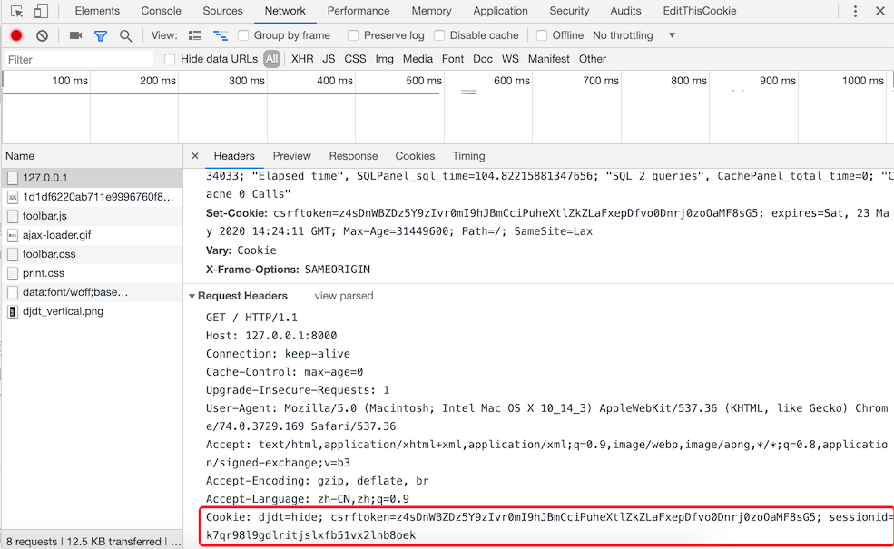

# owf_work

单核工作法在线工具

## 目录

1. [简介](简介)
2. [说明](#说明)
   - [Python日期函数](#python日期函数)
   - [模型详解](#模型详解)
   - [Django中条件过滤](#django中条件过滤)
   - [身份认证](#身份认证)
3. [展望](#展望)

## 简介

## 说明

### Python日期函数

```python
import datetime
now_time = datetime.datetime.now()  # 获取当前日期或者使用自定义日期
day_num = now_time.isoweekday() # 是本周第几天，下标为0开始
the_Sunday = now_time - datetime.timedelta(days=day_num)    # 本周周日
the_Saturday = now_time + datetime.timedelta(days=6-day_num)    # 本周周六
import datetime# 1. 获取「今天」
today = datetime.date.today()# 2. 获取当前月的第一天
first = today.replace(day=1)# 3. 减一天，得到上个月的最后一天
last_month = first - datetime.timedelta(days=1)# 4. 格式化成指定形式

# 日期转字符串（格式化）
print(last_month.strftime("%Y%m"))
print(now_time.strftime('%Y-%m-%d'))
201807
datetime.datetime.now().strftime("%Y")
datetime.datetime(2019,2,2)

# 字符串转日期
datetime.datetime.strptime('2019-02','%Y-%m')
datetime.datetime.strptime('2019-2','%Y-%m')

# 加一天，减一天
import datetime
print ((datetime.datetime.now()+datetime.timedelta(days=1)).strftime("%Y-%m-%d %H:%M:%S"))
# 2019-03-29 17:25:19
print ((datetime.datetime.now()+datetime.timedelta(days=-1)).strftime("%Y-%m-%d %H:%M:%S"))
# 2019-03-27 17:26:23

# 加一小时，减一小时
import datetime
print(type(datetime.datetime.now()))
# <class 'datetime.datetime'>
print((datetime.datetime.now()+datetime.timedelta(hours=1)).strftime("%H:%M:%S"))
# 18:36:11
print((datetime.datetime.now()+datetime.timedelta(hours=-1)).strftime("%H:%M:%S"))
# 16:30:29

# 获取当前日期
import datetime
print(type(date.today()))
# <class 'datetime.date'>
print(date.today())
# 2019-03-28
print(date.today() + datetime.timedelta(days=1))
# 2019-03-29

# 其它API
now = datetime.now()
# 获取当前时间  2019-03-28 17:22:51.750103
dep = Department.query.get(1)
# 获取对象
start_time = dep.dormitory_start_time
# 获取考勤开始时间
end_time = dep.dormitory_end_time
# 获取考勤结束时间
manage_time = dep.instructor_manage_time
# 获取考勤时长
dor_att = DormitoryAttendance.query.order_by(-DormitoryAttendance.attendance_date).first().attendance_date
# 获取最近一次的考勤日期 2019-03-29
sd = "{} {}".format(dor_att.strftime("%Y-%m-%d"), start_time.strftime("%H:%M:%S"))
# 拼接成字符串
ed = "{} {}".format(dor_att.strftime("%Y-%m-%d"), end_time.strftime("%H:%M:%S"))
# 拼接程字符串
ed = datetime.strptime(ed, "%Y-%m-%d %H:%M:%S") + timedelta(hours=manage_time)
# 把一个时间字符串解析为时间元组
if (sd < now.strftime("%Y-%m-%d %H:%M:%S") < ed.strftime("%Y-%m-%d %H:%M:%S")) is False:
  return jsonify(errno=RET.NODATA, errmsg="无数据", data={})
if now.strftime("%Y-%m-%d") > dor_att.strftime("%Y-%m-%d"):
  now = now + timedelta(days=-1)
```

### 模型详解

**Django 模型 model Field 详解：**

| 类型                       | 说明                                                         |
| -------------------------- | ------------------------------------------------------------ |
| AutoField                  | 一个自动增加的整数类型字段。通常你不需要自己编写它，Django会自动帮你添加字段：`id = models.AutoField(primary_key=True)`，这是一个自增字段，从1开始计数。如果你非要自己设置主键，那么请务必将字段设置为`primary_key=True`。Django在一个模型中只允许有一个自增字段，并且该字段必须为主键！ |
| BigAutoField               | 1.10新增。64位整数类型自增字段，数字范围更大，从1到9223372036854775807 |
| BigIntegerField64          | 位整数字段，类似IntegerField ，-9223372036854775808 到9223372036854775807。在Django的模板表单里体现为一个textinput标签。 |
| BinaryField                | 二进制数据类型。使用受限，少用。                             |
| BooleanField               | 布尔值类型。默认值是None。在HTML表单中体现为CheckboxInput标签。如果要接收null值，请使用NullBooleanField。 |
| CharField                  | 字符串类型。必须接收一个max_length参数，表示字符串长度不能超过该值。默认的表单标签是input text。最常用的filed，没有之一！ |
| CommaSeparatedIntegerField | 逗号分隔的整数类型。必须接收一个max_length参数。常用于表示较大的金额数目，例如1,000,000元。 |
| DateField                  | `class DateField(auto_now=False, auto_now_add=False, **options)`日期类型。一个Python中的datetime.date的实例。在HTML中表现为TextInput标签。在admin后台中，Django会帮你自动添加一个JS的日历表和一个“Today”快捷方式，以及附加的日期合法性验证。两个重要参数：（参数互斥，不能共存）auto_now:每当对象被保存时将字段设为当前日期，常用于保存最后修改时间。auto_now_add：每当对象被创建时，设为当前日期，常用于保存创建日期(注意，它是不可修改的)。设置上面两个参数就相当于给field添加了editable=False和blank=True属性。如果想具有修改属性，请用default参数。例子：`pub_time = models.DateField(auto_now_add=True)`，自动添加发布时间。 |
| DateTimeField              | 日期时间类型。Python的datetime.datetime的实例。与DateField相比就是多了小时、分和秒的显示，其它功能、参数、用法、默认值等等都一样。 |
| DecimalField               | 固定精度的十进制小数。相当于Python的Decimal实例，必须提供两个指定的参数！参数max_digits：最大的位数，必须大于或等于小数点位数 。decimal_places：小数点位数，精度。 当localize=False时，它在HTML表现为NumberInput标签，否则是text类型。例子：储存最大不超过999，带有2位小数位精度的数，定义如下：`models.DecimalField(..., max_digits=5, decimal_places=2)`。 |
| DurationField              | 持续时间类型。存储一定期间的时间长度。类似Python中的timedelta。在不同的数据库实现中有不同的表示方法。常用于进行时间之间的加减运算。但是小心了，这里有坑，PostgreSQL等数据库之间有兼容性问题！ |
| EmailField                 | 邮箱类型，默认max_length最大长度254位。使用这个字段的好处是，可以使用DJango内置的EmailValidator进行邮箱地址合法性验证。 |
| FileField                  | `class FileField(upload_to=None, max_length=100, **options)` 上传文件类型，后面单独介绍。 |
| FilePathField              | 文件路径类型，后面单独介绍                                   |
| FloatField                 | 浮点数类型，参考整数类型                                     |
| ImageField                 | 图像类型，后面单独介绍。                                     |
| IntegerField               | 整数类型，最常用的字段之一。取值范围-2147483648到2147483647。在HTML中表现为NumberInput标签。 |
| GenericIPAddressField      | `class GenericIPAddressField(protocol='both', unpack_ipv4=False, **options)` [source],IPV4或者IPV6地址，字符串形式，例如192.0.2.30或者2a02:42fe::4在HTML中表现为TextInput标签。参数protocol默认值为‘both’，可选‘IPv4’或者‘IPv6’，表示你的IP地址类型。 |
| NullBooleanField           | 类似布尔字段，只不过额外允许NULL作为选项之一。               |
| PositiveIntegerField       | 正整数字段，包含0,最大2147483647。                           |
| PositiveSmallIntegerField  | 较小的正整数字段，从0到32767。                               |
| SlugFieldslug              | 是一个新闻行业的术语。一个slug就是一个某种东西的简短标签，包含字母、数字、下划线或者连接线，通常用于URLs中。可以设置max_length参数，默认为50。 |
| SmallIntegerField          | 小整数，包含-32768到32767。                                  |
| TextField                  | 大量文本内容，在HTML中表现为Textarea标签，最常用的字段类型之一！如果你为它设置一个max_length参数，那么在前端页面中会受到输入字符数量限制，然而在模型和数据库层面却不受影响。只有CharField才能同时作用于两者。 |
| TimeField                  | 时间字段，Python中datetime.time的实例。接收同DateField一样的参数，只作用于小时、分和秒。 |
| URLField                   | 一个用于保存URL地址的字符串类型，默认最大长度200。           |
| UUIDField                  | 用于保存通用唯一识别码（Universally Unique Identifier）的字段。使用Python的UUID类。在PostgreSQL数据库中保存为uuid类型，其它数据库中为char(32)。这个字段是自增主键的最佳替代品，后面有例子展示 |

### Django中条件过滤

```python
import datetime

now = datetime.datetime.now()  # 获取现在的时间
start = datetime.timedelta(hours=23,minutes=59,seconds=59)   # 获取当前时间中的一天内的开始时间

# 查询一天内的数据
model.objects.filter(date_time_field__gt=start)

'''
也就这么多的东西，还有一些：
gt: 大于
gte: 大于等于
lt: 小于
lte: 小于等于
'''

# 那如果要查一个时间段呢？我们用 __range
start = datetime.date(2018,7,12)
end = datetime.date(2018,7,13)

model.objects.filter(date_time_filed__range=(start,end))
```


### 身份认证

#### Cookie和Session

**实现用户跟踪**

如今，一个网站如果不通过某种方式记住你是谁以及你之前在网站的活动情况，失去的就是网站的可用性和便利性，继而很有可能导致网站用户的流失，所以记住一个用户（更专业的说法叫**用户跟踪**）对绝大多数Web应用来说都是必需的功能。

在服务器端，我们想记住一个用户最简单的办法就是创建一个对象，通过这个对象就可以把用户相关的信息都保存起来，这个对象就是我们常说的session（用户会话对象）。那么问题来了，HTTP本身是一个无连接（每次请求和响应的过程中，服务器一旦完成对客户端请求的响应之后就断开连接）、无状态（客户端再次发起对服务器的请求时，服务器无法得知这个客户端之前的任何信息）的协议，即便服务器通过session对象保留了用户数据，还得通过某种方式来确定当前的请求与之前保存过的哪一个session是有关联的。相信很多人都能想到，我们可以给每个session对象分配一个全局唯一的标识符来识别session对象，我们姑且称之为sessionid，每次客户端发起请求时，只要携带上这个sessionid，就有办法找到与之对应的session对象，从而实现在两次请求之间记住该用户的信息，也就是我们之前说的用户跟踪。

要让客户端记住并在每次请求时带上sessionid又有以下几种做法：

1. URL重写。所谓URL重写就是在URL中携带sessionid，例如：`http://www.example.com/index.html?sessionid=123456`，服务器通过获取sessionid参数的值来取到与之对应的session对象。

2. 隐藏域（隐式表单域）。在提交表单的时候，可以通过在表单中设置隐藏域向服务器发送额外的数据。例如：`<input type="hidden" name="sessionid" value="123456">`。

3. 本地存储。现在的浏览器都支持多种本地存储方案，包括：cookie、localStorage、sessionStorage、IndexedDB等。在这些方案中，cookie是历史最为悠久也是被诟病得最多的一种方案，也是我们接下来首先为大家讲解的一种方案。简单的说，cookie是一种以键值对方式保存在浏览器临时文件中的数据，每次请求时，请求头中会携带本站点的cookie到服务器，那么只要将sessionid写入cookie，下次请求时服务器只要读取请求头中的cookie就能够获得这个sessionid，如下图所示。



在HTML5时代，除了cookie，还可以使用新的本地存储API来保存数据，就是刚才提到的localStorage、sessionStorage、IndexedDB等技术，如下图所示。


## 展望